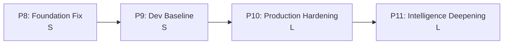

# News Sentry — Phase 8-11 深度迭代设计方案

> 版本: v1.0 | 日期: 2026-05-11
> 状态: 设计阶段 | 基于全面诊断的综合性迭代优化方案
> 口径基准: `docs/contracts-canonical.md`
> 上游: Phase 1-7 全部 DONE（`docs/spec/README.md`）

---

## §0. 诊断基线

### 当前状态快照

| 维度 | 状态 | 备注 |
|------|------|------|
| Phase 1-7 | 全部 DONE | `docs/spec/README.md` 已同步 |
| 测试 | 878 passed (95% cov) | 需 `.venv/bin/python3` (3.12)，系统 Python 3.9 不可用 |
| lint | ruff check 全干净 | — |
| Git 同步 | 本地 ahead 1 commit | e26e6ca 未推送 |
| 文档一致性 | AGENTS.md "Kernel MVP ← 当前" 过期 | dev_progress.py ahead/behind 计算反转 |
| 开发基线 | Karpathy 四原则已落地 | 心智模型/决策框架未制度化 |
| 容器化 | Dockerfile 存在 | 需多阶段构建审查 + CI 集成 |
| CI/CD | 无 GitHub Actions | 敏感数据扫描脚本已就绪 (tools/) |

### 发现的问题

1. **测试环境依赖**：pyproject.toml 声明 `>=3.11`，但无 CI workflow 保证
2. **文档漂移**：AGENTS.md Phase 标注过期，MEMORY.md 描述与实际状态严重不符
3. **工具 bug**：dev_progress.py ahead/behind 数值反转
4. **缺乏可观测性**：无结构化日志、无 metrics、无健康检查
5. **缺乏错误恢复**：bounded run 无 checkpoint 机制
6. **AI 研判无反馈回路**：一旦输出无法评估和迭代
7. **KOL 通道仅做实验**：P6 基础已有，需扩展为生产能力

---

## §1. 方案总览：四阶段线性推进（方案 A）

| Phase | 名称 | 核心目标 | 估算规模 | 依赖 |
|-------|------|---------|---------|------|
| P8 | Foundation Fix | 消除技术债务，建立干净起点 | S | — |
| P9 | Dev Baseline Upgrade | Karpathy 心智模型融入基线 + Agent Skill 注册 | S | P8 |
| P10 | Production Hardening | 可观测性、错误恢复、CI/CD、Docker | L | P9 |
| P11 | Intelligence Deepening | 研判质量、多 Agent 编排、KOL 矩阵、趋势分析 | L | P10 |

**版本号策略**：
- P8 完成后 → `0.2.0`
- P9 完成后 → `0.2.1`
- P10 完成后 → `0.3.0`
- P11 完成后 → `0.4.0`

---

## §2. Phase 8 — Foundation Fix

**目标**：消除所有已知技术债务和文档漂移，为后续阶段建立干净起点。**规模：S**

### 8.1 dev_progress.py ahead/behind bug 修复

- `ahead/behind` 计算逻辑反转：当前显示 "behind 1" 实际本地 ahead 1 commit
- 修复后重新运行确认数值正确
- 验证：`python3 tools/dev_progress.py` 输出与 `git log` 一致

### 8.2 Git 同步

- 将本地 e26e6ca 推送到 origin/main
- 确认远端与本地一致

### 8.3 CI 环境测试确认 + GitHub Actions 初始化

- pyproject.toml 声明 `requires-python = ">=3.11"`，系统 Python 3.9 会导致 import 失败
- 新增 **测试 workflow**（仅此一个，其余 workflow 在 P10 补齐）：
  - 触发：push to main / PR to main
  - 步骤：Python 3.12 setup → 依赖安装 → `make test` → coverage 报告
  - Coverage 门槛：≥ 95%

### 8.4 过期文档更新

修复以下文档与实际状态不符：

| 文件 | 问题 | 修复 |
|------|------|------|
| `AGENTS.md` | Phase Order 写 "Kernel MVP ← 当前" | 全部标记 DONE |
| `CLAUDE.md` | Phase 执行顺序未更新 | 同步全部 DONE |
| `docs/development-plan.md` | §1 总览表可能过时 | 确认状态全 DONE |
| `MEMORY.md` | 写"不是git仓库，纯文档设计阶段" | 修正为实际状态（878 测试、Python 项目） |
| `PROJECT.md`（如有） | — | 同步更新 |

### 8.5 代码与文档一致性审计

- 13 份 JSON Schema vs `contracts-canonical.md` 交叉校验，确认无漂移
- `config/` 下所有 YAML `# Schema:` 头部注释指向正确 schema
- `docs/spec/README.md` 横切组件矩阵 vs `src/news_sentry/` 实际模块，确认一致

### 8.6 性能基线记录

- 执行一次完整 `--stage all` bounded run，记录各阶段耗时、内存峰值、输出文件大小
- 写入 `data/perf_baseline_0.2.0.json`，作为后续迭代的性能对照基准
- 验证：P10 性能优化后与此基线对比，确认无回归

### 出口标准

- `dev_progress.py` ahead/behind 数值正确
- 本地与远端同步（git status 显示 clean + synced）
- GitHub Actions 测试 workflow 通过
- 所有文档 Phase 状态一致标记 DONE
- Schema/config/代码三方审计无漂移
- 性能基线已记录
- `pyproject.toml` 和 `src/news_sentry/__init__.py` 版本号同步至 `0.2.0`

---

## §3. Phase 9 — Dev Baseline Upgrade

**目标**：Karpathy 思维框架深度融入项目开发基线，同时注册为 Agent Skill。**规模：S**

### 3.1 Karpathy 心智模型融入项目基线

从 alchaincyf 版 SKILL.md 提炼 **4 个与项目开发直接相关的心智模型**：

| 心智模型 | 融入位置 | 内容 |
|---------|---------|------|
| **March of Nines** | AGENTS.md | 新增"质量门槛"章节：任何 AI 管道组件上线前须评估尾部行为（最差 5% 场景），AI demo ≠ AI 部署 |
| **构建即理解** | CLAUDE.md 决策框架 | 技术选型时优先选择"能从零重建核心"的方案，外部 Skill 必须能解释内部原理 |
| **锯齿状智能** | AGENTS.md | 新增"AI 辅助设计原则"：为 LLM 已知凹陷点加规则兜底，不假设 AI 能力均匀分布 |
| **Iron Man 套装 > 机器人** | AGENTS.md | News Sentry 定位为"增强人工研判"而非"替代人工决策"，所有关键判断保留人工介入点 |

**不融入的**：
- Software X.0 范式（纯理论讨论，对开发无直接约束）
- 角色扮演/表达 DNA（属于 Skill 功能，不属于项目基线）
- 人格化特征（"imo"、"lol"等）

### 3.2 Agent Skill 注册

在 `.omc/skills/` 注册两个独立 Skill：

**Skill 1：`karpathy-guidelines`**
- 来源：`forrestchang/andrej-karpathy-skills` → `skills/karpathy-guidelines/SKILL.md`
- 操作：直接复制原版（MIT 协议，无需修改），写入 `.omc/skills/karpathy-guidelines/SKILL.md`
- 类型：`guideline`
- 用途：代码审查/重构时的行为准则检查
- 触发：开发讨论中涉及代码质量、复杂度、修改范围时

**Skill 2：`karpathy-perspective`**
- 来源：`alchaincyf/karpathy-skill` → `SKILL.md`
- 操作：从原版中**移除**角色扮演规则（约占原文 40%）、表达 DNA 章节（句式偏好/词汇特征/节奏感/中文输出适配表）、经典句式速查（附录），**保留** 6 个心智模型 + 8 条决策启发式 + 诚实边界 + 调研来源。预计压缩到原文约 50%，写入 `.omc/skills/karpathy-perspective/SKILL.md`
- 类型：`advisor`
- 用途：技术决策顾问，用 Karpathy 视角分析架构选择
- 触发：架构决策、AI 产品评估、技术选型讨论时

### 3.3 开发决策清单

在 AGENTS.md 中新增 **"Decision Checklist"** 章节：

```
每次重大技术决策前必须过：

1. [March of Nines] 这个方案在最差 5% 场景下会怎样？
2. [构建即理解] 我们能向新人解释清楚这个方案的核心吗？
3. [锯齿状智能] 我们依赖的 AI 能力在哪些维度可能有凹陷？
4. [Iron Man 套装] 关键决策点是否保留了人工介入？
5. [简洁优先] 资深工程师会认为这个方案过度复杂吗？
```

### 3.4 CLAUDE.md / AGENTS.md 结构调整

**CLAUDE.md 两级结构**：
- **行为基线**（保有）：先思考再编码、简洁优先、精准修改、目标驱动执行
- **决策框架**（新增）：March of Nines、构建即理解、锯齿状智能、Iron Man 套装

**AGENTS.md 新增章节**：
- `## AI 辅助设计原则`：锯齿状智能 + Iron Man 套装
- `## 质量门槛`：March of Nines + 部署前尾部行为评估
- `## Decision Checklist`：5 条决策清单

### 3.5 ADR-0017

记录本次基线升级的决策过程：
- 为什么选择这 4 个心智模型
- 为什么排除其他 2 个（Software X.0、角色扮演）
- Skill 注册位置和命名规范

### 出口标准

- `.omc/skills/karpathy-guidelines/SKILL.md` 创建完成
- `.omc/skills/karpathy-perspective/SKILL.md` 创建完成
- CLAUDE.md 新增"决策框架"章节
- AGENTS.md 新增"AI 辅助设计原则"、"质量门槛"、"Decision Checklist"章节
- ADR-0017 写入 `docs/adr/`
- 版本号推进至 `0.2.1`

---

## §4. Phase 10 — Production Hardening

**目标**：将 News Sentry 从"功能完整的原型"升级为"可部署的生产系统"。**规模：L**

### 4.1 可观测性

**结构化日志**
- 引入 JSON 格式日志（`logging` + JSON formatter，不引入第三方依赖）
- 每条日志携带 `run_id`、`target_id`、`stage`、`timestamp`、`level`
- 日志写入 `data/{target_id}/logs/` 目录（遵循现有目录协议）

**Metrics 基线**
- 每次 bounded run 结束写入 `data/{target_id}/memory/metrics.jsonl`
- 记录：收集数、过滤数、研判数、输出数、各阶段耗时、Provider 调用次数/成本
- 不引入 Prometheus/Grafana（v1 不做专用前端），JSONL 可被 Obsidian/脚本消费

**健康检查**
- `cli doctor` 子命令扩展：
  - Config schema 合法性
  - 目录结构完整性
  - 信源可达性（HTTP HEAD/GET 探活）
  - Provider API key 存在性（环境变量检查）
- 输出结构化报告，可被 CI 消费

**ADR-0018**：结构化日志方案选择

### 4.2 错误恢复

**Checkpoint 机制**
- 每个 stage 完成后写入：`data/{target_id}/memory/checkpoint_{stage}.json`
- Checkpoint 内容：上次成功的 cursor/offset、已处理的 event ID 集合、时间戳
- Bounded run 中断后重启时从 checkpoint 恢复，不重复处理

**错误分类**
| 类型 | 含义 | 处理 |
|------|------|------|
| `transient` | 网络/限流 | 自动重试 3 次，指数退避 |
| `data` | 单条 event 异常 | 跳过，写入 `data/{target_id}/logs/data_error.jsonl` |
| `fatal` | 配置/schema 错误 | 停止运行，写入 `data/{target_id}/logs/fatal_{ts}.log` |

- `transient` 3 次失败后升级为 `fatal`

**ADR-0019**：Checkpoint 机制设计

### 4.3 CI/CD — GitHub Actions

**Workflow 1：`test.yml`**（P8 已创建基础版，P10 完善）
- 触发：push to main / PR to main
- 步骤：Python 3.12 → deps → `make test` → coverage ≥ 95%

**Workflow 2：`lint.yml`**
- 触发：push to main / PR to main
- 步骤：`ruff check` → JSON Schema config 校验

**Workflow 3：`scan-secrets.yml`**
- 触发：push to main
- 步骤：`tools/scan_sensitive_data.py`（已有工具）

**Workflow 4：`docker.yml`**
- 触发：tag push（`v*`）
- 步骤：build → push to GHCR

### 4.4 Docker 部署标准化

**Dockerfile 审查优化**
- 多阶段构建（builder + runtime）
- 非 root 用户运行
- 环境变量注入（API keys via env，不进镜像）
- `.dockerignore` 确认排除 `.venv/`、`data/`、`.env*`

**docker-compose.yml**（可选，本地开发）
```yaml
services:
  news-sentry:
    build: .
    env_file: .env
    volumes:
      - ./data:/app/data
      - ./config:/app/config
```

### 4.5 Makefile 完善

```makefile
make test          # .venv/bin/python3 -m pytest tests/ -q
make lint          # ruff check src/
make schema-check  # 校验所有 config YAML 的 JSON Schema
make docker-build  # docker build
make progress      # 开发进度（已有）
make doctor        # 项目健康检查
```

### 4.6 测试策略扩充

- **集成测试**：bounded run 端到端（含 checkpoint 恢复场景）
- **合同测试**：Provider 返回值与 schema 一致性（mock API 响应）
- **性能基线**：记录 bounded run 耗时，后续迭代回归检测

### 出口标准

- 所有 bounded run 产生结构化 JSON 日志 + metrics JSONL
- Checkpoint 机制可正确恢复中断的 run
- GitHub Actions 4 个 workflow 全绿
- `docker build` 成功，镜像可通过 `docker run` 执行 bounded run
- `make doctor` 输出完整健康报告
- 测试覆盖率 ≥ 95% 维持
- ADR-0018、ADR-0019 写入
- 版本号推进至 `0.3.0`

---

## §5. Phase 11 — Intelligence Deepening

**目标**：在 P10 生产化基础上，提升 AI 研判质量和多 Agent 协作能力。**规模：L**

### 5.1 AI 研判质量提升

**基线建立**（March of Nines）
- 收集 ≥100 条历史研判结果，人工标注正确/错误
- 形成评估集 `data/{target_id}/memory/judge_eval_set.jsonl`
- 计算当前准确率 baseline + 尾部行为（最差 5% 场景准确率）

**改进措施**
- **Prompt 模板化**：`config/judge_prompts/` 下模板化，支持 A/B 测试
- **置信度校准**：`judge_result.confidence` 与实际准确率对齐
- **多维独立置信度**：`news_value_score`、`china_relevance`、`sentiment_score` 各自携带置信度
- **反馈回路**：人工 review → `data/{target_id}/memory/judge_feedback.jsonl` → 定期分析错误模式

**锯齿状智能应对**
- 为 LLM 已知凹陷点加规则兜底：数字/日期提取、跨语言实体对齐、极端情感判断
- 凹陷点不靠更大的模型解决，靠更窄的规则补丁

### 5.2 多 Agent 编排

**设计原则**（Iron Man 套装）
- "增强人工研判的套装"，不是"替代人工的机器人"
- 所有多 Agent 编排保留人工介入点

**编排配置**
- `config/targets/{target_id}.yaml` 的 `pipeline` 节声明编排模式
- 模式一：`SequentialOrchestrator`（现有逻辑，默认）
- 模式二：`ConcurrentOrchestrator`（多信源并行采集，Collector/Filter 可并行）
- Judge 阶段保持顺序（依赖 Filter 结果）
- 不引入 Celery/RabbitMQ（v1 保持文件驱动）

**人工介入点**
- Review queue（置信度低于阈值的研判）
- 重大事件人工确认（`news_value_score >= 80` 暂停等确认）
- Publish gate（reviewed → published 需人工审批）

**ADR-0020**：多 Agent 编排模式设计

### 5.3 KOL 追踪矩阵

**基础**：P6 已有 `kol_state.py`、KOL 小规模实验通道

**扩展能力**：
- KOL 发文频率追踪（日/周/月）
- KOL 观点倾向性分析（pro/con/neutral 中国议题）
- 影响传播路径（转推/引用网络，仅记录元数据）
- 变异检测：KOL 观点突变告警

**限制**（保持 P6 决策）：
- v1 不做多账号 session 池
- 不存储私信内容
- 更新频率与 bounded run 对齐

### 5.4 舆情趋势分析

**最小可行能力**：
- 基于 NewsEvent 时间序列，生成趋势报告
- 输出到 `data/{target_id}/published/trend_report_{date}.md`
- 趋势维度：议题热度、情感走向、事件聚类、KOL 观点变化

**新增 CLI stage**：
```
python -m news_sentry.cli run --target {id} --stage analyze
```

**不做什么**：
- 不训练自定义模型（LLM + 规则引擎）
- 不做实时流处理（批处理模式）
- 不做预测模型（v1 做趋势描述，不做预测）

**实现**：
- `src/news_sentry/skills/analysis/` 目录：`trend_analyzer.py`、`sentiment_tracker.py`、`event_clusterer.py`
- 趋势报告模板：`config/templates/trend_report.md.j2`

### 5.5 测试策略

- **研判质量评估**：评估集 baseline + CI 回归（评估集准确率不下降）
- **编排测试**：Sequential vs Concurrent 一致性测试
- **KOL 状态**：`kol_state.py` 扩展功能测试
- **趋势报告**：输出格式 + content 完整性测试

### 出口标准

- Judge 评估集 ≥100 条标注样本，准确率 baseline 已记录
- ConcurrentOrchestrator 多信源并行采集可用
- KOL 矩阵 ≥10 个意大利 KOL 追踪数据
- 趋势报告生成：议题热度、情感走向、事件聚类三维度
- 所有关键决策点保留人工介入机制
- ADR-0020 写入
- 测试覆盖率 ≥ 95% 维持
- 版本号推进至 `0.4.0`

---

## §6. 跨阶段关注点

### 6.1 SPEC 文档体系

每个 Phase 完成后，在 `docs/spec/` 新增对应 SPEC 文件：
- `phase-8-foundation-fix.md`
- `phase-9-dev-baseline-upgrade.md`
- `phase-10-production-hardening.md`
- `phase-11-intelligence-deepening.md`

更新 `docs/spec/README.md` 阶段索引表和演进图，同步更新 `docs/development-plan.md` §1 总览表。

### 6.2 ADR 编号接力

| ADR | Phase | 内容 |
|-----|-------|------|
| ADR-0017 | P9 | Karpathy 心智模型融入决策 + Skill 注册方案 |
| ADR-0018 | P10 | 结构化日志方案选择 |
| ADR-0019 | P10 | Checkpoint/恢复机制设计 |
| ADR-0020 | P11 | 多 Agent 编排模式 |

### 6.3 版本号一致性

每个 Phase 结束时同步更新以下两处版本号：
- `pyproject.toml` 的 `project.version` 字段
- `src/news_sentry/__init__.py` 的 `__version__`

P8 完成 → `0.2.0`，P9 → `0.2.1`，P10 → `0.3.0`，P11 → `0.4.0`。

### 6.4 dev_progress.py 进化

- P8：修复 ahead/behind bug
- P8：修改为能识别 `docs/spec/README.md` 中的 Phase 8-11
- P10：增加 CI status 集成（用 `gh` 查询 workflow 状态）

### 6.5 风险回退

| 风险 | 影响 | 缓解 |
|------|------|------|
| P10 checkpoint 实现引入不稳定性 | 数据重复/丢失 | 先在 `test_` 目录做隔离测试，开关控制 |
| P11 多 Agent 编排增加复杂性 | 新增 bug | Sequential 模式保持不动，Concurrent 增量 |
| CI workflow 调试周期长 | 阻塞其他阶段 | P8 仅上线最小化 test workflow，其余 P10 补齐 |
| KOL 矩阵数据源不稳定 | 功能不可用 | 非关键路径，标记 experimental，不影响管道主流程 |

---

## §7. 时序与依赖



- P8 → P9：文档和工具修正必须在基线升级前完成
- P9 → P10：决策框架必须在生产化前就位（指导技术选型）
- P10 → P11：生产基础必须在智能深化前就位（可观测性支撑研判质量评估）
