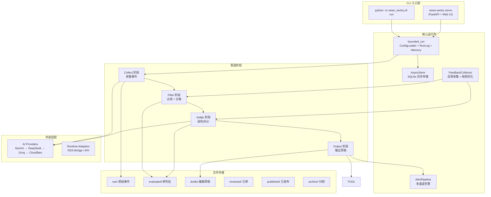
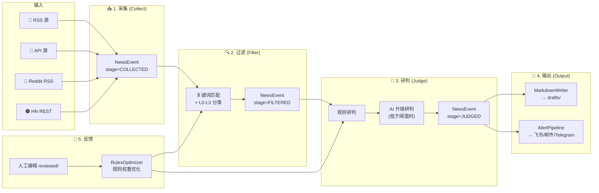
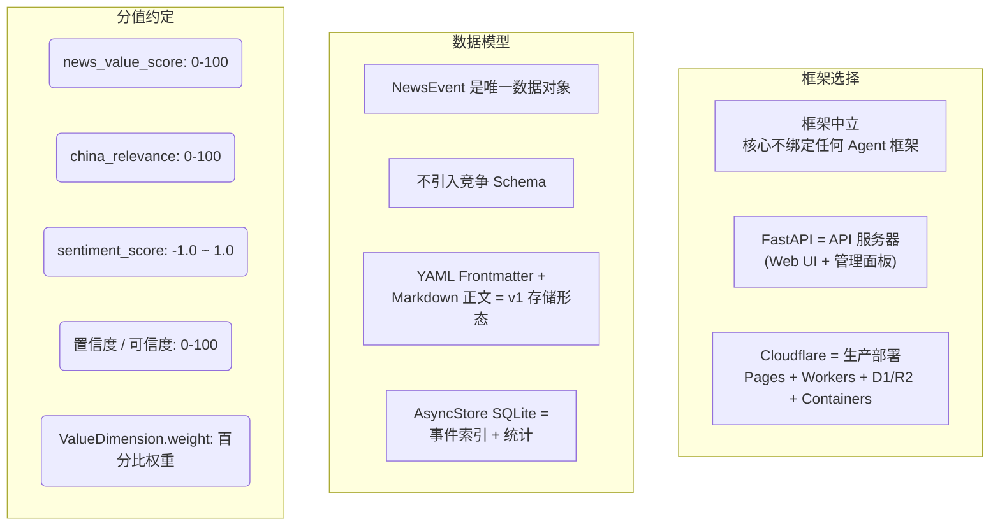
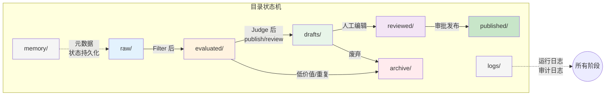
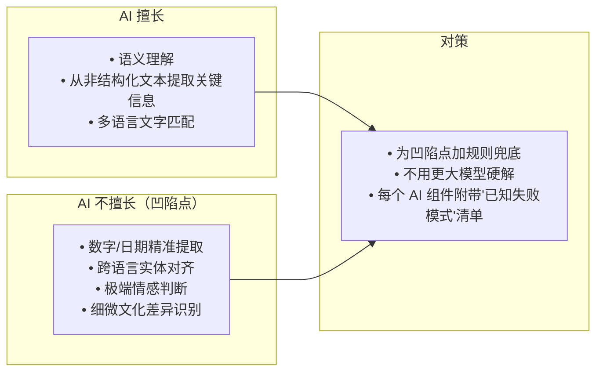

# News Sentry Agent Instructions

## 项目速览

News Sentry 是一个持续新闻监控系统。它的核心流程是：

**采集 → 过滤 → 研判 → 输出 → 反馈**

你可以把它理解为：每天自动扫遍几十个信源，筛选出值得关注的新闻，用 AI 做初步研判，然后生成 Obsidian 兼容的 Markdown 草稿供记者/编辑使用。

> **一句话定位**：增强人工研判的"套装"，不是替代人工的"机器人"。

---

## 系统架构一览



**各组件角色**：
- **CLI 层**：两个入口——批处理模式（`run`）和服务模式（`serve`）
- **核心运行时**：`bounded_run` 驱动整条管道，`AsyncStore` 提供 SQLite 持久化
- **管道阶段**：四个顺序执行的阶段，每个阶段处理并传递 NewsEvent
- **外部适配**：AI Provider 供研判/翻译使用，RSS-Bridge 供社媒采集使用
- **文件存储**：文件系统目录协议，每个目录有明确的语义

---

## 管道数据流



**关键设计原则**：
- **采集阶段零 Token 消耗**：RSS/API/Reddit/HN 四种采集方式都不消耗 AI token
- **两面下注策略**：规则和 AI 同时执行，规则不足时 AI 升级补位
- **反馈闭环**：人工标记→规则优化→下次运行生效

---

## 权威参考源

修改架构、Schema、管道行为、权限、Provider 路由或工具执行前，必读以下文件：

| 文件 | 作用 | 为什么重要 |
|------|------|-----------|
| `docs/contracts-canonical.md` | **口径规范基准** | 字段命名、分值量纲、目录映射、pipeline_stage 枚举的唯一权威来源 |
| `docs/architecture.md` | **架构总览** | 系统架构、数据流、目录结构 |
| `docs/external-integration-strategy.md` | **外部接入策略** | RSS-Bridge 接入原则、Provider chain 设计 |
| `schemas/` (13 份 JSON Schema) | **机器可读契约** | 与 contracts-canonical.md 双向绑定 (ADR-0014) |
| `config/` | **运行时配置骨架** | 各国参数独立封装 (ADR-0015) |
| `src/news_sentry/` | **Python 实现** | Python 3.11+ / Pydantic v2 (ADR-0012, ADR-0013) |

---

## 核心设计决策

### 架构层面



### 关键规则速查

| 规则 | 内容 | 参考 |
|------|------|------|
| **前端策略** | CLI-first，FastAPI + Vanilla JS 可选，无重型框架 | ADR-0025（替代 ADR-0010） |
| **AI Provider** | 内置 chain: Gemini → DeepSeek → Groq → Cloudflare Workers AI | ADR-0005 |
| **分类存储** | L0-L3 走 `metadata.classification`，不做顶层字段 | ADR-0009 |
| **实现语言** | Python 3.11+ / Pydantic v2 | ADR-0012 |
| **配置管理** | 所有国家参数入 config/，禁止硬编码到 src/ | ADR-0015 |
| **CLI 格式** | `python -m news_sentry.cli run --target {id} --stage {all}` | ADR-0016 |
| **外部项目** | 只 install 不 vendor（不 fork、不 submodule） | ADR-0008 |
| **Schema 契约** | JSON Schema 与 contracts-canonical.md 双向绑定 | ADR-0014 |
| **告警策略** | v1 止于通知，不自动对外发布 | — |
| **翻译策略** | 采集阶段机译入 metadata.translation.title_pre，研判阶段 canonical 翻译入 title_translated | ADR-0004 |
| **信源生命周期** | active → degraded(3次失败) → dead(10次失败) → archive | ADR-0019 |
| **社媒采集** | RSS-Bridge Docker sidecar 替代浏览器驱动 | Phase 2 |

---

## 目录协议



**映射关系**：目录是"位置"，`pipeline_stage` 是"状态"。两者同时维护，互相验证。详见 `docs/contracts-canonical.md §5`。

---

## AI 辅助设计原则

基于 Karpathy 的四项心智模型约束所有 AI 相关设计。

### 1. 锯齿状智能（LLM 能力非均匀分布）



### 2. Iron Man 套装（增强而非替代）

- **定位**：增强人工研判，不是替代人工
- **边界**：`news_value_score >= 80`、`publish gate` 等关键判断保留人工介入点
- **角色**：Agent 是执行者，人是监督者
- **红线**：自动发布、自动封禁不在 v1 范围

### 3. March of Nines（工程现实主义）

| 问题 | 检查项 |
|------|--------|
| 尾部行为 | 最差 5% 输入下，组件是否产生静默错误？ |
| 置信度对齐 | `judge_result.confidence` 与实际准确率偏差 ≤ 10%？ |
| 数据飞轮 | 是否持续积累反馈数据以自我改进？ |
| Demo ≠ 部署 | 单次 LLM 调用的"看起来能工作"不等于可部署？ |

### 4. 构建即理解

如果你不能用最少代码重建某个组件的核心，说明你还不理解它。对每个外部 Skill 和工具，应该能解释其内部原理。

### 决策检查清单

每次重大技术决策前，过一遍这 5 个问题：

```
□ March of Nines:  这个方案在最差 5% 场景下会怎样？
□ 构建即理解:      我们能向新人解释清楚核心原理吗？
□ 锯齿状智能:      依赖的 AI 能力在哪些维度可能有凹陷？
□ Iron Man 套装:    关键决策点是否保留了人工介入？
□ 简洁优先:         资深工程师会认为过度复杂吗？
```

> 出现 ≥2 个 ❌ 时，方案必须重新设计。

---

## 开发工作流

1. **动手前先读**：查看相关文档和契约再实现
2. **精准修改**：只改当前目标需要的部分
3. **偏好结构化处理**：Schema 校验 > 临时字符串处理
4. **测试伴随**：契约校验、文件事件转换、沙箱决策、Provider 输出 Schema
5. **文档同步**：用户可见行为变化时，同一 commit 更新文档
6. **提交前验证**：跑最窄但有意义的检查（ruff、相关测试）

### 禁止提交的文件

`.DS_Store`、`.env*`、本地 Claude/Cursor 配置、Token、Cookie、浏览器 Profile、生成日志。

---

## Phase 完成状态

**v1.0.0 主线 23 个 Phase 全部完成。v2.0 重构 Phase 1-5 已完成。**

| Phase | 名称 | 状态 |
|-------|------|------|
| 1-7 | 基础框架 + 多 Target 扩展 | ✅ |
| 8-11 | Obsidian 同步 + AI 研判优化 | ✅ |
| 12 | Italy 信源矩阵 (163 源 + 14 社媒维度) | ✅ |
| 13 | 评测集 (250 条) | ✅ |
| 14 | AI Judge 优化 | ✅ |
| 15 | Cloud VPS 部署 | ✅ |
| 16 | 第三 Target (Japan) | ✅ |
| 17 | 实时告警管道 | ✅ |
| 18 | 生产加固 | ✅ |
| 19-21 | 多语言 + 反馈闭环 + RSS 自动发现 | ✅ |
| 22 | API Gateway | ✅ |
| 23 | Release v1.0 | ✅ |
| P1 | v2 重构: 删除 OpenCLI + 浏览器降级层 | ✅ |
| P2 | v2 重构: API 服务器模块化 | ✅ |
| P3 | v2 重构: Reddit/HN 采集器 + Docker 瘦身 | ✅ |
| P4 | v2 重构: 内置 AI Provider Chain | ✅ |
| P5 | v2 重构: 质量加固 + 部署对齐 | ✅ |
| P6 | v2 重构: 测试覆盖率 + Type 质量 + 部署验证 | ✅ |
| P7 | v2 重构: 文档对齐 (architecture.md, README.md) | ✅ |
| P8 | v2 重构: CI 修复 (Docker workflow) + config 清理 (5K lines) | ✅ |
| P9 | v2 重构: 质量收尾 + 品牌 + 性能优化 | ✅ |
| P10 | v2 重构: 发布就绪 + Prometheus + Makefile 清理 | ✅ |
| M-12~M-15 | Italy 信源矩阵 + 评测集 + AI Judge + Cloud VPS | ✅ |
| M-16~M-20 | 管理后台升级 + 诊断/错误处理 + 数据驱动泛化 | ✅ |
| M-21 | sourcechannel schema 清理 (OpenCLI 残留) | ✅ |
| M-22 | 过滤器模板 + socialsource schema 清理 | ✅ |
| M-23 | 外部接入策略文档重写 + 框架中立 schema 清理 | ✅ |
| M-24 | schemas.py 死代码移除 + OpenAPI schema 清理 | ✅ |
| M-25 | 登录端点 Pydantic 模型化 + OpenAPI 文档覆盖 | ✅ |
| M-26 | AGENTS.md 综合性同步（统计/文档清理） | ✅ |
| M-27 | CI 添加 admin 前端构建（tsc + vite build） | ✅ |
| M-28 | ADR-0011 标记为 Superseded（OpenCLI 已移除） | ✅ |
| M-29 | 前端死代码清理 — 移除未引用 tabs.tsx + @radix-ui/react-tabs | ✅ |
| M-30 | CLAUDE.md 过时引用更新 — 前端栈/Phase/目录/验证 | ✅ |
| M-31 | 前端依赖管理规范化 — 根 package.json + .nvmrc + 移除死依赖 | ✅ |
| M-32 | public 前端独立化 — outDir dist/ + base 双模 + Cloudflare Pages deploy job + check.sh --frontend | ✅ |

**当前状态：** Phase 1-10 全部完成。M-12 ~ M-32 完成。项目处于 v2.0 RC 稳定基线。
- **Tag:** v2.0.0-rc3
- **Commit:** `c2a052e0`
- **测试:** 2,738 collected, 2,736 passed, 2 skipped
- **覆盖率:** 85%
- **Type:** mypy strict + ruff: 零错误
- **生产:** news-sentry.com — `{"status": "ok"}`
- **Docker:** ghcr.io/xucroyuri/news-sentry (279MB)
- **品牌:** 金色瞭望塔, 已挂载管理面板 + README
- **发布:** CHANGELOG.md + .github/release.yml 就绪

---

## AI 辅助注意事项

1. **不要假设**：遇到不确定的，先查文档再动手
2. **不要过度设计**：防猜测性实现，不为一次性需求建抽象
3. **不要完美主义**：90% 可用的方案 > 100% 但从未交付的方案
4. **要暴露冲突**：两种范式矛盾时，明确选一个，标记另一个
5. **要检查点**：每完成一个关键步骤，总结已完成事项和剩余待办
6. **要用自然语言**：文档、注释、commit message 优先使用中文

---

## 项目当前状态速查

- **Python 版本**：3.11+ / Pydantic v2
- **测试规模**：2,738 tests, 85% 覆盖率, ruff=0, mypy=0, frontend=0
- **监控目标**：81 targets (italy, china-watch-en, japan, germany, france + 76 更多)
- **信源规模**：244 源 (147 RSS + 97 API)，覆盖 81 个 target
- **AI Provider**：内置 chain: Gemini → DeepSeek → Groq → Cloudflare Workers AI
- **部署方式**：Cloudflare Pages + Workers + D1/R2；Cloudflare Containers 承接过渡期 Python/RSS-Bridge 后台面；VPS/Tunnel 仅作 legacy rollback，不是运行依赖
- **可选组件**：`[api]` FastAPI + Web UI（管理后台 + 公开新闻阅读器）
