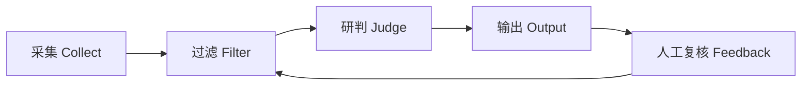

# News Sentry Agent Instructions

News Sentry 是一个长期运行的新闻情报工作台。它每天从多语言信源采集报道，把报道整理为事件、评分、草稿、告警和人工复核队列。

一句话定位：**增强人工研判，不替代人工发布。**

## 先读顺序

每次改代码、契约、部署或文档前，先按这个顺序取当前口径：

1. `docs/status.md`：动态状态、分支、验证命令、生产边界。
2. `docs/contracts-canonical.md`：字段名、分值量纲、目录和 `pipeline_stage`。
3. `docs/architecture.md`：系统结构、数据流、部署拓扑。
4. `docs/external-integration-strategy.md`：外部依赖、Provider、RSS-Bridge 和接入边界。
5. 当前任务直接相关的 `schemas/`、`config/`、`src/news_sentry/`、`frontend/` 文件。

动态数字只写在 `docs/status.md`。不要把测试数、覆盖率、当前 tag、生产 SHA 复制到多个文档。

## 系统心智模型


```mermaid
flowchart LR
    A["采集 Collect"] --> B["过滤 Filter"]
    B --> C["研判 Judge"]
    C --> D["输出 Output"]
    D --> E["人工复核 Feedback"]
    E --> B
```

每个阶段只做一件事：

- `Collect`：RSS、API、Reddit RSS、HN REST；采集阶段不消耗 AI token。
- `Filter`：关键词、分类、去重和低价值归档。
- `Judge`：规则优先，AI 只做辅助升级。
- `Output`：Markdown 草稿、公开读面和通知；v1/v2 默认不自动对外发布。
- `Feedback`：人工标注进入规则优化，不静默覆盖事实层。

## 数据契约

- `NewsEvent` 是唯一事件对象，不新增竞争 Schema。
- L0-L3 分类写入 `metadata.classification`，不要新增顶层分类字段。
- 分值统一使用 `0-100`；`sentiment_score` 仍为 `-1.0..1.0`。
- 目录是位置，`pipeline_stage` 是状态；两者必须互相验证。
- JSON Schema 与 `docs/contracts-canonical.md` 双向绑定；改一个必须检查另一个。

## 生产边界

- `origin/main` 是生产权威分支；`preview` 是 CI/预览门禁。发布判断前必须报告本地与远端 SHA。
- 当前生产路径以 Cloudflare Pages + Workers + D1/R2 为准；Cloudflare Containers 只承接过渡期 Python/RSS-Bridge 后台面。
- VPS、Tunnel、systemd 只作为 legacy rollback，不是默认生产依赖。
- 公共读路径必须优先保持 Worker + D1，不把正常读流量代理到容器或 VPS。
- 任何写入生产、推送远端、发布 release、操作凭据的步骤都要有验证证据。

## AI 与 Provider 原则

- 内置 Provider chain 是执行平面；不要恢复外部 Agent 框架作为核心依赖。
- Provider 顺序、成本层级、备用 Key 和预算兜底见 `docs/external-integration-strategy.md` 与 `docs/specs/2026-07-03-ai-provider-free-capacity-and-paid-fallback.md`。
- 采集阶段不调用 AI；翻译、摘要、研判都必须有失败边界和可重试策略。
- ChatGPT/Codex/Claude 等 Coding Plan 只可用于代码维护，不能默认挪作公共翻译、摘要或 enrichment 后台 Provider。

## 操作工作台原则

从“若无必要，勿增实体”出发，所有用户和 Agent 操作都应满足：

1. 先显示任务语言，再暴露内部字段。
2. 一个动作只出现一次；不要让同一筛选、排序或写操作散落在多个入口。
3. 公共站服务“读和判断”；管理后台服务“修正系统输入与索引”。
4. 高风险动作必须有确认文案和可回滚/不可回滚说明。
5. 复杂关系优先用短流程图或表格表达，不用长段历史叙述。

当前产品审计与任务分解见 `docs/design/minimal-operations-workbench-audit-2026-07-08.md`。

## 开发工作流

1. 先读相关契约和当前实现，再改代码。
2. 优先删除、复用、收敛边界；不要为一次性需求新增抽象或依赖。
3. 结构化处理优先于字符串拼接；Schema 校验优先于临时约定。
4. 用户可见行为变化必须同步文档和测试。
5. 保持 diff 小、可回滚、可审查。
6. 不提交 `.env*`、token、cookie、浏览器 profile、生成日志、本地工具状态或 `.DS_Store`。

## 验证命令

按改动范围选择最窄但有意义的检查：

```bash
.venv/bin/python -m pytest tests/unit/test_public_handlers.py tests/unit/test_voting.py -q
.venv/bin/python -m pytest tests/unit/test_latent_value_model.py -q
npm run test --prefix frontend/public
npm run lint --prefix frontend/public
npm run lint --prefix frontend/admin
.venv/bin/python -m ruff check src tests
.venv/bin/python -m mypy src/news_sentry
python tools/scan_sensitive_data.py
```

Cloudflare Worker 改动还要运行：

```bash
cd frontend/cloudflare
npx wrangler deploy --env="" --dry-run --outdir /tmp/ns-worker-dry-run --containers-rollout none
```

## 汇报格式

进度和最终汇报要先说结论，再列证据：

- 改了哪些文件。
- 删除或收敛了什么复杂度。
- 跑了哪些验证，结果是什么。
- 哪些事项因为网络、凭据、生产权限或外部系统阻塞，需要人工醒来后处理。
