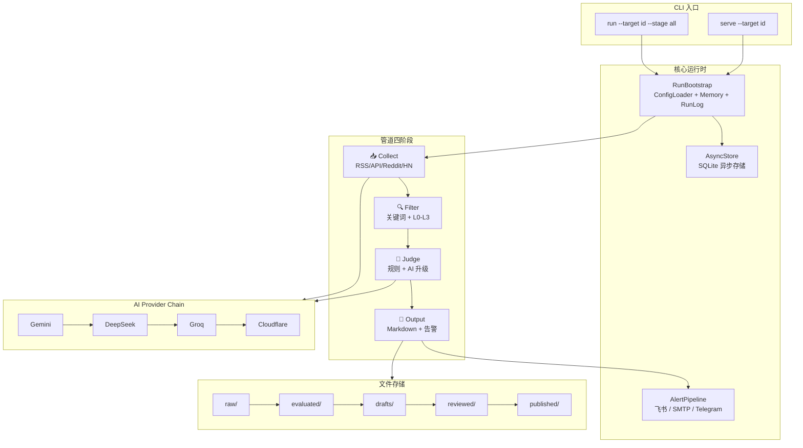
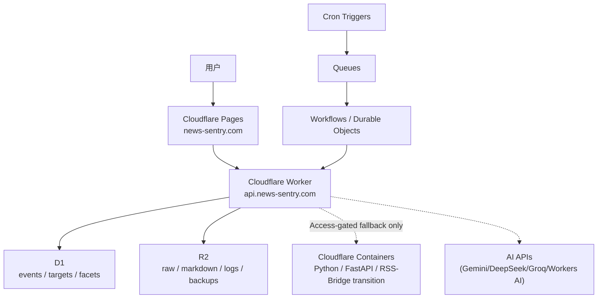

# News Sentry — 系统架构文档

**版本:** v2.0 | **日期:** 2026-06-24
**参考:** contracts-canonical.md, AGENTS.md, ADR-0001 ~ ADR-0025

---

## 1. 系统概述

News Sentry 是一个**开源 AI 新闻情报与 OSINT 监控平台**，持续采集、过滤、研判多语种新闻，生成结构化草稿供记者/编辑使用。定位为"增强人工研判的套装"，非替代人工决策的机器人。

### 核心流程

```
采集 (Collect) → 过滤 (Filter) → 研判 (Judge) → 输出 (Output) → 反馈 (Feedback)
```

- **采集**：RSS / API / Reddit RSS / Hacker News REST 四种方式
- **过滤**：关键词匹配 + L0-L3 分类体系筛除低价值事件
- **研判**：两级策略——规则基础研判 + AI 升级研判（低于阈值时）
- **输出**：Obsidian 兼容 Markdown 草稿 + 多通道告警推送
- **反馈**：人工编辑标注 → 规则权重优化 → 下次运行生效

### 技术栈

| 层面 | 技术 |
|------|------|
| 语言 | Python 3.11+ / TypeScript 5.x |
| 数据模型 | Pydantic v2, JSON Schema 2020-12 |
| 类型检查 | mypy strict, 零错误 |
| Web 框架 | FastAPI + Uvicorn |
| 存储 | Cloudflare D1 + R2；SQLite/文件系统用于本地开发与容器过渡 |
| AI Provider | Gemini → DeepSeek → Groq → Cloudflare (链式降级) |
| 部署 | Cloudflare Pages + Workers + D1/R2；Cloudflare Containers 作为 Python/RSS-Bridge 过渡运行面 |
| 前端 | Vite + React + Tailwind CSS |
| 测试 | pytest 3,013 tests / vitest |

---

## 2. 目录结构

```
NewsSentry/
├── src/news_sentry/              # 核心 Python 源码 (~24,000 lines, 102 files)
│   ├── adapters/                 # 外部适配器
│   │   ├── providers/            # AI Provider (12 个 Provider)
│   │   │   ├── base.py           # AIProvider Protocol
│   │   │   ├── openai_provider.py    # OpenAI-compatible 基类
│   │   │   ├── gemini_provider.py    # Gemini (主)
│   │   │   ├── deepseek_provider.py  # DeepSeek (备选)
│   │   │   ├── groq_provider.py      # Groq (备选)
│   │   │   ├── cloudflare_workers_ai_provider.py  # CF (兜底翻译)
│   │   │   ├── anthropic_provider.py # Anthropic (可选)
│   │   │   ├── openrouter_provider.py # OpenRouter (可选)
│   │   │   ├── rules_provider.py    # 本地规则引擎
│   │   │   ├── libretranslate_provider.py
│   │   │   └── mymemory_provider.py
│   │   └── runtime/              # 运行时适配
│   ├── api/                      # FastAPI 层
│   │   ├── middleware/           # auth.py, security.py
│   │   └── schemas.py            # API Pydantic 模型
│   ├── cli/                      # CLI 入口 (Click)
│   │   ├── __init__.py           # 命令注册
│   │   ├── serve.py              # API Server 管理
│   │   ├── doctor.py             # 项目健康检查
│   │   └── desktop.py            # 桌面窗口 (pywebview)
│   ├── collect/                  # 采集器
│   │   ├── reddit.py             # Reddit RSS
│   │   ├── hn.py                 # Hacker News REST
│   │   └── source_registry.py    # 信源注册
│   ├── core/                     # 核心引擎
│   │   ├── api_server.py         # FastAPI 应用 (9209 lines)
│   │   ├── async_store.py        # SQLite 异步存储 (4993 lines)
│   │   ├── run.py                # 管道编排 bounded_run
│   │   ├── async_run.py          # 异步管道执行
│   │   ├── provider_router.py    # AI Provider 路由与降级
│   │   ├── config/               # 配置管理 (子模块包)
│   │   │   ├── loader.py         # ConfigLoader
│   │   │   ├── models.py         # ResolvedConfig
│   │   │   └── country_axes.py   # 国家轴隔离
│   │   ├── alert_pipeline.py     # 多通道告警
│   │   ├── public_translation.py # 公开翻译管道
│   │   ├── ai_enrichment.py      # AI 富化
│   │   ├── sandbox.py            # 安全沙箱
│   │   ├── canonical_projection.py # 标准投影
│   │   └── ...
│   ├── models/                   # Pydantic 数据模型
│   └── skills/                   # Skill 管道模块
│       ├── collect/              # RSS / API 采集
│       ├── filter/               # 规则过滤 / 分类 / 聚类
│       ├── judge/                # 规则研判 / 反馈
│       └── output/               # Markdown 输出
├── config/                       # YAML 配置
│   ├── provider/                 # AI 路由表
│   ├── targets/                  # 监控目标
│   ├── profiles/                 # 部署 Profile
│   ├── sources/                  # 信源定义
│   └── sandbox/                  # 沙箱策略
├── schemas/                      # JSON Schema 2020-12 (19 files)
├── tests/                        # 测试 (110 files)
│   └── unit/                     # 单元测试 (~90 files)
├── frontend/public/              # 前端 (Vite + React + Tailwind)
├── docs/                         # 文档
│   ├── contracts-canonical.md    # 口径规范 (权威)
│   └── adr/                      # 架构决策记录 (25 ADRs)
├── docker-compose.yml
├── Dockerfile
├── pyproject.toml
├── run.sh / run.ps1
├── MAKE_GUIDE.md
├── AGENTS.md
└── CLAUDE.md
```

---

## 3. 核心组件架构



---

## 4. 数据管道流程

```mermaid
flowchart LR
    subgraph INPUT["输入"]
        RSS["RSS (163 sources)"]
        API_SRC["API (NewsAPI/GDELT)"]
        REDDIT["Reddit RSS"]
        HN["Hacker News"]
    end

    subgraph C1["1. 采集"]
        COLLECT["RSSCollector / APICollector<br/>RedditCollector / HNCollector"]
        C_OUT["stage=COLLECTED<br/>→ raw/"]
    end

    subgraph C2["2. 过滤"]
        FILTER["RulesFilter + ClassifierRules<br/>+ EventClustering"]
        F_OUT["stage=FILTERED<br/>→ evaluated/"]
    end

    subgraph C3["3. 研判"]
        JUDGE["RulesJudge<br/>→ AI 升级 (低于阈值时)"]
        J_OUT["stage=JUDGED<br/>→ evaluated/"]
    end

    subgraph C4["4. 输出"]
        OUTPUT["MarkdownWriter → drafts/<br/>PublicTranslation → published/<br/>AlertPipeline → 飞书/邮件/TG"]
    end

    INPUT --> COLLECT --> C_OUT --> FILTER --> F_OUT --> JUDGE --> J_OUT --> OUTPUT
```



**关键设计原则：**

- **采集零 Token 消耗** — 四种采集方式均不使用 AI
- **两面下注** — 规则和 AI 同时执行，规则不足时 AI 补位
- **反协同过滤去重** — title_hash + URL + source_id 三维去重

---

## 5. AI Provider 架构

### Provider Chain

```
Gemini (首选) → DeepSeek (备选 1) → Groq (备选 2) → Cloudflare Workers AI (兜底翻译)
     ↓ 失败            ↓ 失败               ↓ 失败
  自动降级到下一个节点，无需人工干预
```

### Provider 层次

```
AIProvider (Protocol)
├── OpenAIProvider — OpenAI-compatible HTTP client
│   ├── GeminiProvider    (api_key: GEMINI_API_KEY)
│   ├── DeepSeekProvider  (api_key: DEEPSEEK_API_KEY)
│   ├── GroqProvider      (api_key: GROQ_API_KEY)
│   └── OpenRouterProvider
├── AnthropicProvider — Anthropic Messages API
├── CloudflareWorkersAIProvider — 翻译专用
├── LibreTranslateProvider / MyMemoryProvider — 翻译备选
└── RulesProvider — 本地规则引擎 (无 API 依赖)
```

### 路由配置

定义在 `config/provider/routes.yaml` 中：

```yaml
routes:
  - route_id: translate.public
    provider: gemini
    model: gemini-2.0-flash
    fallback_route_ids: [translate.public.deepseek, translate.public.groq]

  - route_id: judge.primary
    provider: gemini
    fallback_route_ids: [judge.deepseek, judge.groq]
```

### 环境变量

至少配置一个 Provider key：

| 变量 | Provider | 获取地址 |
|------|---------|---------|
| `GEMINI_API_KEY` | Gemini | aistudio.google.com/apikey |
| `DEEPSEEK_API_KEY` | DeepSeek | platform.deepseek.com |
| `GROQ_API_KEY` | Groq | console.groq.com |
| `CLOUDFLARE_ACCOUNT_ID` + `CLOUDFLARE_API_TOKEN` | Cloudflare | dash.cloudflare.com |

---

## 6. API 服务器设计

### 端点

| 路径 | 用途 | 认证 |
|------|------|------|
| `/api/v1/health` | 健康检查 | 无 |
| `/api/v1/public/*` | 公开新闻接口 | CORS |
| `/api/v1/admin/*` | 管理面板 | API Key |
| `/admin/*` | 管理 Web UI | Session / API Key |
| `/public-app/*` | 公开新闻站点 (React) | 无 |

### 安全

- Auth 中间件 (`api/middleware/auth.py`) — API Key + Session 双模式
- CSP 头部 — nonce-based script policy
- 部署 commit SHA 响应头 — 可追溯版本

---

## 7. 部署拓扑



### 运行面

| Surface | 运行方式 | 适用 |
|------|---------|------|
| Public frontend | Cloudflare Pages | 公开站点与静态资源 |
| Public API | Worker + D1 | 高频读路径：news/facets/bootstrap/detail |
| Artifacts | R2 | 原始采集、Markdown、日志、备份、证据 |
| Collection orchestration | Cron Triggers + Queues + Workflows/Durable Objects | 定时采集、重试、幂等锁 |
| Transitional backend | Cloudflare Containers | 暂未 Worker-native 化的 Python/RSS-Bridge 后台面 |

### CI/CD

```
Push to main → CI Gate (lint + mypy + pytest + frontend build)
             → Cloudflare D1 schema migration
             → Deploy Worker + Pages
             → Verify Cloudflare-native public/API/security receipts
```

性能优先规则：公开读路径必须保持 Worker + D1，不代理到容器；容器只承接后台、管理或采集迁移面。VPS/Tunnel
仅作为 legacy rollback 资料，不再是生产运行依赖。详细迁移和下线闸门见
[`docs/deployment/cloudflare-native-vps-removal.md`](deployment/cloudflare-native-vps-removal.md)。

---

## 8. 配置管理

`ConfigLoader` (`core/config/loader.py`) 加载层次：

```
Deployment Profile → Target Config
  ├── Source Channels
  ├── Filter Rules
  ├── Classification Rules (支持 extends 继承)
  ├── Sandbox Policy
  └── Provider Routes
```

所有 YAML 通过 `# Schema:` 头部注释关联 JSON Schema，加载时自动校验。

---

## 9. 关键设计决策

| 决策 | 内容 | ADR |
|------|------|-----|
| 数据对象 | NewsEvent 为唯一数据对象 | — |
| 分值量纲 | 0-100 (sentiment -1.0~1.0) | 0002 |
| 前端策略 | CLI-first，前端可选 | 0025 |
| AI Provider | 内置链式降级 | 0005 |
| 配置管理 | config/ 集中管理，禁止硬编码 | 0015 |
| 分类存储 | L0-L3 入 metadata.classification | 0009 |
| 外部项目 | 只 install 不 vendor | 0008 |
| 社媒采集 | RSS-Bridge Docker sidecar | P2 |

### 架构原则

- **"Iron Man 套装"** — 增强人工研判，不是替代
- **"锯齿状智能"** — LLM 凹陷点加规则兜底
- **"March of Nines"** — 关注尾部 5% 行为
- **"构建即理解"** — 每个外部组件应能从零重建核心

---

## 10. 测试策略

**3,013 tests, 86% 覆盖率, 0 失败, 0 警告**

| 保障项 | 命令 | 阈值 |
|--------|------|------|
| Type Check | `mypy src/news_sentry/` | 0 errors |
| Lint | `ruff check` | 0 errors |
| 测试 | `pytest tests/ -q` | All pass |
| 安全扫描 | `tools/scan_sensitive_data.py` | 0 findings |
| 前端 Lint | `tsc --noEmit` | 0 errors |
| 前端测试 | `vitest run` | All pass |

### 运行方式

```bash
./run.sh serve --target italy           # 启动 API Server
python -m pytest tests/ -q              # 运行全部测试
python -m pytest tests/ -q --tb=short   # 带失败详情
```

---

## 参考

- [contracts-canonical.md](contracts-canonical.md) — 口径规范权威
- [AGENTS.md](../AGENTS.md) — 跨 Agent 共用基准
- [docs/adr/](adr/) — 架构决策记录
- [schemas/](../schemas/) — JSON Schema
- [pyproject.toml](../pyproject.toml) — 项目元数据与工具配置
- [MAKE_GUIDE.md](../MAKE_GUIDE.md) — 开发者上手引导
