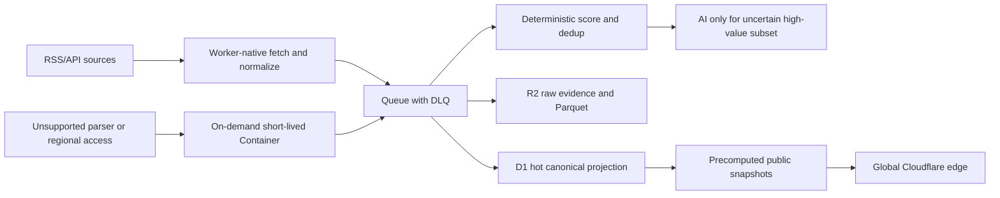

# News Sentry 项目健康、安全与低成本全球化审计

> 审计时间：2026-08-01
> 仓库基线：`main@83efaaa74d6c4c1ba0e4a944e7fd1ceb29cd8299`
> 总体结论：**58/100 — 公开面可服务，但连续采集与数据可信度不合格**
> 机器可读评分卡：[2026-08-01-project-scorecard.json](./2026-08-01-project-scorecard.json)

> 2026-08-02 更新：本地 `dev-xu/fix/cloudflare-persistent-runtime` 已补 Phase 2 Task 4 的
> preview-safe preflight/receipt、显式 scheduler mode、worker-native collect 禁用、
> UTF-8 quarantine payload 边界和 partial migration runbook。该更新未部署生产；
> 72h canary、7d SLO、Cloudflare 费用和真实 Queue/D1 receipt 仍未开始。

## 1. 范围、方法与限制

本轮覆盖：

- 当前分支、版本、工作树、文档真相源和未合并工作。
- Python、React/Vite、Cloudflare Worker/D1/Container、GitHub Actions 的质量门禁。
- 生产与 preview 的公开端点、SEO/GEO、Access 保护、实时性能、采集新鲜度和 Source Health Audit。
- 全部分值口径、运行时阈值、Breaking 分值和生产公开样本。
- HTTP、SQL、文件、URL、SSRF、HTML、WebSocket、YAML、CI shell、LLM prompt、身份 header 和供应链注入面。
- Cloudflare/GitHub 当前官方价格口径下的低成本全球化路线。

证据分为三类：

- **已确认**：本轮命令、测试、公开端点或代码数据流直接证明。
- **条件性风险**：代码存在危险信任关系，但线上配置或额外前提可能缓解。
- **待验证**：缺 Cloudflare 正确账户只读状态、日志或账单，不能从仓库推断。

Codex Security 深扫在移除旧 `agents.max_threads` 配置后通过 preflight 并开始执行，scan id 为 `c51b0377-d1ff-437f-8493-9c1d8ac4b0a0`。协调器在 discovery 阶段被平台网络安全策略终止，最终状态为 `failed`；一个完成的 worker 对 14,392 个工作表路径做了字节读取和热点索引，但没有经过协调器归并与集中验证。因此，本报告只采用经过本轮人工复核的数据流，不把插件的未完成候选直接视为漏洞。

静态工具限制：Semgrep CLI 未安装，GitHub code/secret scanning 未启用或当前令牌不可读，Python 依赖审计未新增临时依赖执行。已执行仓库敏感数据扫描、publication hygiene、硬编码 target 检查和 npm 官方 registry 审计。

## 2. 项目进度与事实基线

### 2.1 当前版本

| 项目 | 结果 |
|---|---|
| 本地/远端主线 | `HEAD == origin/main == 83efaaa...` |
| 最近提交 | 2026-07-02，合并 PR #48，apex API Worker route |
| 描述版本 | `v2.0.0-rc3-198-g83efaaa` |
| Release 状态 | HEAD 未打 release tag；“当前就是 rc3 tag”已过时 |
| Preview | `d65445b...`，与 main 双向均非祖先，已经分叉 |
| Draft PR | #49 `codex/news-value-latent-model` 仍开放，checks cancelled |
| 动态状态文档 | main 原先没有 `docs/status.md`；本轮已建立 |

现有 `docs/architecture.md`、AGENTS 的测试数、source 数和 release 描述存在不同程度漂移。以后动态事实只在 `docs/status.md` 更新，避免把易变计数复制到架构规范。

### 2.2 工程质量

| 检查 | 结果 | 判断 |
|---|---|---|
| 后端 pytest | 5,158 passed、27 skipped、157 deselected | 通过 |
| 覆盖率 | 85%，18,057 statements / 2,666 misses | 通过当前基线 |
| ruff | `All checks passed` | 通过 |
| mypy CI 口径 | 142 个源文件零问题 | 通过 |
| `./check.sh --frontend` | 4/5；本地 strict mypy 因 PIL/pywebview 可选依赖缺失失败 | 脚本不完全 hermetic |
| Public frontend | 9 files / 139 tests；lint/build 通过 | 通过 |
| Admin frontend | 3 files / 68 tests；lint/build 通过 | 通过 |
| 敏感数据 | 未发现 | 通过 |
| Publication hygiene | 无禁止跟踪路径 | 通过 |
| Target 硬编码 | 未发现意大利专用硬编码 | 通过 |

测试虽然全绿，仍有 5 条警告：Starlette TestClient deprecation、重复 OpenAPI operation ID，以及 3 次 `aiosqlite` worker thread 在 event loop 关闭后回调。这些不推翻通过结论，但说明异步资源清理仍有尾部风险。

两个前端的 `npm audit --omit=dev` 均报告 3 个 high package：`geist@1.7.2` 传递引入 `next@16.2.9`、旧 `postcss` 和 `sharp@0.34.5`。当前应用是 Vite 静态 SPA，没有发现 Next.js Server Actions、middleware 或 image optimizer 的可达运行面，因此不能按“线上已可利用 high”处理；最小修复是移除为了字体引入的 `geist` 运行时包，改用已打包的字体文件或纯 CSS。

## 3. 远端健康与持续性

### 3.0 本地整改进展（不改变远端分值）

- Worker runtime 配置新增 `SCHEDULER_MODE=legacy|shadow|queue` 与
  `WORKER_NATIVE_COLLECT_ENABLED=false`，缺失或非法组合 fail closed。
- 当前配置保持 `shadow`，`collection.authoritative=false`；Queue authoritative 还需要显式
  `NEWS_SENTRY_QUEUE_CUTOVER_RECEIPT`，真实 canary 后才能开启。
- 新增 `tools/cloudflare_deploy_guard.py`：部署前检查 Queue/DLQ、consumer、`d1_migrations`
  applied receipt 与 `wrangler.toml` 绑定；默认 verify-only，不盲目执行 `wrangler queues create`。
- 部署后 receipt 要同时校验 Worker version、deployment、health commit/version/mode、D1 migration 与 Queue preflight。
- 新增 `docs/deployment/cloudflare-phase2-migration-runbook.md`，明确 partial `ALTER TABLE ADD COLUMN`
  的预检和恢复方式。
- `import-staging.ts` 的 quarantine payload 截断改为真实 UTF-8 byte 口径，覆盖非 ASCII 大 payload。

这些是本地代码和 CI 治理改造，不等同于生产修复。生产仍需通过受控 workflow 重新部署并持续观测。

### 3.1 已确认健康项

- `api.news-sentry.com/api/v1/health` 与 apex `/api/v1/health` 均 200。
- 公开新闻、regions、facets、根页面、public app 均 200。
- production SEO/GEO 22/22 通过。
- `/api/v1/runtime/info`、`status`、`auth/*`、`admin/*` 均 403，未发现受保护控制面裸露。
- 最新 main Deploy run `28563362256` 成功，D1 migration、Worker、Pages 和 production verify 均通过。

### 3.2 不健康或未证明项

| 项目 | 证据 | 影响 |
|---|---|---|
| 采集停滞 | `latest_collected_at=2026-07-23T07:52:23.678529Z` | 审计时约 9 天未更新，新闻节点核心功能失效 |
| 健康语义失真 | 同一 health 仍返回 `status=ok` | 外部探针会误判为健康 |
| 连续审计失败 | 7/6、7/13、7/20、7/27 四次 Source Health Audit 全失败 | 失败没有形成恢复闭环 |
| 最新信源质量 | 1,803 total；1,397 ok；98 failed；147 rate limited | ok 仅 77.48% |
| 性能门禁 | featured/all/bootstrap/facets 多项 warm median/p95 失败 | 缓存命中仍慢，全球体验不可预测 |
| Cloudflare 状态 | deployed surface 唯一 blocker 为 `cloudflare-state-unavailable` | Access/WAF/routes/worker state 不能闭环证明 |
| Live commit | 响应中没有 `x-news-sentry-deploy-commit` | 无法把线上内容精确绑定到 SHA |
| Preview | 最新 Deploy 失败且与 main 分叉 | 不能作为受验证的快进发布源 |

最新信源状态占比：

- ok：77.48%
- degraded：4.27%
- failed：5.44%
- rate limited：8.15%
- temporary unavailable：4.66%

最差 target 包括 Indonesia 38.10%、Algeria 50%、Israel 50%、Middle East 57.14%、Egypt/Iraq/Turkey/UN System 60%。全球节点不能只看总量，必须按 target/source tier 建立局部 SLO。

当前 Source Health workflow 用 `max_failed=0` 审计 1,803 个外部网络引用，任何一个永久失败都会让整条 workflow 红灯。这个门禁太脆弱，既不能表达趋势，也容易长期告警疲劳。应改为：绝对失败上限 + 健康率 + 相对前一周期退化幅度 + P0 信源零容忍的组合门禁。

## 4. 全部分值口径与生产表现

### 4.1 契约和实现状态

| 分值/阈值 | 量纲 | 实现状态 | 评估 |
|---|---:|---|---|
| `news_value_score` | 0–100 | Pydantic/Schema/过滤/研判/存储/前端均落地 | 主分值，但生产高分饱和 |
| `china_relevance` | 0–100 | 模型和研判落地，公开面主要投影为高/中/低标签 | 缺公开校准分布和 target-relative 语义 |
| `sentiment_score` | -1.0–1.0 | 模型与 I/O 边界校验 | 唯一合法非 0–100 分值；缺线上校准证据 |
| `JudgeResult.confidence` | 0–100 | Pydantic 落地；规则取 classification confidence，AI 默认 50 | 没有“预测置信度 vs 实际准确率”回归 |
| `NLP.sentiment_confidence` | 0–100 | Pydantic 落地 | 没有线上分布/校准收据 |
| `Entity.relevance` | 0–100 | Pydantic 落地 | 语义明确，实体存储另有 mention confidence |
| classification confidence | 0–100 | L0/L1/L2 规则计算并进入 metadata | 规则命中率不等于真实分类概率，应避免误解 |
| translation confidence | 0–100 | Schema 落地，属于模型自评 | 只能做风险信号，不能当准确率 |
| `source_credibility` | 0–100 | canonical 文档存在；公开投影读取 metadata | 与配置 `credibility_base: 0.0–1.0` 双尺度并存 |
| `ValueDimension.score/weight` | 0–100 / 百分比 | 规范和旧设计存在，当前核心 NewsEvent 未作为一等字段实现 | 应明确废弃、metadata 化或正式落地 |
| `priority_threshold` | 0–100，默认 70 | canonical 文档声明；当前 config/src 未发现显式运行时字段 | 文档与运行时漂移 |
| filter `score_threshold` | 0–100 | 81 个实际 target 均为 30；模板 target 无实际 filter | 统一阈值简单，但缺 target 校准 |
| RulesJudge 决策阈值 | 80/60/30 | `>=80 publish`、`>=60 review`、`<30 discard` | recommendation 不是自动外发授权，但名称易造成误解 |

`credibility_base` 是 0–1 比率，而 canonical 明确禁止新建 0–1 的置信度/相关性字段。即使二者技术上是不同层级，名称和转换边界仍会造成系统性误用。建议改名为 `credibility_ratio`，或存储时统一乘 100 并记录 version。

### 4.2 Breaking v1

Breaking deterministic score 使用 8 个维度，权重合计 100：

- impact scope 22
- urgency 16
- novelty 15
- source reliability 12
- actionability 11
- systemic/cross-border 10
- human attention 8
- evidence confidence 6

惩罚维度为 duplicate 10、routine 12、sensationalism 8、thin evidence 10。当前代码标签阈值：`flash >=85 && confidence>=70`、`breaking >=72 && confidence>=60`、`watch >=52`、其余 timeline。

设计优点：有 evidence/duplicate/thin-evidence 对抗项、边界 clamp、版本字段和高分失败检查。主要缺口：

1. LLM validation 只校验 label 是否属于枚举，没有强制 label 与 score/confidence 阈值一致。
2. D1 import 接受调用方传入的 breaking 字段，没有统一在 Worker 侧重算或验证跨字段不变量。
3. 公开 API 不返回 score version，无法判断历史数据由哪个算法生成。
4. 缺校准集、分位数和版本迁移策略。

### 4.3 生产样本

生产公开 API 每页上限 50。本轮分别读取普通流第一页和 featured 流第一页；这是产品展示样本，不是全库随机样本。

普通流 50 条：

- value score 最小 80、最大 100、平均 89.8。
- 17 条为 90–100，33 条为 80–89，没有低于 80 的记录。
- 50/50 的 `breakingScore == valueScore`。
- 0/50 有 breaking label、confidence 或非空 dimensions。
- 47 条 china relevance 标签为低，3 条为中。
- 1 条发布时间为 2028-01-01，晚于审计时间。

Featured 流 50 条：

- value score 平均 97.6；44/50 为 100 分，明显饱和。
- 32/50 有 breaking label/confidence/dimensions；18/50 缺失。
- 32 条标签全部为 `watch`，confidence 全部固定为 70。
- 3 条 deterministic 记录为 `breakingScore=80, confidence=70, label=watch`，与当前阈值应为 `breaking` 不一致。

结论：现有分值适合做粗筛，但还不是可解释、可跨 target 比较、可长期校准的全球新闻排序。优先修复顺序应为“数据完整性 → 版本一致性 → 分布去饱和 → 人工反馈校准”，而不是再增加新分值字段。

本地未跟踪的 latent-value 模型以及 Draft PR #49 定义了 short/mid/long value、propagation、impact、uncertainty、domain percentile 等新分值，但尚未合并、部署或形成契约。本轮只记录其存在，不把它计入生产能力。

## 5. 注入面与安全结论

### 5.1 已确认或高置信风险

#### SEC-01：Cloudflare Access 身份只信任 email header

严重度：**High，配置相关；未确认线上绕过**

数据流：`Cf-Access-Authenticated-User-Email` → `hasAccessIdentity()` 只检查存在 → D1 import/write 或 Container proxy。

线上安全探测对 API subdomain 和 apex 分别发送无 header 与伪造 email header，四次均为 403，因此当前自定义域未被简单伪造绕过。问题在于代码不验证 `Cf-Access-Jwt-Assertion` 签名、issuer 和 audience；路由、preview、内部调用或未来配置漂移都可能使边缘缓解失效。

Cloudflare 官方要求即使 Access 位于 Worker 前方，Worker 仍应验证 JWT。参考：[Validate JWTs](https://developers.cloudflare.com/cloudflare-one/access-controls/applications/http-apps/authorization-cookie/validating-json/) 和 [Application token](https://developers.cloudflare.com/cloudflare-one/access-controls/applications/http-apps/authorization-cookie/application-token/)。

修复：Worker 侧 JWT 验签；固定 AUD；缓存 JWKS；拒绝只有 email header 的请求；保留生产非写入 canary。

#### SEC-02：Rules optimize target_id 可发生条件性路径逃逸

严重度：**Medium，需 write 权限与现存目标文件**

`RulesOptimizeRequest.target_id` 是裸字符串；endpoint 解析 `config/filters/{target_id}/default.yaml` 后没有做 slug 和 parent containment 检查；`dry_run=false` 且反馈匹配时会写回 YAML。

修复：复用 `_TARGET_SLUG_RE`；`resolve()` 后强制位于 filters 根；加入 `../sandbox`、绝对路径、编码 traversal 回归测试。

#### SEC-03：不可信事件 URL 直接进入 public/admin anchor

严重度：**Medium，外链/钓鱼；未确认 javascript XSS**

import 只要求 URL 非空，public/admin 直接渲染 `href`。React 19 本轮 SSR 测试会把 `javascript:` 改写为阻断错误，但仍会输出 `data:` href；因此当前高置信影响是危险 scheme、钓鱼和开放跳转，不把它夸大为已确认 XSS。

修复：ingest 和 render 两层只允许 `http:`/`https:`；拒绝 control char、混淆 scheme、凭据 URL；统一 `safeExternalUrl()`。

#### SEC-04：间接提示词注入可影响评分与推荐

严重度：**Medium，情报完整性**

新闻标题/正文与 judge 指令处于同一 prompt；现有 sanitization 只截断和去控制字符，模型返回的合法 JSON 会直接写入 score、recommendation、translation、rationale 和 flags。当前没有证据证明模型输出能执行命令/SQL或绕过人工外发，但可以污染排序和审核优先级。

修复：把新闻内容标记为不可信 data；规则分与模型分分开存；模型只能提出候选；跨源证据、确定性规则和人工反馈做二次校验；对 adversarial article 建回归集。

#### SEC-05：Collector SSRF 控制缺 DNS 后地址验证

严重度：**Medium，条件性**

生产 `bounded_run` 和 `async_run` 会构造 `SandboxEnforcer` 并注入 RSS/API collector，Cloudflare profile 为 deny-by-default 且有 host allowlist，所以“生产完全没有 sandbox”的原始候选不成立。

残余风险：`check_network_host()` 只检查字符串 hostname/裸 IP，不解析 A/AAAA 后再次拒绝 private/link-local 地址；HTTP 请求也没有把已验证地址固定到连接。因此 allowlisted 域被接管、DNS rebinding、配置漂移或其他直接构造 collector 的调用方仍可形成 SSRF。远端 RSS/API 内容提供的二次全文 URL同样依赖这一控制。

修复：URL schema 限制；每次连接前解析并验证全部 IP；固定解析结果或使用受控 transport；重定向每跳复检；生产 collector 禁止 `sandbox=None`；敏感 header 不得跨 host。

#### SEC-06：前端传递依赖安全债

严重度：**Medium，当前未发现运行时可达**

官方 npm registry 报告 `next/postcss/sharp` 3 个 high package，来源是字体包 `geist`。修复方式是删除无必要的 Next 传递树，而不是在 Vite SPA 中升级和保留 Next。

### 5.2 待运行态验证

- Container internal task 仅比较 `X-News-Sentry-Internal-Task` 固定 header。仓库假设端口只能经 Durable Object binding 访问；必须用 Cloudflare 状态证明容器没有公网直达路径，或改为不可伪造的 service binding/随机 secret/mTLS。
- NewsSentry Cloudflare zone 的 Access application、audience、WAF、Worker routes、`workers.dev`、D1/R2 binding 和 Container instance 状态当前无正确账户只读证据。
- GitHub Actions 全部使用 major tag（如 `actions/checkout@v4`），没有固定 commit SHA；未发现 PR 输入进入高权限 shell，但供应链最小权限仍可加强。
- GitHub secret scanning 未启用；Dependabot alerts 当前令牌 403；这两项不能视为“零告警”。

### 5.3 已检查的负面控制

| 类别 | 结论 |
|---|---|
| D1/SQLite SQL 注入 | 查询使用 bindings/placeholders，动态片段来自代码 allowlist；未保留可达 SQLi |
| Shell/command 注入 | 生产 subprocess 和 source-health workflow 使用 argv/bash array；未发现请求字符串进入 `shell=True` |
| YAML/反序列化 | 使用 `yaml.safe_load`；未发现 pickle/不安全 YAML 链 |
| WebSocket | token gate；入站只处理精确 ping，未进入命令/SQL/HTML sink |
| React 文本 XSS | 未发现生产 `dangerouslySetInnerHTML`；React 文本默认转义 |
| SSRF redirect | collector 禁止自动 redirect，是有效但不充分的控制 |
| CORS | 生产 origin allowlist，`allow_credentials=false`；未发现 wildcard credential 组合 |
| Secrets | 本地敏感数据扫描通过；不等于远端 secret governance 已验证 |

## 6. 综合评分卡

评分采用 0–100，权重合计 100%。它不是“项目完成度”，而是当前作为持续全球新闻节点的可运营健康度。

| 维度 | 分 | 权重 | 加权分 | 理由 |
|---|---:|---:|---:|---|
| 公开面可用性 | 82 | 10 | 8.20 | 页面/API/SEO 正常，控制面受保护；性能门禁失败 |
| 数据新鲜度 | 25 | 15 | 3.75 | 约 9 天未采集，未来时间戳污染 freshness |
| 信源连续性 | 60 | 10 | 6.00 | 77.48% ok，四周连续失败，区域差异大 |
| 评分完整性 | 52 | 12 | 6.24 | 契约强，线上饱和、缺失、版本和标签漂移 |
| 软件质量 | 86 | 10 | 8.60 | 5,158 tests、85% coverage、前端/ruff/mypy 通过 |
| 安全控制 | 58 | 15 | 8.70 | 无确认 RCE/SQLi；存在 6 个主要边界缺口 |
| 部署治理 | 60 | 8 | 4.80 | main 回执成功；preview 分叉、CF state/live SHA 未闭环 |
| 可观测与恢复 | 45 | 8 | 3.60 | 有 receipt 工具，但 health 语义和自动恢复不足 |
| 全球化准备度 | 78 | 7 | 5.46 | 82 targets、多语言、全球边缘；信源质量未达一致 |
| 成本效率 | 55 | 5 | 2.75 | serverless 基础好，但 Container 调度可能常驻 |
| **总计** |  | **100** | **58.10** | **58/100** |

## 7. 超低成本全球节点架构

### 7.1 当前成本判断

Cloudflare 当前官方口径：

- Workers Paid 最低 $5/月，含 10M requests/月和 30M CPU ms；超出为 $0.30/M requests、$0.02/M CPU ms。静态资源请求免费。[Workers pricing](https://developers.cloudflare.com/workers/platform/pricing/)
- D1 Paid 含 25B rows read/月、50M rows written/月和 5GB；无数据传输费。[D1 pricing](https://developers.cloudflare.com/d1/platform/pricing/)
- R2 Standard 免费层含 10GB、1M Class A、10M Class B，公网 egress 免费。[R2 pricing](https://developers.cloudflare.com/r2/pricing/)
- Queues Paid 含 1M operations/月，超出 $0.40/M；一条成功消息通常约 3 次操作。[Queues pricing](https://developers.cloudflare.com/queues/platform/pricing/)
- Workers AI 每日 10,000 neurons 免费，超出 $0.011/1,000 neurons。[Workers AI pricing](https://developers.cloudflare.com/workers-ai/platform/pricing/)
- AI Gateway 核心分析、缓存和限流免费，并支持 spend limit。[AI Gateway pricing](https://developers.cloudflare.com/ai-gateway/reference/pricing/)
- GitHub 公共仓库使用标准 GitHub-hosted runner 的 Actions minutes 免费，但 artifact storage 仍有配额。[GitHub Actions billing](https://docs.github.com/en/billing/concepts/product-billing/github-actions)

当前 Worker 有 196 次 cron trigger/天，其中 collect 每 15 分钟、translation 每 30 分钟都会访问同一个 Container；Container `sleepAfter="30m"`，因此健康运行时很可能一直被下一次 trigger 唤醒，无法 scale-to-zero。

按一个 `basic` 实例、30 天持续保持运行估算：

- Memory：`(720 - 25) GiB-hour × 3600 × $0.0000025 ≈ $6.26`
- Disk：`(4 × 720 - 200) GB-hour × 3600 × $0.00000007 ≈ $0.68`
- 加 Workers Paid $5：在 CPU、日志、AI 和网络前约 **$11.93/月**。

这是配置推算，不是账单。实际费用仍需 Cloudflare billing receipt。若出现第二实例或 Container 长时间高 CPU，费用会上升。[Containers pricing](https://developers.cloudflare.com/containers/pricing/)

### 7.2 推荐目标架构

核心原则：

1. **全球分发不等于全球部署数据库。** 先利用 Cloudflare edge + D1/R2；只有某些国家网络不可达时才增加受控区域 collector。
2. **Worker-native 优先。** RSS/JSON、去重、轻量规则、D1/R2 写入在 Worker 完成；Container 只承接 Python-only 解析、RSS-Bridge 或特殊正文提取。
3. **分层新鲜度。** P0 source 每 5–15 分钟，P1 每小时，长尾每 6–24 小时；不要让 82 targets 同频扫描。
4. **一次采集，多 target 投影。** Reuters/BBC/GDELT 等共享源只抓一次，再按 target/taxonomy 投影，避免 1,803 引用重复抓取。
5. **AI 是稀缺增强层。** 采集、初筛、去重、基础翻译优先本地规则/便宜模型；只对不确定且高潜力的 5–10% 事件使用 LLM。
6. **先 D1/R2，后重型平台。** 在 D1 rows、p95、R2 数据或研究查询明确超过阈值前，不引入 Kafka、Postgres、ClickHouse、独立向量数据库。
7. **费用是硬约束。** AI Gateway spend limit、Workers CPU limit、Queue backlog、Container 并发和 R2 lifecycle 都要 fail-closed。

### 7.3 成本目标

| 阶段 | 月度目标 | 架构边界 |
|---|---:|---|
| 恢复期 | `< $20` | 单一 Workers Paid account；一个按需 Container；D1/R2 免费包含量 |
| 早期全球节点 | `< $50` | Worker-native 主采集；Queues；AI 只处理小比例高价值事件 |
| 增长期 | `< $0.50 / 1,000 个有效事件` | 以有效事件而非请求数衡量，重复抓取和无效 AI 调用计入浪费 |

## 8. 系统性整改路线

### P0：0–48 小时，恢复事实生产

1. 读取正确 Cloudflare 账户的 `ops_state/ops_runs`、Cron、Container logs 和 billing，定位 7/23 后采集停止的首个失败点。
2. health 增加 freshness：P0 source 超过 30 分钟、全局超过 2 个 collect cycle 未更新时至少返回 `degraded`。
3. 拒绝或隔离 `published_at > collected_at + 6h`；公开 latest 只能使用通过时间校验的数据。
4. Worker 加 Access JWT 验证；保留无写入的线上 spoof regression。
5. Breaking import 增加 version、字段完整性和 label invariant；不合格记录进入 quarantine。

完成证据：连续 24 小时 collect cycle 成功、最新采集滞后低于 30 分钟、future-date count 为 0、伪造 header 为 403、Breaking invariant 100%。

### P1：3–14 天，建立持续性和安全基线

1. Source Health 从 `max_failed=0` 改为 SLO：P0 信源 100%、全局 ok ≥90%、failed ≤2%、周退化不超过 3 个百分点。
2. source 分 tier；共享源单抓取多投影；对 429 使用 host-level token bucket、Retry-After 和指数退避。
3. Worker-native 化 RSS/JSON 主路径；Container 合并 collect+translation 唤醒并缩短 sleep，目标是实际运行占比 <10%。
4. 统一 URL validator、DNS 后地址验证、redirect 每跳复检、敏感 header 跨 host 清理。
5. 修复 rules optimize containment、外链 scheme allowlist、internal task 不可伪造认证。
6. 移除 `geist → next` 传递树；GitHub Actions 固定 commit SHA；启用 secret scanning/Dependabot。
7. 修复重复 OpenAPI operation ID 和 aiosqlite 测试资源清理。

完成证据：连续两周 Source Health 绿色；npm production high=0；安全回归测试全绿；Cloudflare surface audit 有完整 state receipt。

### P2：15–45 天，修正评分和数据可信度

1. 发布 `score_contract_version`；所有分值记录 input features、version、confidence、provenance。
2. 统一 `source_credibility` 与 `credibility_base` 量纲，删除或重命名 0–1 字段。
3. 建 500–1,000 条跨地区、跨语言、包含慢热新闻和对抗文本的 calibration set。
4. 监控分布：100 分占比、缺失率、target percentile、label mismatch、Brier/ECE、precision@k、slow-burn recall。
5. Breaking 与潜在价值采用双榜；潜在价值模型先 shadow，不参与生产排序，直到回测超过现基线。
6. 模型输出不直接覆盖规则分；保留 rule/AI/human 三路 provenance。

完成证据：Breaking metadata completeness ≥99%、label mismatch=0、100 分占比 <15%、置信度 ECE ≤10%、人工 top-k 接受率连续四周改善。

### P3：45–90 天，形成全球低成本节点

1. D1 保持 hot canonical/event mention/projection；R2 保存 raw evidence 和冷归档；生命周期自动清理。
2. Queue + DLQ 承接 backpressure；按 source/target 隔离 poison messages。
3. 只在网络可达性或合规需要时增加区域 collector，使用短期 node credential 和签名上传，不开放 P2P。
4. 建立每 target 的 freshness、coverage、language、source diversity 和 cost/event 仪表盘。
5. 建立月度灾难恢复演练：D1 export、R2 restore、Worker rollback、credential rotation。

完成证据：全球 P0 freshness p95 <30 分钟、长尾 <6 小时、区域 healthy ≥90%、月成本符合阶段预算、恢复演练 RTO <2 小时。

## 9. 不应立即做的事

- 不应因为“全球化”立刻引入 Kafka、Kubernetes、ClickHouse、独立 Postgres 和多区域写入。
- 不应继续增加互相重叠的分值字段来掩盖校准问题。
- 不应把 `200 status=ok`、单次部署成功或测试全绿当成持续采集健康。
- 不应把所有 82 targets 以同一频率、同一深度扫描。
- 不应让新闻正文中的 LLM 输出直接决定自动外发、权限或不可逆动作。

## 10. 审计完成条件与剩余未知项

本轮已完成代码、质量、公开远端、分值样本和低成本架构的系统评估；以下仍必须由后续有正确只读权限的运行态审计关闭：

- NewsSentry Cloudflare zone/Access/WAF/routes/Container/D1/R2 的真实配置和当前账单。
- 7/23 后 collector 停止的第一个错误和是否仍在重试。
- 全库评分分布、score version 分布和历史回填范围。
- Python 生产依赖的独立 CVE/SBOM 审计。
- 实际 Container awake time、CPU、memory、disk 和 AI provider 花费。

在这些证据补齐前，可以称为“公开面在线”，不能称为“持续健康的全球新闻节点”。
