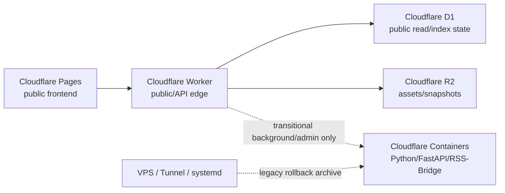

# News Sentry — 部署指南

> 版本: v2.1 | 日期: 2026-07-08
> 当前部署权威、分支 SHA 和验证状态见 `docs/status.md`。

## 当前原则

News Sentry 的生产路径按优先级分三层：



- 公开读路径：Cloudflare Pages + Worker + D1/R2。
- 过渡后台：Cloudflare Containers 承接尚未 Worker-native 化的 Python、FastAPI、RSS-Bridge 或管理任务。
- 本地开发：CLI、FastAPI、Docker Compose 都可以使用，但不代表生产权威。
- legacy 回滚：VPS、Tunnel、systemd 只用于紧急回退和历史诊断。

## 本地快速运行

```bash
python3 -m venv .venv
. .venv/bin/activate
pip install -e ".[dev,api,proxy]"

./run.sh doctor --target italy
./run.sh run --target italy --stage all
./run.sh serve --target italy
```

打开：

```text
http://localhost:8000/admin/
http://localhost:8000/public-app/
```

## 环境变量

最小本地配置：

```bash
export GEMINI_API_KEY=...
export DEEPSEEK_API_KEY=...    # optional
export GROQ_API_KEY=...        # optional
export NEWSSENTRY_API_KEY=...  # optional API auth
export HTTPS_PROXY=socks5://127.0.0.1:10808  # optional
```

Provider 免费额度池、备用 Key、预算兜底和禁用边界见：

- `docs/external-integration-strategy.md`
- `docs/specs/2026-07-03-ai-provider-free-capacity-and-paid-fallback.md`

## Cloudflare 验证

Worker 改动至少做 dry-run：

```bash
cd frontend/cloudflare
npx wrangler deploy --env="" --dry-run --outdir /tmp/ns-worker-dry-run --containers-rollout none
```

公开站部署或发布判断需要同时验证：

- live deployment commit header。
- public news API。
- runtime info 或 health endpoint。
- GitHub preview/main gate 状态。
- `docs/status.md` 中的分支和验证快照。

不要用本地 curl 成功替代公开站证明。

## Docker Compose 本地开发

```bash
export GEMINI_API_KEY=...
docker compose up -d
curl http://localhost:8000/api/v1/health
```

Docker Compose 用于本地和过渡诊断。它不是当前公开读面的默认生产路径。

## API 服务本地运行

```bash
pip install -e ".[api,proxy]"
./run.sh serve --target italy

curl http://localhost:8000/api/v1/health
curl -H "X-API-Key: $NEWSSENTRY_API_KEY" \
  "http://localhost:8000/api/v1/events?target_id=italy&page=1&page_size=20"
```

## Legacy Rollback Archive

以下方式只保留为历史回滚或故障诊断，不应作为新功能默认部署路径。

### systemd

```bash
sudo cp config/news-sentry.service /etc/systemd/system/
sudo systemctl daemon-reload
sudo systemctl enable --now news-sentry
sudo systemctl status news-sentry
```

### VPS Docker

```bash
docker build -t news-sentry .
docker run -d \
  --name news-sentry \
  -e GEMINI_API_KEY="$GEMINI_API_KEY" \
  -e NEWSSENTRY_API_KEY="$NEWSSENTRY_API_KEY" \
  -v /data/news-sentry:/app/data \
  -p 8000:8000 \
  news-sentry
```

### Cron

```bash
*/15 * * * * cd /path/to/NewsSentry && .venv/bin/python -m news_sentry.cli run --target italy --stage all --profile cloud-vps
```

使用 legacy 路径前必须在任务记录里说明：

- 为什么 Cloudflare 当前路径不可用。
- 回滚持续多久。
- 如何验证回到 Cloudflare 当前路径。

## 备份和诊断

```bash
bash tools/backup.sh /data/news-sentry
python tools/scan_sensitive_data.py
python tools/security_audit.py
```

健康端点：

- API 模式：`GET /api/v1/health`
- HealthServer 模式：`GET /health`
