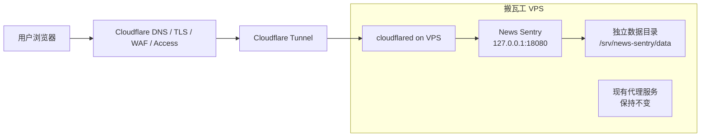

# 搬瓦工 VPS + Cloudflare Tunnel 候选部署假设

> 日期: 2026-05-31
> 状态: 候选假设，暂不实施
> 适用范围: News Sentry 第一阶段上线方案讨论

## 背景

当前有一台部署在加州的搬瓦工 VPS，已有代理服务在运行，但硬件资源占用较低。该服务器可作为 News Sentry 第一阶段上线的候选运行时，以复用现有硬件资源，并通过 Cloudflare 账号中的 `news-sentry.com` 域名提供访问入口。

该方案的前提是：不得影响服务器上已经存在的代理应用，包括端口占用、网络规则、系统服务、资源争用和日志/数据目录。

## 候选架构



建议入口链路为：

```text
news-sentry.com
  -> Cloudflare DNS / TLS / WAF / Access
  -> Cloudflare Tunnel
  -> VPS 上的 cloudflared
  -> 127.0.0.1:18080
  -> News Sentry FastAPI / Web UI
```

## 隔离原则

1. News Sentry 仅监听 `127.0.0.1` 的高位端口，例如 `18080`，不占用 `80/443`。
2. 不改现有代理服务的配置、端口、证书、iptables/nftables 规则和 systemd 单元。
3. 使用独立系统用户，例如 `newssentry`。
4. 使用独立目录，例如 `/opt/news-sentry`、`/srv/news-sentry/data`、`/var/log/news-sentry`。
5. Cloudflare Tunnel 仅通过出站连接暴露 News Sentry，不要求 VPS 开放新的入站端口。
6. 第一阶段优先运行 `core` / API + Web UI 能力；浏览器/OpenCLI/full 镜像能力需在资源评估后再启用。
7. 必须显式设置 `NEWSSENTRY_DEPLOYMENT_ENV=vps`、`docker` 或其他非 `local` 值，避免 Tunnel 反代到 localhost 后触发本地免登录逻辑。

## Cloudflare 分工

Cloudflare 在该方案中承担入口层和防护层，而不是第一阶段主运行时：

- DNS: `news-sentry.com` 与可选 `www.news-sentry.com` 指向 Tunnel。
- TLS: 使用 Cloudflare 边缘证书，VPS 不直接暴露公网 HTTPS。
- WAF: 先启用基础托管规则和速率限制。
- Access: 第一阶段建议只允许授权用户访问，待公开门户稳定后再拆分公开页与管理后台。
- Tunnel: 将公网 hostname 映射到 VPS 本机服务。
- 后续: 可逐步接入 R2 备份、Pages 静态公开页面、D1/R2 云原生存储。

## 风险与缓解

| 风险 | 影响 | 缓解 |
| --- | --- | --- |
| 误占现有代理端口 | 代理服务中断 | News Sentry 只绑定 `127.0.0.1:18080`，部署前检查 `ss -lntup` |
| Docker 修改网络规则 | 影响代理转发 | 若服务器代理依赖复杂 iptables，第一阶段优先考虑 venv + systemd，而非 Docker |
| 资源争用 | 代理延迟升高或 News Sentry OOM | 初期限制 CPU/内存，先跑 core 模式，观察 72 小时 |
| 本地免登录误触发 | 公网访问绕过认证 | 显式设置非 local 部署环境，并使用 Cloudflare Access |
| 数据未备份 | SQLite、drafts、logs 丢失 | 数据目录独立，后续同步到 R2 或 VPS 快照 |
| 加州节点到欧洲信源延迟 | 采集耗时增加 | 接受为第一阶段折中；后续可拆欧洲采集节点 |

## 第一阶段成功标准

- `news-sentry.com` 可通过 Cloudflare 访问 News Sentry Web UI。
- 现有代理服务端口、进程和转发行为不变。
- VPS 不新增公网入站端口。
- News Sentry 有独立数据目录和日志目录。
- API 认证、Cloudflare Access 或等价访问控制生效。
- 运行 72 小时后无 OOM、无代理服务异常、无磁盘快速膨胀。

## 暂不实施事项

- 不创建 Cloudflare Tunnel。
- 不修改 Cloudflare DNS。
- 不改 VPS 防火墙、反向代理或现有代理应用。
- 不启动 News Sentry 服务。
- 不迁移数据到 R2/D1。
- 不将该方案写成 ADR；它仍是后续架构比较的候选项。

## 后续讨论入口

后续可将该候选方案与以下路线继续比较：

1. Cloudflare-native: Workers / Containers + D1 + R2。
2. Netlify-fronted: Netlify 静态前端 + 外部 News Sentry API。
3. VPS hybrid: VPS 跑完整采集，Cloudflare 只做入口、防护、备份和静态公开页。
4. Multi-node: VPS 作为 browser/OpenCLI 节点，Cloudflare 或其他平台运行 API/core。
