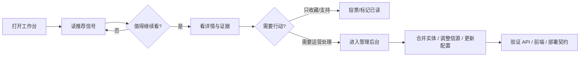

# 极简操作工作台审计与改进计划（2026-07-08）

本文件记录一次从“若无必要，勿增实体”出发的产品、前端、API、文档协同审计。目标不是把 News Sentry 改成更复杂的“全能控制台”，而是让人和 Agent 都能用更少概念完成同一件事：

> 发现重要新闻，判断是否值得继续看，进入行动或复核。

## 设计原则

1. **先读信号，再管系统**：公共站第一屏服务读者，管理动作放到次级入口。
2. **一个动作只出现一次**：筛选、排序、更新、合并、投票等动作不要在多个控件里重复表达。
3. **显示人的语言，隐藏内部公式**：可以保留 `hnScore`、`breaking_score`、`pipeline_stage` 等内部字段，但 UI 默认说“推荐分”“突发分”“最新”。
4. **分数列表不伪装成时间线**：`top` / `breaking` 是分数驱动，没有稳定 cursor；`recent` 才支持“加载更早/轮询更新”。
5. **Agent 文档用自然语言，但保留机器边界**：流程图和短句优先；字段名、命令、状态机必须精确。

## 当前工作台模型

这个模型里，公共站和管理后台不是两个平行产品。公共站是“读和判断”，管理后台是“修正系统输入与索引”。凡是不服务这两件事的入口，都应该降级、合并或删除。

## 明显不足

### 1. 公共站入口过多

现状问题：

- 侧边栏同时呈现 `Breaking`、`All`、`Daily`、`Agent`、`Update`、`Sources`、`Subscribe` 等概念。
- 部分入口是读者任务，部分入口是运营任务，混在同一层会提高学习成本。
- `Update` 页面暴露 API / source 更新语义，像管理工具，不像公共阅读工具。

改进方向：

- 第一层只保留“新闻哨兵 / 新闻纵览 / 新闻日报”三类阅读入口。
- `Agent`、`Update`、`Sources`、`Subscribe` 降为底部工具或二级菜单。
- `Update` 公共页改为只读“更新日志/同步状态”，写操作移回 admin。

本轮已修复：

- 公共侧边栏和移动底部导航只保留“新闻哨兵 / 新闻纵览 / 新闻日报”。
- `Agent`、`Update`、`Sources`、`Subscribe` 已收进辅助工具栏。
- 公共 `Update` 页移除了 API 数据源输入、保存和重置控件，只保留刷新时间与版本状态。

### 2. 筛选与排序重复

现状问题：

- `ReaderControls` 和 `FilterPanel` 都能表达筛选。
- `SortTabs` 与路由状态曾经脱节：UI 默认推荐排序，但 API 仍可能请求 recent。
- 分数驱动列表曾经继续暴露 cursor，容易让前端、测试和 Agent 误以为可以稳定分页。

本轮已修复：

- `sortMode` 进入路由和请求状态，默认推荐排序会发送 `sort=top`。
- featured 为空时 fallback 到 all-news 也继承当前排序。
- `top` / `breaking` 不再暴露 `nextCursor` / `latestCursor` 语义，轮询更新归属 `recent`。

后续改进：

- 顶部只保留常用筛选 chip；高级筛选只在抽屉中出现。
- 所有筛选结果页统一使用同一套空态、加载态、返回态文案。

### 3. 内部实现名外泄

现状问题：

- 公共 UI 曾直接使用 `Hacker News`、`hnScore`、`points`、`Top/Recent/Breaking`。
- 对读者而言，这些词解释了实现，而不是解释“我现在该怎么读”。

本轮已修复：

- 排序 Tab 改为“推荐 / 最新 / 突发”。
- 行内分数改为“推荐分”，不再展示公式词。
- 首页高价值列表改为“推荐新闻 / 推荐排序”。

后续改进：

- TypeScript/Python 内部仍可保留 `hnScore` 字段，但文档应明确它是内部推荐排序分，不是产品名。
- 面向 Agent 的文档要避免“学习 Hacker News”成为目标，改成“采用时间衰减推荐排序”。

### 4. 管理后台默认任务不明确

现状问题：

- Admin 默认入口偏资源对象：targets、sources、events、entities 等。
- 对运营用户来说，真实任务通常是“今天有哪些需要处理”“哪些信源坏了”“哪些实体要合并”。
- Entity 合并确认曾经总是合并搜索结果第一项，而不是用户实际点击项。

本轮已修复：

- Entity 合并确认绑定用户选择的 source entity，避免误合并第一条搜索结果。

后续改进：

- Admin 默认页从 `targets` 改为“今日工作台”。
- 左侧导航按任务分组：`今日处理`、`信源维护`、`实体整理`、`系统状态`。
- 表单用自然语言标签；内部字段名只保留在调试视图或 tooltip。

### 5. 公共 API / Worker 契约不一致

现状问题：

- Python public API 已扩展推荐分和投票字段，但 Cloudflare Worker contract 曾缺少对应字段。
- Worker feed 曾只按 recent/featured 思路处理，缺少 `sort` 参数和 score-driven 语义。
- Vote endpoint 曾允许对任意 event id 写投票，缺少“必须是公开可见事件”的边界。

本轮已修复：

- Worker `PublicNewsItem` contract 增加 `hnScore`、`points`、`gravityAgeHours`、`voteCount`。
- Worker feed 支持 `sort=top|recent|breaking`，score-driven 模式不返回 cursor。
- Python vote/unvote 在写入前先通过 public item lookup 确认事件可见。
- 投票 event id 增加格式限制，降低任意 id 写入面。
- IP 提取优先使用 Cloudflare / real IP / socket host，最后才回退 `x-forwarded-for`。

仍需处理：

- Worker 侧投票写路径还未落地；当前 Worker `voteCount` 是 0。
- 生产边缘必须明确可信代理头清洗策略，不能长期依赖任意客户端 header。

### 6. Agent 文档过重且口径漂移

现状问题：

- `AGENTS.md` 包含项目说明、运行规则、架构图、Phase 表、状态数字，体量过大。
- `README.md`、`AGENTS.md`、`docs/architecture.md` 中测试数、覆盖率、tag、schema 数存在历史漂移风险。
- 部署文档仍保留 VPS / systemd 等历史路径，容易让 Agent 误判生产权威路径。

改进方向：

- `AGENTS.md` 压缩为“当前工作协议 + 必读权威文档 + 禁止事项”，目标少于 100 行。
- 新增或收敛到一个 `docs/status.md`，所有动态数字只在那里维护。
- 部署文档拆成 `Cloudflare production` 与 `legacy rollback archive`。
- 历史 Phase 表移入 archive，当前文档只保留“现在该怎么做”。

## 本轮已落地的修复

| 领域 | 修复 | 价值 |
| --- | --- | --- |
| 公共排序 | `sortMode` 进入 URL、API 查询和 fallback 查询 | UI 与 API 不再各说各话 |
| 分数分页 | `top` / `breaking` 不再返回 cursor | 避免重复第一页和错误轮询 |
| 投票排序 | `sort=top` 批量读取投票数并参与排序 | 投票影响推荐，而不只是显示 |
| 投票边界 | vote/unvote 只允许公开可见事件 | 减少匿名写入滥用面 |
| Worker 契约 | Worker 支持 sort 和推荐字段 | Cloudflare 读面与 Python 读面收敛 |
| 前端文案 | `Top/Recent/Breaking` 改为“推荐/最新/突发” | 降低读者理解成本 |
| 公共导航 | 主导航收敛为三类阅读入口，低频说明入口移到辅助工具栏 | 首屏只服务“读新闻”任务 |
| Update 页面 | 移除公共页 API 数据源写控件 | 公共站只读，配置修改不混入阅读工作台 |
| Admin 合并 | Entity merge 使用用户实际选择项 | 修复高风险误操作 |
| 空 bootstrap | 空首屏数据不吞掉 all-news fallback | 保持首页兜底可用 |
| 缓存隔离 | public feed cache key 纳入 `data_dir` | 防止测试/多运行目录串数据 |

## 任务分解

### P0：保持当前修复可部署

状态：本轮已完成。

- 后端 public API 排序、投票、缓存隔离测试。
- public 前端排序、fallback、轮询语义测试。
- admin entity merge 类型检查。
- Worker dry-run bundle 验证。

验收：

- `tests/unit/test_public_handlers.py tests/unit/test_hn_ranking.py tests/unit/test_hn_ranking_integration.py tests/unit/test_voting.py` 通过。
- `frontend/public` tests 和 `tsc --noEmit` 通过。
- `frontend/admin` `tsc --noEmit` 通过。
- `wrangler deploy --dry-run` 通过。

### P1：公共站第一层减法

状态：本轮已完成。

目标：让第一次打开的人只看到阅读任务，不被维护入口打断。

任务：

- 将公共侧边栏缩减为“新闻哨兵 / 新闻纵览 / 新闻日报”。
- 将 `Agent`、`Update`、`Sources`、`Subscribe` 移到工具区。
- `Update` 公共页改为只读状态页；写入口从公共页移除。
- 为移动端底部导航同步同样信息架构。

验收：

- 首屏入口不超过 3 个主任务。
- 公共站没有“API / stage / target_id / page_size”这类调试文案。
- Playwright 截图检查桌面和移动端入口不重叠。

### P2：筛选与排序统一

目标：减少控件重复，让一次筛选只出现在一个地方。

任务：

- 顶部保留地区、议题、相关三个 chip row。
- 高级筛选只放进“筛选”抽屉。
- 搜索、日期、source 放入高级筛选；结果摘要用自然语言说明。
- Recent 才显示“加载更多/自动插入”；Top/Breaking 显示“推荐排序/突发排序”。

验收：

- 同一个筛选维度不在两个常驻面板里重复出现。
- 切换推荐/最新/突发时 URL、API 请求、列表排序一致。
- `top` / `breaking` 不出现“加载更多”或 cursor 状态。

### P3：Admin 任务化

目标：把资源列表后台改成操作工作台。

任务：

- 默认页改为“今日工作台”。
- 导航分组：今日处理、信源维护、实体整理、系统状态。
- Entity 页面突出“待合并候选”“近期高影响实体”“误合并恢复说明”。
- Source 页面突出“失败信源”“降级信源”“需补充翻译/摘要的队列”。

验收：

- 首屏能回答“今天先处理什么”。
- 每个列表项都有明确下一步：查看、合并、暂停、恢复、验证。
- 高风险动作都有确认文案，并明确不可撤销/可回滚边界。

### P4：Agent 文档瘦身

目标：让 Agent 读取少量自然语言就能行动，不被历史计划和实现名带偏。

任务：

- `AGENTS.md` 只保留工作协议、必读文档、生产边界、验证命令。
- `README.md` 保留产品定位和最短启动路径；历史 Phase 移入 archive。
- `docs/status.md` 成为动态状态唯一来源。
- `docs/deployment-guide.md` 拆为 Cloudflare 当前路径与 legacy rollback。
- `docs/external-integration-strategy.md` 移除历史修复叙述，改成当前准入规则。

验收：

- 新 Agent 只读 `AGENTS.md + docs/status.md + 当前任务相关文档` 就能开始。
- 文档中动态数字不重复维护。
- 部署路径不会让 Agent 把 VPS 当成生产权威。

### P5：投票与可信代理闭环

目标：把匿名投票从“本地 Python 可用”推进到 Cloudflare 生产一致。

任务：

- 为 Worker 增加 D1 vote 表读写路径。
- `voteCount` 从 D1 聚合，不再固定为 0。
- 明确可信代理头策略：只信 Cloudflare 注入头，忽略客户端伪造转发链。
- 增加生产速率限制和异常监控指标。

验收：

- Python API 和 Worker API 对同一事件返回一致 `voteCount`。
- 未公开事件无法投票。
- 恶意 event id 不会创建投票记录。
- 文档说明匿名投票的隐私边界、去重窗口和滥用限制。

## 输出文案规则

给人看的文案：

- 先说结论，再给证据。
- 用“推荐、最新、突发、来源、时间、相关”这类任务词。
- 避免展示实现名、字段名、公式名。

给 Agent 看的文案：

- 字段名必须精确，但要先解释业务含义。
- 每个流程说明都包含输入、输出、失败边界、验证命令。
- 遇到历史/当前并存的路径，必须明确哪个是当前权威，哪个是 archive。

## 后续停止条件

本计划不是无限重构许可。每个阶段达到验收项后停止，进入验证和提交。新增抽象、依赖或大面积改名，必须能删除更多复杂度或减少真实误操作，否则不做。
