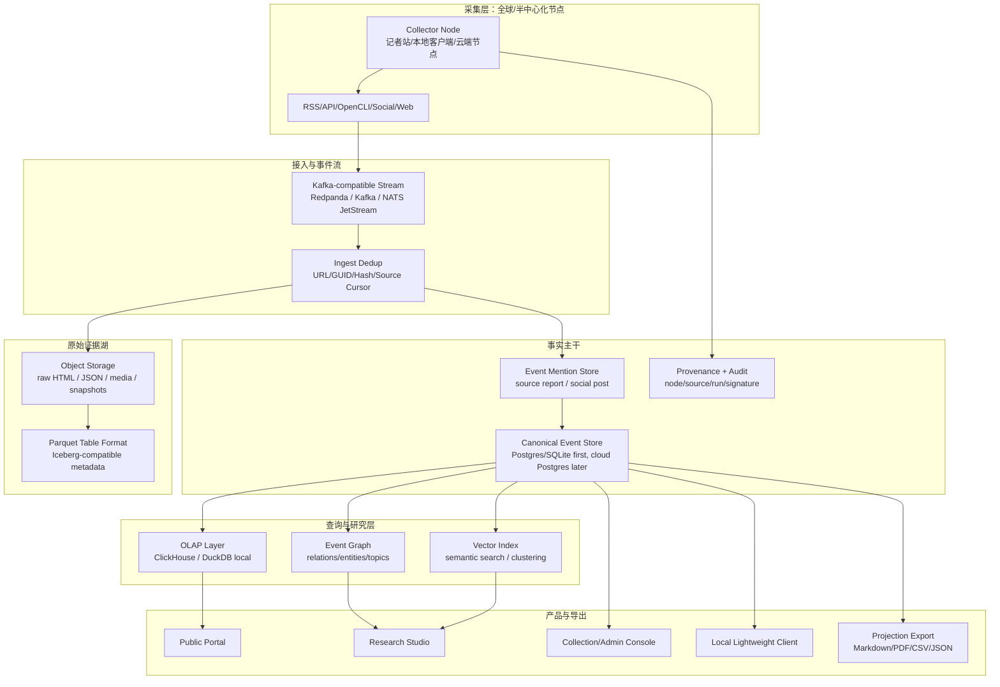

# News Sentry 全球规模新闻情报平台技术架构设计

> 日期：2026-05-30
> 状态：长期方向设计稿
> 关联文档：
> - `docs/superpowers/specs/2026-05-30-global-intelligence-platform-business-architecture-design.md`
> - `docs/superpowers/specs/2026-05-30-shadow-canonical-data-spine-design.md`
> - `docs/superpowers/specs/2026-05-30-ai-provider-credential-governance-design.md`
> - `docs/performance-overhaul-design.md`

## 1. 背景判断

News Sentry 当前从单机新闻监控工具出发，早期采用大量 Markdown 文件承载事件、草稿和人审流转。这种设计适合原型阶段和 Obsidian 工作流，但不适合作为未来全球新闻、社媒、舆情和研究平台的 canonical 存储基础。

当前本地数据已经暴露出规模风险：

- `data/` 约 708M，其中 `data/italy` 约 654M。
- Italy 目录内约有 `raw/` 6808 个 Markdown、`archive/` 6409 个、`evaluated/` 5696 个、`drafts/` 2848 个。
- 当前 UI、分析、输出、历史扫描和人审草稿之间仍存在“文件即事实”的遗留假设。

如果未来扩展到全球国家、地区、语言、重点话题、社媒矩阵、专业研究工作台、本地客户端和企业告警，继续以 Markdown 文件作为主数据形态会导致：

- 文件数量快速膨胀，目录扫描、解析 frontmatter、去重和分页成本不可控。
- 同一个现实事件在 raw/evaluated/drafts/archive 中产生多份局部事实。
- 公开门户、研究工作台、本地客户端、告警系统各自读取不同文件视图，重新形成数据孤岛。
- 事件合并、拆分、关系链、引用溯源、权限隔离、审计、订阅和差量同步很难可靠实现。

因此，长期架构必须把 Markdown 从主存储降级为按需导出格式。

## 2. 核心结论

长期目标不是“把 Markdown 存得更好”，而是建立：

**Canonical Event Store + Raw Evidence Lake + OLAP Query Layer + Graph/Vector Research Layer + Projection/Export System。**

Markdown 的角色调整为：

- 不再默认生成海量事件 Markdown。
- 不再作为 pipeline 阶段间传递介质。
- 不再作为公开页面、分析页面、告警系统、研究工作台的主查询来源。
- 仅作为用户主动选择的导出格式：用户在某个新闻事件、简报、研究包或审核结果上点击“下载 Markdown”时即时生成。

这能保留 Markdown 对记者、编辑和 Obsidian 用户的价值，同时避免它成为平台规模化瓶颈。

## 3. 产品形态目标

成熟的 News Sentry 网站应分为四个产品面，而不是一个混合后台：

### 3.1 公开新闻情报门户

面向读者和订阅用户：

- 国家、地区、主题、行业、风险、实体、事件链入口。
- 快速浏览最新事件、精选事件、趋势、背景关系。
- 支持分享的事件详情页。
- 不暴露采集、运行、配置和技术诊断。

### 3.2 专业研究工作台

面向研究员、记者、编辑、分析师：

- canonical event 追踪。
- 多来源证据对照。
- 人工 merge/split。
- 事件链与背景关系。
- 标注、笔记、引用、简报、日报、研究包。
- 导出 Markdown/PDF/CSV/JSON，但导出不是存储事实。

### 3.3 采集与信源控制台

面向运维和采编管理员：

- target、source、collector node、source health、采集策略、失败诊断。
- 信源生命周期：active / degraded / dead / archived。
- 半中心化公共采集节点治理：节点准入、能力声明、地理覆盖、合规策略、采集质量。

### 3.4 平台与数据治理后台

面向技术管理员和组织管理员：

- AI Provider Key、平台访问 Key、Collector Node Credential 分离治理。
- 用户、团队、订阅、权限、审计。
- taxonomy、实体库、canonical graph、数据保留、备份恢复。
- 云端部署、区域节点、成本和配额管理。

## 4. 目标数据架构

### 4.1 Raw Evidence Lake

原始证据湖保存不可轻易重建的证据：

- RSS/API 原始响应。
- 网页快照、结构化抽取结果、可选正文快照。
- 社媒公开帖子和采集 metadata。
- 采集节点、时间、网络区域、工具版本、source ref。

建议以对象存储为基础，按日期、target、source、content hash 分区。结构化索引用 Parquet 表表达，长期可采用 Iceberg 这类开放表格式，获得 schema evolution、partition evolution、快照和多引擎读取能力。

### 4.2 Event Mention Store

`event_mention` 表示某个信源对某个事件的一次报道或提及。它是事实归并前的最小可追溯报道单元。

核心字段：

- `mention_id`
- `target_id`
- `source_id`
- `source_ref`
- `collector_node_id`
- `url`
- `canonical_url`
- `guid`
- `title_original`
- `title_translated`
- `language`
- `published_at`
- `collected_at`
- `raw_evidence_uri`
- `content_hash`
- `taxonomy`
- `entities`
- `news_value_score`
- `china_relevance`
- `provenance`

### 4.3 Canonical Event Store

`canonical_event` 表示现实世界中的同一个事实、事件或进展，不等于某一篇报道。

核心能力：

- 多语言、多信源报道归并。
- 稳定 canonical id。
- 事件时间、首次发现、最后更新。
- 事件状态：active / needs_review / merged / archived。
- 人工 merge/split 覆盖自动判断。
- 所有判断保留 provenance 和 confidence。

第一阶段可在 SQLite 中实现影子 canonical 表；进入云端后迁移到 Postgres 或兼容分布式 Postgres 的存储。关键是 schema 和写入语义先稳定，而不是立刻引入重型基础设施。

### 4.4 OLAP Query Layer

公开门户和分析页需要面向时间、分类、来源、地域、实体、评分做高频聚合。它们不应扫描 Markdown，也不应直接复杂查询事务库。

推荐路径：

- 本地/开发：DuckDB 读取 SQLite 导出或 Parquet。
- 云端/生产：ClickHouse 承载趋势、排行、分布、窗口聚合、订阅统计。
- 保留 canonical store 作为事实主写，OLAP 作为查询投影。

### 4.5 Graph + Vector Research Layer

研究工作台需要两类能力：

- Graph：事件关系、实体关系、source coverage、事件链、矛盾关系、背景关系。
- Vector：跨语言语义搜索、近似重复、聚类候选、主题发现。

第一阶段不需要引入独立图数据库。可以先用 relational tables 表示 `event_relation`、`entity_link`、`topic_cluster`，用向量索引作为候选召回层。人工确认结果回写为 canonical graph 的显式关系。

## 5. Markdown 新定位

Markdown 是投影，不是事实源。

### 5.1 默认行为

- pipeline 默认不再为每个事件写入 `drafts/{event_id}.md`。
- output 阶段默认写 canonical store、alert log、artifact record。
- 公开门户和研究工作台直接从 canonical/query layer 读取。

### 5.2 用户按需导出

用户可以在以下对象上触发 Markdown 导出：

- 单个新闻事件。
- canonical event 的多来源证据包。
- 研究笔记。
- 日报/周报/专题简报。
- 审核结论或反馈记录。

导出文件即时生成，可下载，也可复制到剪贴板或同步到 Obsidian。导出结果可选记录为 `research_artifact`，但不再反向作为事实输入。

### 5.3 兼容迁移

现有 Markdown 不删除、不强制重写。

迁移策略：

- 将历史 Markdown 作为 import/backfill 输入。
- 抽取 frontmatter、正文摘要、路径和 workflow state。
- 写入 `event_mention`、`research_artifact` 或 legacy reference。
- 新数据逐步改为 canonical-first，Markdown 只在用户导出时产生。

## 6. 采集与半中心化节点架构

长期可以采用“半中心化公共采集节点”模型，类似大型新闻集团/通讯社的全球记者站网络。

### 6.1 节点角色

- 云端核心节点：调度、存储、归并、查询、订阅、权限、结算。
- 区域采集节点：运行在所在国家/地区网络环境中，负责本地信源采集。
- 专业用户本地客户端：默认轻同步，可选择加入受控采集贡献。

### 6.2 准入与治理

为避免开放 P2P 带来的风险，第一阶段不做完全开放网络。

节点必须具备：

- node credential。
- 组织/用户归属。
- 采集能力声明。
- 地理和网络区域声明。
- source allowlist / policy。
- 版本和健康心跳。
- 签名上传和审计日志。

节点贡献的数据进入 raw evidence lake，并通过 provenance 标记。canonical 归并不信任单一节点，必须结合 source credibility、cross-source corroboration 和人工审核。

## 7. 低成本高性能技术路线

### 7.1 本地与早期云端

优先保持简单：

- SQLite：本地 canonical store、任务状态、节点状态。
- DuckDB：本地分析、Parquet 读取、轻客户端离线查询。
- Parquet：可交换、可压缩、列式分析。
- FastAPI + Vanilla JS：继续符合当前项目策略。

### 7.2 规模化云端

当数据量和并发超过单机后，再引入：

- Kafka-compatible stream：Redpanda 或 Kafka，用于采集事件流。
- Object Storage：S3/R2/MinIO，用于 raw evidence lake。
- Iceberg-compatible table metadata：用于大规模 Parquet 表管理和 schema evolution。
- Postgres：canonical transactional store、用户、权限、workflow。
- ClickHouse：高性能聚合、时间序列、趋势和分布查询。
- Vector index：语义检索和聚类候选。

这套组合的核心优点是：存储便宜，查询快，组件边界清晰，且可以从单机渐进迁移。

## 8. 迁移路线

### Phase A：当前系统止血

- run batch/delta 语义彻底落地。
- 禁止后续阶段全量重复扫描历史事件。
- alert history、drafts、archive 幂等。
- static build manifest、服务版本和运行记录可观测。

### Phase B：Shadow Canonical Spine

- 建立 `canonical_event`、`event_mention`、`event_relation`、`taxonomy_assignment`、`research_artifact`。
- 从当前 SQLite event_index 和 Markdown backfill。
- 页面开始优先读取 canonical projection。
- 保留旧文件作为历史证据，不再扩散为新事实源。

### Phase C：Markdown 降级为导出

- output 阶段默认不写 per-event Markdown。
- 新增 `GET /api/v1/events/{id}/export/markdown`。
- 新增 brief/research package Markdown export。
- 后台可配置“是否自动生成本地 Markdown 草稿”，默认关闭。

### Phase D：Raw Evidence Lake 与 Parquet

- 新采集原始响应写入对象存储或本地对象目录。
- 结构化 mention 和运行记录定期导出 Parquet。
- DuckDB 支持本地分析和客户端同步包。

### Phase E：云端可扩展查询

- canonical store 迁移到 Postgres。
- OLAP 投影进入 ClickHouse。
- 引入 event stream 和 projection workers。
- local client 通过 snapshot/delta sync 获取关注范围数据。

## 9. 关键边界与风险

### 9.1 不把 AI 当数据库

AI 用于抽取、归类、摘要、翻译、关系候选和研究辅助。事实存储、引用溯源、合并决策、权限、审计和删除策略必须由确定性系统管理。

### 9.2 不让导出污染事实层

Markdown、PDF、日报、简报和研究包都是 projection。它们可以记录为 artifact，但不能作为 canonical event 的唯一事实来源。

### 9.3 误合并比漏合并危险

全球新闻研究平台中，错误合并不同事实会破坏信任。自动归并必须保守，中置信进入人工审核。

### 9.4 半中心化不等于无治理

采集节点可以分布式运行，但凭据、准入、审计、source policy、数据签名和滥用防护必须中心化治理。

### 9.5 本地客户端必须避免数据孤岛

本地客户端的私有笔记、收藏和标注可以本地优先，但公共事实、canonical id、source refs、taxonomy 和事件关系必须与云端契约兼容。

## 10. 参考技术依据

- Apache Iceberg 官方文档强调表格式支持 schema、partition、snapshot、maintenance 和多引擎集成，适合管理长期演进的 Parquet 数据湖。
- ClickHouse 官方文档定位为高性能分析数据库，适合时间序列、分布、排行和趋势聚合。
- DuckDB 官方文档支持直接读写 Parquet，适合本地客户端和轻量分析。
- Redpanda 官方文档提供 Kafka-compatible client 接入，适合作为未来低运维事件流候选。

这些组件不是第一阶段必须全部引入。第一阶段最重要的是把数据契约和 Markdown 降级边界定清楚。

## 11. 成功标准

长期架构改造成功后，应满足：

- 新事件默认进入 canonical/mention store，而不是生成多份 Markdown。
- 公开门户、研究工作台、告警、日报、本地客户端读取同一套 canonical 数据契约。
- 用户仍可在任意事件或简报上按需下载 Markdown。
- 任意结论都能追溯到 source、URL、collector node、raw evidence 和处理批次。
- 同一新闻事实可跨语言、跨信源、跨 target 归并，并支持人工 merge/split。
- 趋势分析和分类统计不再依赖目录扫描。
- 本地轻客户端可用 DuckDB/SQLite/Parquet 快速读取关注范围数据。
- 半中心化采集节点可贡献本地网络内信源，同时被准入、凭据、审计和 provenance 约束。
