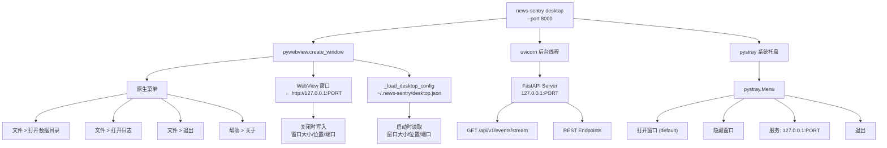
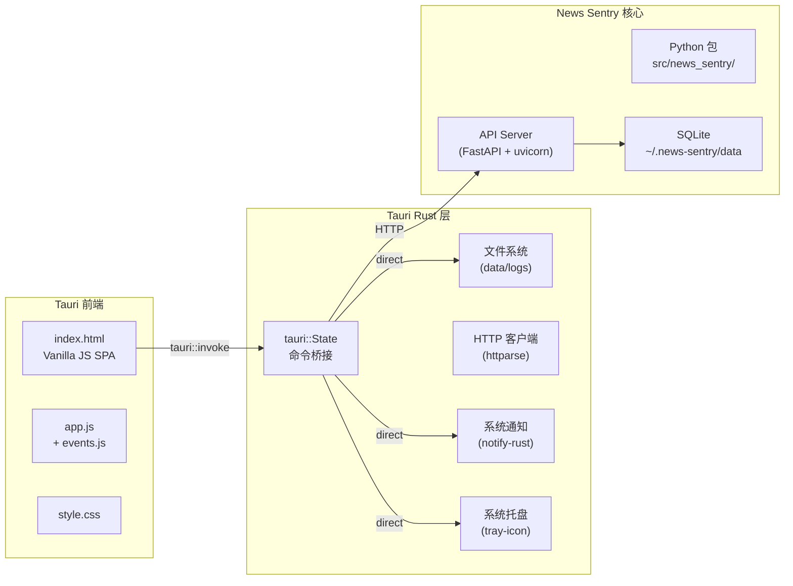

# 本地客户端架构

> 三阶段客户端演进路线（决策记录）

## 路线总览

```
Phase 1 (当前)          Phase 2 (短期目标)        Phase 3 (长期目标)
┌────────────────┐     ┌────────────────┐        ┌────────────────┐
│  Vanilla JS     │     │  pywebview 壳  │        │  Tauri 原生    │
│  SPA           │ ──► │  (本阶段)       │  ──►   │  客户端        │
│                │     │                │        │                │
│ 无构建步骤      │     │ 原生菜单/托盘  │        │ Rust 核心      │
│ Cloudflare部署 │     │ 配置持久化     │        │ 系统通知       │
│ 响应式布局      │     │ pystray 系统托盘│        │ 离线缓存       │
└────────────────┘     └────────────────┘        └────────────────┘
       2026.05              2026.06                  Q3 2026
```

## 当前状态 (Phase 2)

### 技术栈

| 组件 | 版本 | 用途 |
|------|------|------|
| pywebview | 6.2.1 | 原生 WebView 窗口 + 原生菜单 |
| pystray | 0.19.5 | 系统托盘图标 + 右键菜单 |
| Pillow | (bundled) | 托盘图标在线生成 |
| uvicorn | 0.47.0 | 本地 API 服务器 |
| FastAPI | (bundled) | REST + SSE 端点 |

### 已实现功能

- `news-sentry desktop` CLI 命令
- 原生菜单：文件（打开数据目录/日志/退出）+ 帮助（关于）
- 系统托盘：打开窗口/隐藏窗口/服务状态/退出
- 窗口关闭 → 隐藏到托盘（非退出）
- 配置持久化：窗口大小/位置/端口保存到 `~/.news-sentry/desktop.json`
- 服务器生命周期：后台 uvicorn 线程，退出时自动停止
- confirm_close 对话框

### 架构图



## 迁移到 Tauri (Phase 3)

### 为什么迁移

| 维度 | pywebview | Tauri |
|------|-----------|-------|
| 性能 | Python + WebView | Rust + 系统 WebView |
| 内存占用 | ~150-200MB | ~10-30MB |
| 打包 | pip install | 单二进制文件 (.app/.dmg) |
| 系统通知 | 浏览器 Notification API | 原生 Notification |
| 离线支持 | 依赖 Service Worker | Rust 本地存储 |
| 跨平台 | macOS/Windows/Linux | macOS/Windows/Linux |
| 自动更新 | 无 | built-in updater |
| 开发者体验 | 调试简单 | 需 Rust toolchain |

### 前置条件

```bash
# Tauri 依赖
brew install rustup   # 如未安装
rustup-init           # 安装 Rust

# 系统依赖 (macOS)
xcode-select --install

# 创建 Tauri 项目
npm create tauri-app@latest news-sentry-desktop
```

### 架构设计草案



### 迁移路线

```
Step 1: Rust toolchain 安装 + 项目脚手架
Step 2: Sidecar 包装 Python API Server
Step 3: 用 tauri::command 替代 pywebview 菜单
Step 4: 系统托盘用 tauri-tray-icon 替代 pystray
Step 5: 原生通知用 notify-rust 替代 Notification API
Step 6: 配置管理用 tauri::State 替代 desktop.json
Step 7: 自动更新用 tauri updater
Step 8: 二进制打包 (dmg/msi/deb)
```

### Sidecar 策略

Python 后端无法直接编译进 Tauri 二进制，需要 sidecar 模式：

```json
// tauri.conf.json
{
  "bundle": {
    "externalBin": ["binaries/news-sentry-server"]
  }
}
```

**打包方案：**
- macOS: `.dmg` 内含 Python 运行时的 `.app` bundle
- 或用 PyInstaller/Nuitka 将 Python API Server 编译为单二进制
- 更简洁的方案：用 `embedded-server` feature 把 Python 作为 sidecar 进程管理

### 风险与权衡

| 风险 | 缓解措施 |
|------|----------|
| Rust 学习曲线 | 先上手简单 tauri::command |
| Python 打包复杂度 | PyInstaller sidecar 或 Docker |
| 双进程通信开销 | 局部功能直接走 Rust 而非 HTTP |
| WebView 兼容性 | 对 macOS 优先 (WKWebView) |

## CLI 命令演化

```bash
# Phase 2 (当前)
news-sentry desktop                    # pywebview 壳
news-sentry desktop --no-tray          # 无系统托盘
news-sentry desktop --port 9000        # 自定义端口

# Phase 3 (未来 Tauri)
news-sentry desktop --tauri            # Tauri 原生窗口 (future)
news-sentry desktop install            # 安装为本地应用
news-sentry desktop uninstall          # 卸载
news-sentry desktop version            # 显示客户端版本
```

## 附录：pywebview 6.x API 备忘

```python
# 菜单构建
from webview.menu import Menu, MenuAction, MenuSeparator

Menu("文件", [
    MenuAction("打开", callback),       # 菜单项 + 回调
    MenuSeparator(),                     # 分隔线
    MenuAction("退出", quit_fn),
])

# 窗口事件
w = webview.create_window(...)
w.events.closing += on_closing     # 窗口关闭前
w.events.closed += on_closed       # 窗口关闭后
w.events.loaded += on_loaded       # 页面加载完成
w.events.shown += on_shown         # 窗口显示
w.events.hidden += on_hidden       # 窗口隐藏 (via w.hide())

# 系统托盘 (外部库 pystray)
import pystray
icon = pystray.Icon("app-name", image, "tooltip", menu)
icon.run()     # 阻塞，需后台线程
icon.stop()    # 停止
```
