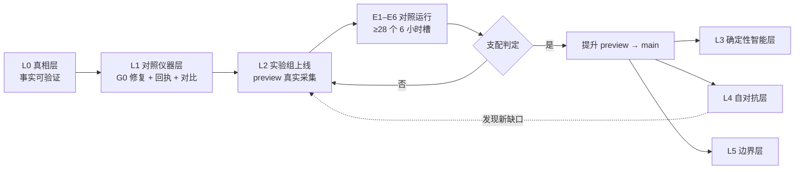

# 03 · 阶段总表（Phase Plan）

> **状态**：`DONE`（本文件为导航与状态总表，随阶段推进更新）
> **单一状态源**：各 `phases/*.md` 首部的 `> **状态**：` 行
> **矩阵为生成物**：由 `tools/spec_guard.py --render` 产出，**手改即 CI 红**

---

## §1 阶段总览

<!-- GENERATED:phase-matrix BEGIN -->
| 阶段 | 名称 | 状态 | 依赖 | 阻塞 |
|------|------|------|------|------|
| L0 | 真相层 | `DONE` | 无 | 无 |
| L1 | 对照仪器层 | `IN-PROGRESS` | L0（已完成） | 无 |
| L2 | 实验组上线 | `DECIDED` | L1 | 无 |
| L3 | 确定性智能层 | `DECIDED` | L2（提升完成后开始） | 无 |
| L4 | 自对抗层 | `DECIDED` | L2（提升完成后开始） | 无 |
| L5 | 边界层 | `DECIDED` | L2（提升完成后开始） | 无 |
<!-- GENERATED:phase-matrix END -->

**阶段划分的原则**：每一层都必须能被前一层**证伪**。
L0 让事实可信 → L1 让仪器可读 → L2 让实验可跑 → L3–L5 让结论可扩张。

---

## §2 依赖图

**关键**：L3/L4/L5 在**提升之后**开始，因为它们的前提是"新栈已在 `main` 上"。
L4 有权把发现的新缺口打回 L2——闭环不是直线。

---

## §3 对照实验矩阵（E1–E6）

完整定义见 [`02-engineering-baseline.md §3.3`](./02-engineering-baseline.md)。
此处仅登记状态（由 L2 阶段文档维护，进入 E 阶段后填写）：

| # | 假设 | 测量量 | 杀灭条件 | 状态 |
|---|------|--------|---------|------|
| E1 | Worker 10ms 内可完成单源采集 | CPU p99 分段计时 | p99 ≥ 10ms | 未开始 |
| E2 | 事件召回不劣于 Container | `recall = \|A∩B\|/\|B\|` | < 99.0% | 未开始 |
| E3 | 研判结果 bit-for-bit 一致 | digest 差异数 | > 0 | 未开始 |
| E4 | 前端可 0 依赖交付 | 制品 KB / node_modules MB | > 200KB / > 0 | 未开始 |
| E5 | 边际成本不增、总成本下降 | 账号级增量费用 | 增量 > $0 | 未开始 |
| E6 | 故障显式化 | 静默错误数 | > 0 | 未开始 |

**绝对地板（不可协商）**：E2 召回 ≥99.0%；E3 差异 =0；E1 p99 <10ms；E4 制品 <200KB 且 0 依赖；E6 静默错误 =0。
**对照组准入门槛**：对照组自身 source `ok` 率 ≥90%，否则实验无效，先修对照组。

---

## §4 当前焦点

**L1 进行中。** 入口状态（2026-09-19 实测）：

| # | 事实 | 影响 |
|---|------|------|
| 1 | ~~`main` 自 2026-08-20 起无法通过 Deploy 的 CI Gate（陈旧 `geist` 测试）~~ | ✅ **已解除**（L1.0） |
| 2 | ~~preview 配置渲染守卫因占位符碰撞失败（自 2026-08-05，45 天）~~ | ✅ **已修复**（L1.1）；preview 流水线全绿（run `35449872399`） |
| 3 | **KV-first 特性合并但从未激活**：生产与 preview 的 KV id 均为占位全零；Wrangler 不把 `kv_namespaces` 继承给命名环境，故 preview 无 KV 绑定；`deploy.yml` 零 KV 处理 | 非隔离缺陷（两轨当前同为 D1 兜底）。**待裁决是否激活** —— 见 `02 §2.7` |
| 4 | 全仓库无任何同时读取两个 D1 的对比工具 | L1.4 建设 |
| 5 | preview→main 无提升判据 | L1.6 建设（支配判定编码） |
| 6 | `docs/status.md` 声称生产 `ok`，实测 `degraded`（`projection_snapshot_pending`） | 活文档应与运行时事实同步 |

**L1 的退出条件**：`python tools/spec_guard.py --check` 通过 + preview 可部署 ✅ + 隔离哨兵证明通过。

---

## §5 阶段推进规则

### 进入条件

| 阶段 | 进入条件 |
|------|---------|
| L1 | L0 的验收命令全部通过（已完成） |
| L2 | L1 的 G0 修复生效，preview 能成功部署一次；隔离哨兵证明 PASS |
| L3/L4/L5 | 支配判定为"是"，且提升已完成 |

### 退出条件

| 阶段 | 退出条件 |
|------|---------|
| L0 | 生成物与提交物一致；旧体系已冻结；ADR-0029 已接受 |
| L1 | 见 §4 退出条件 |
| L2 | E1–E6 至少连续 28 个健康 6 小时槽位 |
| L3 | ECE ≤0.10 且 NDCG 不劣于基线；token 消耗下降 ≥90% |
| L4 | 故障矩阵全部显式分类，静默错误 = 0 |
| L5 | 单 HTML 制品 <200KB 且禁用 JS 仍可读 |

### 失败处置

- **可归因失败** → 修复后重跑本阶段（生产零影响）
- **不可归因失败** → 登记到 §6，并考虑是否需要新 ADR 推翻上层决策
- **30 天未达支配** → 自动降级为"部分提升"（只提升已独立证明的层），避免无限期悬置

---

## §6 阻塞登记

| # | 阻塞 | 影响阶段 | 解除条件 | 状态 |
|---|------|---------|---------|------|
| B1 | `main` 部署通道被陈旧测试阻断 | L1.0 | `geist` 测试修正后 CI Gate 通过 | 本次处理 |
| B2 | preview 渲染守卫占位符碰撞 | L1.1 | 结构化渲染 + 真实制品测试 | 待处理 |

**登记规则**：任何阶段若因外部条件无法推进，必须在此登记，
写明**解除条件**与**责任动作**。超过 7 天未解除的阻塞需上报一次。

---

## §7 历史阶段命名映射（消除旧体系的四套命名）

旧体系存在四套互不映射的阶段命名。本表是**唯一**映射，供阅读历史文档时对照：

| 旧命名 | 大致对应 | 说明 |
|--------|---------|------|
| `Phase 1–23` | 已完成的 v1.0 主线 | 见 `docs/roadmap/`（已冻结） |
| `Phase 44–88` | v1.7 → v2.0 期间的产品化 | 见 `docs/roadmap/public-news-productization-*.md`（已冻结） |
| `Phase P1–P10` | v2 重构（删除 OpenCLI、API 模块化等） | 已完成 |
| `Phase A / B1–B4` | 公开读快照 + TS 移植 + 写穿管道 | 已完成（B4 见 `docs/status.md`） |
| `M-12 ~ M-32` | 代码库质量收尾 | 已完成 |

**新工作一律使用 L0–L5 与 E1–E6**，不再新增字母/数字混合的 Phase 编号。
