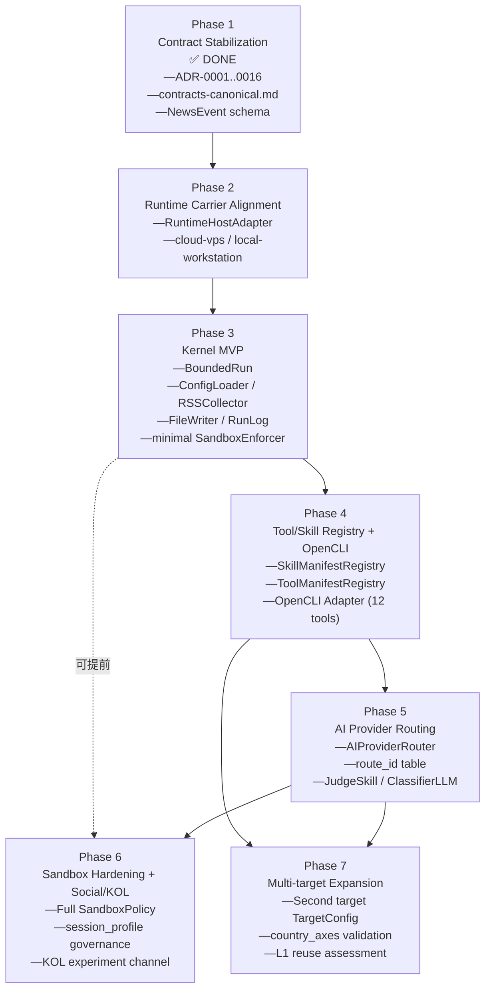

# News Sentry — 阶段 SPEC 索引

> 版本: v1.0 | 日期: 2026-05-09  
> 口径基准: [docs/contracts-canonical.md](../contracts-canonical.md)  
> 路线图主权文档: [docs/development-plan.md](../development-plan.md)  
> 架构决策记录: [docs/adr/README.md](../adr/README.md)

本目录为 News Sentry 七个开发阶段的详细 SPEC 文档索引。每份 SPEC 文件覆盖：目标与出口标准、内外范围矩阵、横切组件接口定义、配置契约、测试策略、验收清单和风险回退。

**使用原则：** SPEC 文件是"对 development-plan.md 的实现级细化"，不替代路线图，不创建新的口径，遇到字段命名争议以 [contracts-canonical.md](../contracts-canonical.md) 为准。

---

## 阶段索引

| Phase | 文件 | 核心目标 | 状态 |
|-------|------|---------|------|
| Phase 1 | [phase-1-contract-stabilization.md](phase-1-contract-stabilization.md) | 定稿所有核心契约，消除口径漂移 | ✅ DONE |
| Phase 2 | [phase-2-runtime-carrier-alignment.md](phase-2-runtime-carrier-alignment.md) | RuntimeHostAdapter、bounded run 入口协议 | 🔲 PENDING |
| Phase 3 | [phase-3-kernel-mvp.md](phase-3-kernel-mvp.md) | RSS/API 基线、文件事件闭环、最小 sandbox | 🔲 PENDING |
| Phase 4 | [phase-4-tool-skill-registry-opencli.md](phase-4-tool-skill-registry-opencli.md) | Skill/Tool registry、OpenCLI 12 条接入 | 🔲 PENDING |
| Phase 5 | [phase-5-ai-provider-routing.md](phase-5-ai-provider-routing.md) | 多 Provider 路由、翻译/研判 route_id | 🔲 PENDING |
| Phase 6 | [phase-6-sandbox-hardening-social-kol.md](phase-6-sandbox-hardening-social-kol.md) | 沙箱强化、社媒/KOL 实验通道 | 🔲 PENDING |
| Phase 7 | [phase-7-multi-target-expansion.md](phase-7-multi-target-expansion.md) | 第二国家 reference package | 🔲 PENDING |

---

## 阶段演进 Mermaid 图

---

## 横切组件 × 阶段矩阵

> 图例：`🟢 引入` = 该 Phase 首次定义或实现 | `🔵 使用` = 该 Phase 使用或扩展 | `—` = 本 Phase 不涉及

| 组件 | P1 | P2 | P3 | P4 | P5 | P6 | P7 |
|------|----|----|----|----|----|----|-----|
| **NewsEvent** | 🟢 引入 | 🔵 使用 | 🔵 使用 | 🔵 使用 | 🔵 使用 | 🔵 使用 | 🔵 使用 |
| **PipelineContext** | 🟢 引入 | 🔵 使用 | 🔵 使用 | 🔵 使用 | 🔵 使用 | 🔵 使用 | 🔵 使用 |
| **ConfigLoader** | — | — | 🟢 引入 | 🔵 使用 | 🔵 使用 | 🔵 使用 | 🔵 使用 |
| **BoundedRun** | — | 🟢 引入 | 🔵 使用 | 🔵 使用 | 🔵 使用 | 🔵 使用 | 🔵 使用 |
| **RSSCollector** | — | — | 🟢 引入 | 🔵 使用 | 🔵 使用 | — | 🔵 使用 |
| **APICollector** | — | — | 🟢 引入 | 🔵 使用 | 🔵 使用 | — | 🔵 使用 |
| **OpenCLICollector** | — | — | — | 🟢 引入 | 🔵 使用 | 🔵 使用 | 🔵 使用 |
| **RulesFilter** | — | — | 🟢 引入 | 🔵 使用 | 🔵 使用 | 🔵 使用 | 🔵 使用 |
| **ClassifierRules** | — | — | 🟢 引入 | 🔵 使用 | 🔵 使用 | 🔵 使用 | 🔵 使用 |
| **JudgeSkill** | — | — | — | — | 🟢 引入 | 🔵 使用 | 🔵 使用 |
| **MarkdownWriter** | — | — | 🟢 引入 | 🔵 使用 | 🔵 使用 | 🔵 使用 | 🔵 使用 |
| **SkillManifestRegistry** | — | — | — | 🟢 引入 | 🔵 使用 | 🔵 使用 | 🔵 使用 |
| **ToolManifestRegistry** | — | — | — | 🟢 引入 | 🔵 使用 | 🔵 使用 | 🔵 使用 |
| **SandboxEnforcer** | — | — | 🟢 引入（最小） | 🔵 使用 | 🔵 使用 | 🟢 强化 | 🔵 使用 |
| **AIProviderRouter** | — | — | — | — | 🟢 引入 | 🔵 使用 | 🔵 使用 |
| **RuntimeHostAdapter** | — | 🟢 引入 | 🔵 使用 | 🔵 使用 | 🔵 使用 | 🔵 使用 | 🔵 使用 |

---

## 关键 ADR 快查表

| ADR | 简要决策 | 影响的 Phase |
|-----|---------|------------|
| ADR-0001 | `pipeline_stage` 枚举（collected/filtered/judged/outputted）、`NewsEvent.id` 格式 | P1 锁定，全 Phase 约束 |
| ADR-0002 | `output_channels` → `output_result.destinations[].target` | P1 锁定，P3 实现 |
| ADR-0003 | SandboxPolicy `write_roots` 补全、`ToolRunResult.error.type` 枚举对齐 | P1 锁定，P3/P6 实现 |
| ADR-0004 | collect 阶段标题机译（`title_pre`）+ judge 阶段 canonical 翻译（`title_translated`）| P1 锁定，P3/P5 实现 |
| ADR-0005 | `pipeline_stage` 与 `workflow_state` 正交分离 | P1 锁定，P3 遵守 |
| ADR-0006 | CLI 入口暂缓，P3 前决策 | P3 必须解决 |
| ADR-0007 | PRD Open Questions 批量关闭 | P1 完成 |
| ADR-0008 | 外部项目只 install 不 vendor | P4 实现 OpenCLI 时约束 |
| ADR-0009 | 四层分类框架 L0–L3，写入 `metadata.classification` | P3 规则引擎，P5 LLM 分类器 |
| ADR-0010 | 永不做专用前端；Obsidian Markdown + 推送 | 全 Phase 约束 |
| ADR-0011 | 12 条 OpenCLI ToolManifest 骨架 | P4 实现 |
| ADR-0012 | Python 3.11+ 实现语言 | P3 起约束 |
| ADR-0013 | src layout，core/skills/adapters 三层结构 | P3 起约束 |
| ADR-0014 | JSON Schema 2020-12，存放 `schemas/` | P1 定义，P3 起验证 |
| ADR-0015 | 配置合并优先级：target → source → sandbox | P3 ConfigLoader 实现 |
| ADR-0016 | CLI `python -m news_sentry.cli run --target <id> --stage <stage> --profile <profile_id>` | P3 入口 |
