# News Sentry — 阶段 SPEC 索引

> 版本: v2.0 | 日期: 2026-05-11
> 口径基准: [docs/contracts-canonical.md](../contracts-canonical.md)
> 路线图主权文档: [docs/development-plan.md](../development-plan.md)
> 架构决策记录: [docs/adr/README.md](../adr/README.md)
> Phase 12 设计: [docs/superpowers/specs/2026-05-11-phase-12-source-matrix-design.md](../superpowers/specs/2026-05-11-phase-12-source-matrix-design.md)

本目录为 News Sentry 多阶段开发 SPEC 文档索引。每份 SPEC 文件覆盖：目标与出口标准、内外范围矩阵、横切组件接口定义、配置契约、测试策略、验收清单和风险回退。

**使用原则：** SPEC 文件是"对 development-plan.md 的实现级细化"，不替代路线图，不创建新的口径，遇到字段命名争议以 [contracts-canonical.md](../contracts-canonical.md) 为准。

---

## 阶段索引

### v0.1.0–v0.3.0 — 基础平台 ✅

| Phase | 文件 | 核心目标 | 状态 |
|-------|------|---------|------|
| Phase 1 | [phase-1-contract-stabilization.md](phase-1-contract-stabilization.md) | 定稿所有核心契约，消除口径漂移 | ✅ DONE |
| Phase 2 | [phase-2-runtime-carrier-alignment.md](phase-2-runtime-carrier-alignment.md) | RuntimeHostAdapter、bounded run 入口协议 | ✅ DONE |
| Phase 3 | [phase-3-kernel-mvp.md](phase-3-kernel-mvp.md) | RSS/API 基线、文件事件闭环、最小 sandbox | ✅ DONE |
| Phase 4 | [phase-4-tool-skill-registry-opencli.md](phase-4-tool-skill-registry-opencli.md) | Skill/Tool registry、OpenCLI 12 条接入 | ✅ DONE |
| Phase 5 | [phase-5-ai-provider-routing.md](phase-5-ai-provider-routing.md) | 多 Provider 路由、翻译/研判 route_id | ✅ DONE |
| Phase 6 | [phase-6-sandbox-hardening-social-kol.md](phase-6-sandbox-hardening-social-kol.md) | 沙箱强化、社媒/KOL 实验通道 | ✅ DONE |
| Phase 7 | [phase-7-multi-target-expansion.md](phase-7-multi-target-expansion.md) | 第二国家 reference package | ✅ DONE |

### v0.4.0 — 迭代改进 ✅

| Phase | 文件 | 核心目标 | 状态 |
|-------|------|---------|------|
| Phase 8 | Obsidian Ontology Sync | Obsidian 知识库与本体图双向同步 | ✅ DONE |
| Phase 9 | Karpathy Skills Integration | Karpathy 四原则 + 四心智模型 Skill | ✅ DONE |
| Phase 10 | Structured Logging + CLI Doctor | JSON 日志 + doctor 诊断命令 | ✅ DONE |
| Phase 11 | Trend Analysis | TopicTrend + TrendReport 趋势报告 | ✅ DONE |

### v0.5.0 — 信源矩阵与评估基线 ✅

| Phase | 文件 | 核心目标 | 状态 |
|-------|------|---------|------|
| Phase 12 | [phase-12-source-matrix.md](phase-12-source-matrix.md) | 70+ 信源 / 13 维度 / 3 采集方式 / Twitter KOL | ✅ DONE |
| Phase 13 | [phase-13-eval-set.md](phase-13-eval-set.md) | 112 评估集 + Rules Baseline + Eval Runner | ✅ DONE |

### v0.6.0 — AI 优化与云部署

| Phase | 文件 | 核心目标 | 状态 |
|-------|------|---------|------|
| Phase 14 | AI Judge Optimization | AI 研判优化、accuracy >70%、eval 对比 | ✅ DONE |
| Phase 15 | Cloud VPS Deployment | Hetzner/Oracle 部署验证、72h 稳定运行 | 🔧 PARTIAL |

### v0.7.0 — 生产化与多目标扩展

| Phase | 文件 | 核心目标 | 状态 |
|-------|------|---------|------|
| Phase 16 | Third Target (Japan JP) | 第三国家验证、多语言模板化 | ✅ DONE |
| Phase 17 | Real-time Alert Pipeline | 飞书/邮件/推送实时告警 | ✅ DONE |
| Phase 18 | Production Hardening | 监控/告警/备份/HA | ✅ DONE |

### v0.8.0 — 多语言增强与质量反馈

| Phase | 文件 | 核心目标 | 状态 |
|-------|------|---------|------|
| Phase 19 | Multi-language Enhancement | 德语/法语第 4-5 target | ✅ DONE |
| Phase 20 | Quality Feedback Loop | 人工反馈→规则自优化 | 📋 PLANNED |

### v0.9.0 — 生态集成与高级功能

| Phase | 文件 | 核心目标 | 状态 |
|-------|------|---------|------|
| Phase 21 | RSS Auto-Discovery | 信源自动发现与矩阵自进化 | 📋 PLANNED |
| Phase 22 | API Gateway | REST API + Webhook 入站 | 📋 PLANNED |

### v1.0.0 — 稳定发布

| Phase | 文件 | 核心目标 | 状态 |
|-------|------|---------|------|
| Phase 23 | Release v1.0 | 功能冻结、安全审计、正式发布 | 📋 PLANNED |

---

## 阶段演进 Mermaid 图

```mermaid
graph TD
    subgraph v0_1_0["v0.1.0–v0.3.0 基础平台"]
        P1["Phase 1\nContract Stabilization ✅\nADR-0001..0016"]
        P2["Phase 2\nRuntime Carrier ✅"]
        P3["Phase 3\nKernel MVP ✅\nRSS/API/Filter/Judge"]
        P4["Phase 4\nTool/Skill Registry ✅\nOpenCLI 12 tools"]
        P5["Phase 5\nAI Provider Routing ✅\nMulti-provider"]
        P6["Phase 6\nSandbox + KOL Exp ✅"]
        P7["Phase 7\nMulti-target ✅\nchina-watch-en"]
    end

    subgraph v0_4_0["v0.4.0 迭代改进"]
        P8["Phase 8\nOntology Sync ✅"]
        P9["Phase 9\nKarpathy Skills ✅"]
        P10["Phase 10\nLogging + Doctor ✅"]
        P11["Phase 11\nTrend Analysis ✅"]
    end

    subgraph v0_5_0["v0.5.0 信源矩阵"]
        P12["Phase 12\nSource Matrix ✅\n70+ sources / 13 dims\n3 collect methods"]
        P13["Phase 13\nEval Set ✅\n112 examples\nRules Baseline"]
    end

    subgraph v0_6_0["v0.6.0 AI 优化与云部署"]
        P14["Phase 14\nAI Judge Opt ✅\naccuracy >70%"]
        P15["Phase 15\nCloud Deploy 📋\n72h stable"]
    end

    subgraph v0_7_0["v0.7.0 生产化"]
        P16["Phase 16\n3rd Target JP ✅"]
        P17["Phase 17\nReal-time Alert ✅"]
        P18["Phase 18\nProd Hardening ✅"]
    end

    subgraph v0_8_0["v0.8.0 多语言+反馈"]
        P19["Phase 19\nMulti-language ✅\nDE + FR targets"]
        P20["Phase 20\nFeedback Loop 📋\nHuman→Rules"]
    end

    subgraph v0_9_0["v0.9.0 生态集成"]
        P21["Phase 21\nRSS Discovery 📋\nMatrix 自进化"]
        P22["Phase 22\nAPI Gateway 📋\nREST + Webhook"]
    end

    subgraph v1_0_0["v1.0.0 稳定发布"]
        P23["Phase 23\nRelease v1.0 📋\nSecurity Audit"]
    end

    P1 --> P2 --> P3 --> P4 --> P5 --> P6
    P3 -.-> P6
    P5 --> P7
    P4 --> P7
    P7 --> P8 --> P9 --> P10 --> P11
    P11 --> P12 --> P13
    P13 --> P14 --> P15
    P15 --> P16 --> P17 --> P18
    P18 --> P19 --> P20
    P20 --> P21 --> P22
    P22 --> P23
```

---

## 横切组件 × 阶段矩阵

> 图例：`🟢 引入` = 该 Phase 首次定义或实现 | `🔵 使用` = 该 Phase 使用或扩展 | `—` = 本 Phase 不涉及

| 组件 | P1 | P2 | P3 | P4 | P5 | P6 | P7 | P12 |
|------|----|----|----|----|----|----|-----|-----|
| **NewsEvent** | 🟢 引入 | 🔵 使用 | 🔵 使用 | 🔵 使用 | 🔵 使用 | 🔵 使用 | 🔵 使用 | 🔵 使用 |
| **PipelineContext** | 🟢 引入 | 🔵 使用 | 🔵 使用 | 🔵 使用 | 🔵 使用 | 🔵 使用 | 🔵 使用 | 🔵 使用 |
| **ConfigLoader** | — | — | 🟢 引入 | 🔵 使用 | 🔵 使用 | 🔵 使用 | 🔵 使用 | 🔵 使用 |
| **BoundedRun** | — | 🟢 引入 | 🔵 使用 | 🔵 使用 | 🔵 使用 | 🔵 使用 | 🔵 使用 | 🔵 使用 |
| **RSSCollector** | — | — | 🟢 引入 | 🔵 使用 | 🔵 使用 | — | 🔵 使用 | 🟢 扩展（32新源） |
| **APICollector** | — | — | 🟢 引入 | 🔵 使用 | 🔵 使用 | — | 🔵 使用 | 🟢 扩展（4新源） |
| **OpenCLICollector** | — | — | — | 🟢 引入 | 🔵 使用 | 🔵 使用 | 🔵 使用 | 🟢 扩展（12+新源） |
| **SocialKOLCollector** | — | — | — | — | — | 🟢 引入（stub） | — | 🟢 升级（Bridge驱动） |
| **BrowserFallback** | — | — | — | — | — | — | — | 🟢 引入 |
| **MatrixGovernance** | — | — | — | — | — | — | — | 🟢 引入 |
| **RulesFilter** | — | — | 🟢 引入 | 🔵 使用 | 🔵 使用 | 🔵 使用 | 🔵 使用 | 🔵 使用 |
| **ClassifierRules** | — | — | 🟢 引入 | 🔵 使用 | 🔵 使用 | 🔵 使用 | 🔵 使用 | 🔵 使用 |
| **JudgeSkill** | — | — | — | — | 🟢 引入 | 🔵 使用 | 🔵 使用 | 🔵 使用 |
| **MarkdownWriter** | — | — | 🟢 引入 | 🔵 使用 | 🔵 使用 | 🔵 使用 | 🔵 使用 | 🔵 使用 |
| **SkillManifestRegistry** | — | — | — | 🟢 引入 | 🔵 使用 | 🔵 使用 | 🔵 使用 | 🔵 使用 |
| **ToolManifestRegistry** | — | — | — | 🟢 引入 | 🔵 使用 | 🔵 使用 | 🔵 使用 | 🔵 使用 |
| **SandboxEnforcer** | — | — | 🟢 引入（最小） | 🔵 使用 | 🔵 使用 | 🟢 强化 | 🔵 使用 | 🔵 使用 |
| **AIProviderRouter** | — | — | — | — | 🟢 引入 | 🔵 使用 | 🔵 使用 | — |
| **RuntimeHostAdapter** | — | 🟢 引入 | 🔵 使用 | 🔵 使用 | 🔵 使用 | 🔵 使用 | 🔵 使用 | 🔵 使用 |

---

## 关键 ADR 快查表

| ADR | 简要决策 | 影响的 Phase |
|-----|---------|------------|
| ADR-0001 | `pipeline_stage` 枚举（collected/filtered/judged/outputted）、`NewsEvent.id` 格式 | P1 锁定，全 Phase 约束 |
| ADR-0002 | `output_channels` → `output_result.destinations[].target` | P1 锁定，P3 实现 |
| ADR-0003 | SandboxPolicy `write_roots` 补全、`ToolRunResult.error.type` 枚举对齐 | P1 锁定，P3/P6 实现 |
| ADR-0004 | collect 阶段标题机译（`title_pre`）+ judge 阶段 canonical 翻译（`title_translated`）| P1 锁定，P3/P5 实现 |
| ADR-0005 | `pipeline_stage` 与 `workflow_state` 正交分离 | P1 锁定，P3 遵守 |
| ADR-0006 | CLI 入口暂缓，P3 前决策 | P3 必须解决 |
| ADR-0007 | PRD Open Questions 批量关闭 | P1 完成 |
| ADR-0008 | 外部项目只 install 不 vendor | P4 实现 OpenCLI 时约束 |
| ADR-0009 | 四层分类框架 L0–L3，写入 `metadata.classification` | P3 规则引擎，P5 LLM 分类器 |
| ADR-0010 | 永不做专用前端；Obsidian Markdown + 推送 | 全 Phase 约束 |
| ADR-0011 | 12 条 OpenCLI ToolManifest 骨架 | P4 实现 |
| ADR-0012 | Python 3.11+ 实现语言 | P3 起约束 |
| ADR-0013 | src layout，core/skills/adapters 三层结构 | P3 起约束 |
| ADR-0014 | JSON Schema 2020-12，存放 `schemas/` | P1 定义，P3 起验证 |
| ADR-0015 | 配置合并优先级：target → source → sandbox | P3 ConfigLoader 实现 |
| ADR-0016 | CLI `python -m news_sentry.cli run --target <id> --stage <stage> --profile <profile_id>` | P3 入口 |
| ADR-0017 | 采集阶段零 Token 消耗原则 | P12 信源矩阵 |
| ADR-0018 | 三层浏览器采集兜底（Bridge → Playwright → Computer Use） | P12 信源矩阵 |
| ADR-0019 | 信源生命周期状态机（active/degraded/dead） | P12 信源矩阵 |
| ADR-0020 | 社媒 KOL 三级账号分级（L1/L2/L3）+ active/semi-active 双模式 | P12 信源矩阵 |
| ADR-0021 | Docker 全栈零依赖部署（Chromium + Xvfb + Playwright MCP + Node.js） | P12 信源矩阵 |
| ADR-0022 | 评估集基准测试与规则引擎准确率基线 | P13 评估集 |
