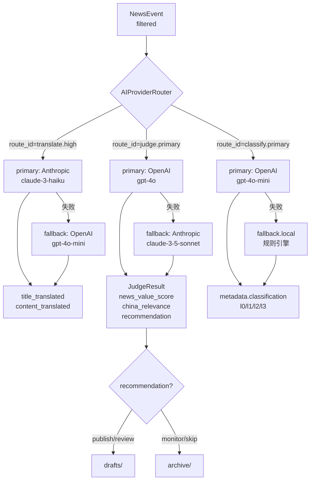

# Phase 5 — AI Provider Routing

> 详细 SPEC: 本文档  
> 路线图: [docs/development-plan.md §Phase-5](../development-plan.md)  
> 横切组件矩阵: [docs/spec/README.md](README.md)  
> ADR-0004: [双语翻译时机](../adr/0004-bilingual-translation-timing.md)

---

## 1. 目标与出口标准

**目标：** 研判、翻译、摘要和草稿生成不绑定单一 Provider，按 `route_id` 路由，有成本预算和 fallback。同一 judge 任务可在至少两个 Provider 间切换，输出仍满足 `NewsEvent.judge_result` 结构。实现双语翻译 canonical 路由（ADR-0004 的 `translate.high`）。

**出口标准（进入 Phase 6 的前提）：**
- [ ] `judge.primary` route 可切换至少两个 Provider，输出 `JudgeResult` 结构一致
- [ ] `translate.fast` 路由在 collect 阶段成功写入 `metadata.translation.title_pre`
- [ ] `translate.high` 路由在 judge 阶段成功写入 `title_translated`（canonical）
- [ ] cost budget 超限时，超限事件降级到 `recommendation=monitor`，写入 run log
- [ ] Provider 失败 fallback 可切换到备用 Provider 或规则引擎降级

---

## 2. 内外范围矩阵

| 范围 | 包含 | 不包含 |
|------|------|--------|
| **IN** | `AIProviderRouter`（task-based routing，`route_id` 驱动） | 离线 eval 集（治理 backlog EVAL-001） |
| **IN** | `ProviderConfig`（route_id、primary/fallback model、cost budget、output_schema_id） | 模型微调 |
| **IN** | 5 条核心 route_id：`translate.fast`、`translate.high`、`judge.primary`、`classify.primary`、`fallback.local` | 社媒/KOL 特殊 Provider 场景（Phase 6） |
| **IN** | prompt/output schema 注册（与 `route_id` 绑定，版本化） | 全量 KOL Provider 矩阵 |
| **IN** | LLM 分类器（`classify.primary` route，ADR-0009 L0–L3 LLM 分类） | 多租户 Provider 配额管理 |
| **IN** | `JudgeSkill`（研判 Skill，调用 `judge.primary` route） | MCP Server 形态（TrendRadar，治理 backlog） |
| **IN** | cost budget 追踪（软限制告警 + 硬限制停止） | 浏览器自动化 Provider（Phase 6） |
| **IN** | Provider 切换测试（同任务在两 Provider 间切换，schema 验证） | — |

---

## 3. 横切组件章节

### 3.1 AIProviderRouter

- **接口**:
  ```python
  # src/news_sentry/core/provider_router.py
  from pathlib import Path
  from pydantic import BaseModel

  class ProviderModelSpec(BaseModel):
      provider_name: str           # 如 "openai" | "anthropic" | "deepseek" | "local"
      model_id: str                # 如 "gpt-4o-mini" | "claude-3-haiku-20240307"
      max_tokens: int = 2048
      temperature: float = 0.3

  class ProviderConfig(BaseModel):
      route_id: str                # 如 "judge.primary"
      primary: ProviderModelSpec
      fallback: ProviderModelSpec | None = None
      prompt_template_id: str      # 与此 route 绑定的 prompt 模板 ID
      output_schema_id: str        # 期望输出结构的 schema ID
      max_cost_usd_per_call: float = 0.05
      max_calls_per_run: int = 100
      enabled: bool = True

  class RouteResult(BaseModel):
      route_id: str
      provider_used: str
      model_used: str
      prompt_tokens: int
      completion_tokens: int
      cost_usd: float
      output: dict                 # 原始输出，后续由调用方 parse 为具体类型
      fallback_used: bool = False

  class AIProviderRouter:
      """
      框架无关的 AI Provider 路由器。
      按 route_id 选择 Provider 和模型，不用 Provider 名直接命名（防止 Provider 锁定）。
      """
      def __init__(
          self,
          routes_config_path: Path,
          prompts_dir: Path,
          budget_tracker: BudgetTracker,
      ) -> None: ...

      def route(
          self,
          route_id: str,
          input_data: dict,
          context: PipelineContext,
      ) -> RouteResult:
          """
          1. 查找 route_id 对应的 ProviderConfig
          2. 校验 budget_tracker 是否超限
          3. 渲染 prompt_template_id 对应的 prompt
          4. 调用 primary Provider
          5. 校验输出是否符合 output_schema_id
          6. 失败时切换 fallback Provider
          7. 更新 budget_tracker
          """
          ...

      def get_routes(self) -> list[ProviderConfig]: ...
  ```

- **数据流**:
  ```
  config/providers/routing.yaml
        │
  AIProviderRouter.route("judge.primary", {event: ...})
        │
        ├─ BudgetTracker.check_and_reserve(cost_estimate)
        ├─ PromptRegistry.render("judge-italy-v2", input_data)
        ├─ Provider SDK 调用（openai / anthropic / litellm）
        │     ├─ 成功 → schema 校验 → RouteResult
        │     └─ 失败 → fallback Provider 重试 → RouteResult
        └─ BudgetTracker.record(actual_cost)
  ```

- **错误处理**:
  - `route_id` 不存在 → `RouteNotFoundError`，事件降级到 `recommendation=monitor`
  - budget 超硬限制 → `BudgetExceededError`，run 停止处理新事件
  - 两个 Provider 均失败 → `AllProvidersFailedError`，事件降级，写 run log

### 3.2 route_id 表

| route_id | 用途 | 触发阶段 | 写入字段 |
|----------|------|---------|---------|
| `translate.fast` | 标题快速机译（非 canonical） | collect 阶段，ADR-0004 | `metadata.translation.title_pre` |
| `translate.high` | 高保真 canonical 翻译 | judge 阶段，ADR-0004 | `title_translated`、`content_translated` |
| `judge.primary` | 事件研判（新闻价值、涉华相关度、建议） | judge 阶段 | `judge_result.*` |
| `classify.primary` | LLM 分类（L0–L3） | filter 或 judge 阶段 | `metadata.classification.*` |
| `fallback.local` | 本地规则引擎降级（无 LLM 依赖） | 任何阶段 Provider 失败时 | 各字段降级值 |

### 3.3 JudgeSkill

- **接口**:
  ```python
  # src/news_sentry/skills/judge_skill.py
  from pydantic import BaseModel, Field
  from typing import Literal

  class JudgeResult(BaseModel):
      """
      研判结果（写入 NewsEvent.judge_result）。
      遵守 contracts-canonical.md §4：所有分值 0–100，sentiment_score -1.0~1.0。
      judge_result.recommendation 在 judge_result 内部，不做顶层字段（ADR）。
      """
      news_value_score: int = Field(ge=0, le=100)
      china_relevance: int = Field(ge=0, le=100)
      sentiment_score: float = Field(ge=-1.0, le=1.0)
      recommendation: Literal["publish", "review", "monitor", "skip"]
      summary_zh: str                  # 30 字中文摘要
      key_entities: list[str] = []     # 关键实体（人名/机构名/地名）
      value_dimensions: list[dict] = [] # [{"dimension": ..., "score": ..., "weight": ...}]
      confidence: int = Field(ge=0, le=100, default=70)
      provider_used: str               # 记录实际使用的 Provider
      model_used: str                  # 记录实际使用的模型

  class JudgeSkill:
      """
      LLM 研判 Skill。调用 AIProviderRouter("judge.primary")。
      输出必须满足 JudgeResult schema，不满足则 fallback 到 fallback.local。
      """
      def __init__(self, router: AIProviderRouter, sandbox: SandboxEnforcer) -> None: ...

      def judge(
          self,
          event: NewsEvent,
          context: PipelineContext,
      ) -> NewsEvent:
          """
          1. 调用 translate.high 路由填充 title_translated / content_translated
          2. 调用 judge.primary 路由获取 JudgeResult
          3. 校验 JudgeResult schema
          4. 更新 event.pipeline_stage = "judged"
          5. 根据 recommendation 决定写入 drafts/ 或 archive/
          """
          ...
  ```

- **数据流**:
  ```
  NewsEvent(pipeline_stage=filtered)
        │
  JudgeSkill.judge()
        │
        ├─ router.route("translate.high", {title: ..., content: ...})
        │       → title_translated, content_translated
        │
        ├─ router.route("judge.primary", {event_zh_context: ...})
        │       → JudgeResult{news_value_score, china_relevance, recommendation, ...}
        │
        ├─ schema 校验（output_schema_id: "judge-result-v1"）
        │
        ├─ event.judge_result = judged_result
        ├─ event.pipeline_stage = "judged"
        │
        ├─ if recommendation in ["publish", "review"]:
        │       MarkdownWriter.write_draft(event)   → drafts/{id}.md
        └─ if recommendation == "skip":
                MarkdownWriter.write_archive(event)  → archive/{id}.md
  ```

### 3.4 BudgetTracker

- **接口**:
  ```python
  # src/news_sentry/core/budget_tracker.py

  class BudgetState(BaseModel):
      run_id: str
      total_cost_usd: float = 0.0
      total_calls: int = 0
      by_route: dict[str, dict] = {}  # route_id → {calls, cost_usd}
      soft_limit_triggered: bool = False
      hard_limit_hit: bool = False

  class BudgetTracker:
      def __init__(
          self,
          max_cost_usd_per_run: float,
          soft_limit_ratio: float = 0.8,  # 80% 时触发告警
      ) -> None: ...

      def check_and_reserve(self, route_id: str, estimated_cost: float) -> None:
          """超硬限制 raise BudgetExceededError，超软限制 log warning"""
          ...

      def record(self, route_id: str, actual_cost: float, tokens: int) -> None: ...
      def get_state(self) -> BudgetState: ...
  ```

### 3.5 PromptRegistry

- **接口**:
  ```python
  # src/news_sentry/core/prompt_registry.py
  from pathlib import Path

  class PromptTemplate(BaseModel):
      template_id: str
      version: str
      language: str          # 模板语言，如 "zh" 或 "it"
      system_prompt: str
      user_prompt_template: str   # Jinja2 模板
      output_schema_id: str

  class PromptRegistry:
      """
      管理 prompt 模板，与 route_id 绑定（ProviderConfig.prompt_template_id）。
      版本化管理（SCHEMA-VERSION-001 治理 backlog）。
      """
      def __init__(self, prompts_dir: Path) -> None: ...

      def get(self, template_id: str) -> PromptTemplate: ...

      def render(self, template_id: str, variables: dict) -> tuple[str, str]:
          """返回 (system_prompt, user_prompt)"""
          ...
  ```

---

## 4. 配置契约

| 配置文件 | 用途 | 说明 |
|--------|------|------|
| `config/providers/routing.yaml` | route_id → ProviderConfig 映射表 | Phase 5 核心配置 |
| `config/prompts/judge-italy-v2.yaml` | 意大利研判 prompt 模板 | 含 system + user Jinja2 模板 |
| `config/prompts/translate-it-zh-v1.yaml` | 意大利语→中文翻译 prompt | 对应 translate.fast 和 translate.high |
| `config/prompts/classify-italy-v1.yaml` | LLM 分类 prompt | L0–L3 分类，含分类体系说明 |
| `schemas/judge-result-v1.schema.json` | JudgeResult 输出 schema | Provider 输出必须通过此校验 |

**routing.yaml 示意**:
```yaml
routes:
  - route_id: translate.fast
    primary:
      provider_name: openai
      model_id: gpt-4o-mini
      temperature: 0.1
      max_tokens: 100
    prompt_template_id: translate-it-zh-v1
    output_schema_id: translation-fast-v1
    max_cost_usd_per_call: 0.001
    max_calls_per_run: 500

  - route_id: translate.high
    primary:
      provider_name: anthropic
      model_id: claude-3-haiku-20240307
      temperature: 0.1
      max_tokens: 500
    fallback:
      provider_name: openai
      model_id: gpt-4o-mini
    prompt_template_id: translate-it-zh-v1
    output_schema_id: translation-high-v1
    max_cost_usd_per_call: 0.005
    max_calls_per_run: 200

  - route_id: judge.primary
    primary:
      provider_name: openai
      model_id: gpt-4o
      temperature: 0.2
      max_tokens: 800
    fallback:
      provider_name: anthropic
      model_id: claude-3-5-sonnet-20241022
    prompt_template_id: judge-italy-v2
    output_schema_id: judge-result-v1
    max_cost_usd_per_call: 0.02
    max_calls_per_run: 100

  - route_id: classify.primary
    primary:
      provider_name: openai
      model_id: gpt-4o-mini
      temperature: 0.0
    fallback:
      provider_name: local
      model_id: rules-engine   # fallback.local 规则引擎
    prompt_template_id: classify-italy-v1
    output_schema_id: classification-v1
    max_cost_usd_per_call: 0.003
    max_calls_per_run: 300

  - route_id: fallback.local
    primary:
      provider_name: local
      model_id: rules-engine
    prompt_template_id: null   # 规则引擎不使用 prompt
    output_schema_id: null
    max_cost_usd_per_call: 0.0
    max_calls_per_run: 9999
```

---

## 5. 测试策略

| 测试类型 | 目标 | 工具 | 优先级 |
|---------|------|------|-------|
| 单元测试 | `AIProviderRouter.route()` 在 primary 失败时切换 fallback | pytest + mock | P0 |
| 单元测试 | `BudgetTracker.check_and_reserve()` 软限制和硬限制触发逻辑 | pytest | P0 |
| 合约测试 | `JudgeResult` 输出通过 `judge-result-v1.schema.json` 校验 | jsonschema | P0 |
| 合约测试 | `translate.high` 输出的 `title_translated` 非空且为 UTF-8 中文 | pytest | P0 |
| 集成测试 | 同一 judge 任务在 openai → anthropic 之间切换，`JudgeResult` 结构不变 | pytest + httpx mock | P1 |
| 集成测试 | cost budget 超限时事件降级到 `recommendation=monitor` | pytest | P1 |
| 集成测试 | `translate.fast` 在 collect 阶段写入 `metadata.translation.title_pre` | pytest | P1 |
| 回归测试 | Phase 3 Kernel MVP 的已有测试全部通过（无 regression） | pytest | P0 |

---

## 6. 验收清单

### AIProviderRouter
- [ ] `routing.yaml` 包含 5 条 route_id（translate.fast / translate.high / judge.primary / classify.primary / fallback.local）
- [ ] `AIProviderRouter.route("judge.primary", ...)` 在 mock 下可调用成功
- [ ] primary 失败时自动切换 fallback，`RouteResult.fallback_used=True`

### 翻译路由（ADR-0004）
- [ ] `translate.fast` 路由在 collect 阶段写入 `metadata.translation.title_pre`（意大利语标题 → 中文）
- [ ] `translate.high` 路由在 judge 阶段写入 `title_translated` 和 `content_translated`（canonical）
- [ ] `title_translated` 和 `content_translated` 字段不在 collect 阶段填充

### 研判 Skill
- [ ] `JudgeSkill.judge()` 产出 `JudgeResult`，含 `news_value_score`、`china_relevance`、`recommendation`
- [ ] `news_value_score` 在 0–100 范围（整数）
- [ ] `sentiment_score` 在 -1.0 到 1.0 范围（浮点数）
- [ ] `judge_result.recommendation` 在 `judge_result` 内部，无顶层 `recommendation` 字段

### 成本控制
- [ ] 超软限制（80%）时 run log 中有 warning 记录
- [ ] 超硬限制时未处理事件以 `recommendation=monitor` 降级，run log 记录 `budget_hard_limit_hit=true`
- [ ] `BudgetState.by_route` 记录每个 route_id 的实际消耗

### LLM 分类器
- [ ] `classify.primary` 路由产出 `ClassificationResult`，含 `l0`（必填）
- [ ] `classify.primary` 失败时降级到 `fallback.local`（规则引擎），`method=rules`

### Schema 版本化
- [ ] `output_schema_id` 在 ProviderConfig 中定义（如 `judge-result-v1`）
- [ ] Provider 切换时，enforcer 验证输出 schema 兼容性

---

## 7. 风险与回退

| 风险 | 可能性 | 影响 | 回退策略 |
|------|--------|------|---------|
| 模型 API 变更导致 output schema 不一致 | 中 | 高 | `output_schema_id` 版本化；Provider 切换时 enforcer 验证 schema 兼容性（SCHEMA-VERSION-001） |
| LLM 成本线性失控 | 中 | 高 | `max_provider_cost` 硬限制；低分事件（`news_value_score < 30`）不进 LLM judge |
| Provider API 可用性不稳定（rate limit / 维护） | 高 | 中 | fallback Provider 自动切换；fallback 也失败时降级到 `fallback.local` 规则引擎 |
| prompt 模板质量差，研判结果不准确 | 中 | 中 | Phase 5 不做离线 eval（EVAL-001 backlog）；人工审查 `reviewed/` 文件质量 |
| `judge.primary` 被某 Provider 名称硬编码（Provider 锁定） | 低 | 高 | 配置中只用 `provider_name` 字符串，不 import Provider SDK 名；切换通过修改 YAML 完成 |
| translate.fast 在 collect 阶段增加延迟 | 中 | 低 | 可配置 `translate_on_collect: false`，降级为 collect 时不机译 |

---

## 附：Provider 路由 Mermaid 图


