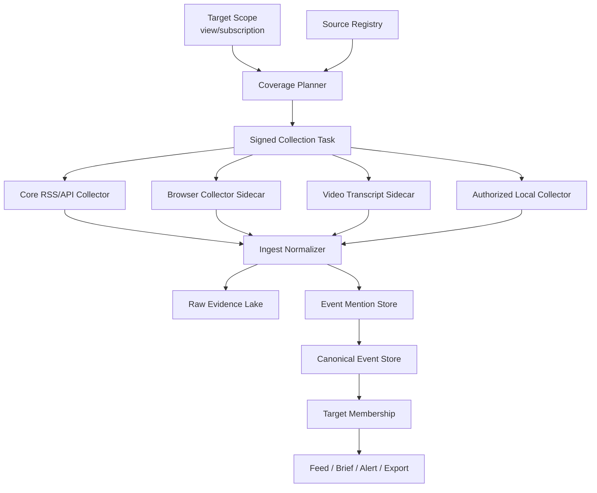

# 运行时瘦身、外部方案借鉴与 Target 口径重定义设计

> 日期：2026-05-31
> 状态：设计规格
> 适用范围：运行时边界、外部方案借鉴、云端扩展、target 数据口径
> 上游方向文档：
> - `docs/roadmap/global-scale-news-intelligence-architecture.md`
> - `docs/specs/2026-05-30-global-intelligence-platform-business-architecture-design.md`
> - `docs/deployment/2026-05-31-vps-cloudflare-tunnel-hypothesis.md`

## 1. 核心结论

News Sentry 后续不应继续把所有能力塞进一个“全功能运行时”。完整镜像中的 Chromium、Xvfb、OpenCLI、ffmpeg、yt-dlp、视频转写、AI 研判、MCP 服务和静态公开页生成都可能各自合理，但它们不应默认进入主进程、主镜像或第一阶段上线形态。

正式口径调整为：

```text
source 是采集单位
event_mention 是原始报道/提及单位
canonical_event 是全球事实单位
target 是视图 / 订阅 / 覆盖范围定义
```

`target` 不再被定义为“运行管道实例”。国家、地区、城市、主题、行业、风险类型、实体关注列表都应编译成查询范围、订阅规则、采集覆盖计划和物化投影，而不是复制一套独立 pipeline 和数据目录。

## 2. 设计目标

1. 降低第一阶段部署成本，让 News Sentry 可在小型 VPS 或轻量云端服务中稳定运行。
2. 防止重型系统依赖进入 base runtime。
3. 让外部项目的优秀思路进入架构，而不是把外部项目整体 vendor 进来。
4. 为全球国家/地区、多层地理、多主题、多行业、多实体 target 爆炸提前建立数据口径。
5. 让本地客户端、区域节点和云端节点共享同一套采集、事实和订阅契约。
6. 保持现有 CLI-first / FastAPI + Vanilla JS / Python 3.11+ 基线，避免过早引入重型前端或复杂微服务。

## 3. 外部方案借鉴边界

### 3.1 OpenCLI

OpenCLI 适合作为网站、社媒、登录态页面和 Electron app 的 CLI 化采集能力来源。

采用方式：

- 保留为可选外部工具适配。
- 默认只在需要 browser/session/profile 能力的 collector sidecar 中启用。
- 对已稳定的公开 API/RSS 信源，不强制经 OpenCLI。
- 所有 OpenCLI 输出必须进入 `event_mention` / raw evidence，而不是直接写 target 目录。

不采用方式：

- 不把 OpenCLI runtime 放入 core 镜像。
- 不把 Chrome profile、Cookie、浏览器路径写入事件、日志或 frontmatter。
- 不让 OpenCLI 成为任意网页代理执行器。

### 3.2 CLI-Anything

CLI-Anything 更适合作为 harness 工程化方法论，而不是 News Sentry 的主运行时依赖。

采用方式：

- 借鉴其“任意软件生成结构化 CLI harness”的思想。
- 为 News Sentry 建立 `ToolHarness` 规范：命令声明、输入 schema、输出 schema、错误码、测试样例、资源需求、权限声明。
- 对视频、桌面软件、专业 API、GIS、文档处理等复杂外部工具，优先生成或维护 harness，而不是在 core 中硬编码。

不采用方式：

- 不把 CLI-Anything 整体作为生产采集依赖。
- 不允许自动生成的 harness 未经安全审查就进入生产 allowlist。
- 不允许 harness 绕过 News Sentry 的 sandbox、budget、source policy 和 provenance。

### 3.3 TrendRadar / TrendRader-extend

TrendRadar 的核心启发是轻量拆分和用户可理解的输出模式。

采用方式：

- 将“新闻推送服务”和“MCP/AI 分析服务”拆分的思路用于 News Sentry sidecar 化。
- 借鉴 `daily / current / incremental` 三种推送语义，映射为 `brief_daily / board_current / monitor_delta` 三类 projection。
- 借鉴关键字过滤、必须词、排除词、推送模式和静态 HTML 报告的低成本产品形态。

不采用方式：

- 不把 HTML 报告当事实存储。
- 不用单一关键词过滤替代 canonical taxonomy、entity、geo scope 和 source credibility。
- 不让推送模式反向决定事实层 schema。

### 3.4 AutoYoutubeSummaryEmailAgent

视频平台信息提取应作为独立能力，而不是主运行时默认能力。

采用方式：

- 视频处理采用 caption-first：优先 YouTube/API 字幕或平台可得 transcript。
- 只有无字幕或低质量时才 fallback 到 yt-dlp、ffmpeg、ASR/Whisper。
- 采用 `classify -> prompt template -> summarize -> optional verify` 的轻量流程。
- 输出转为 `event_mention`、`research_artifact` 或 media transcript artifact。

不采用方式：

- 不把 ffmpeg、yt-dlp、ASR 模型放进 core 镜像。
- 不默认下载视频或音频。
- 不让视频 sidecar 自行决定 canonical merge。

### 3.5 AIHOT / Agent Skill API

AIHOT 的核心启发是公开产品形态和 Agent 友好的查询接口。

采用方式：

- 为公开门户和 Agent Skill 暴露简洁 API：`items`、`briefs`、`dailies`、`search`。
- 支持 `mode`、`category`、`since`、`cursor`、`q` 等查询语义，但对最终用户隐藏基础设施细节。
- 保持输出人话化：时间窗、条数、分类、推荐理由、来源链接，而不是 raw endpoint、cursor、cache、HTTP 状态码。
- 将“精选池”和“全量池”区分为不同 projection，而不是混在同一个列表。

不采用方式：

- 不把 LLM 摘要当原文引用。
- 不让公开 API 成为内部管理 API 的简单透传。
- 不把某个垂直领域分类体系直接升级为 News Sentry 全局 taxonomy。

## 4. Core Runtime 边界

Core runtime 是任何部署形态都应该能跑起来的最小可用平台。它必须轻、可诊断、可升级、可迁移。

### 4.1 Core 必须包含

| 能力 | 说明 |
| --- | --- |
| Config Loader | 加载 target scope、source registry、collector policy、provider policy |
| Source Registry | 信源真相源、生命周期、credibility、region/language/topic 元数据 |
| RSS/API Collector | 无浏览器、无重系统依赖的基础采集 |
| Ingest Normalizer | URL/GUID/hash/source cursor 去重与规范化 |
| Event Mention Store | 保存报道/提及层事实 |
| Shadow Canonical Spine | `canonical_event`、`event_mention`、`relation`、`taxonomy_assignment` 投影 |
| Rules Filter | 关键词、分类、基础评分和低成本规则研判 |
| AsyncStore / SQLite | 本地与早期云端的状态、索引、用户、session、任务状态 |
| FastAPI API | Web UI、公共 API、管理 API、健康检查 |
| Vanilla JS Web UI | 本地与早期云端可用的管理与研究界面 |
| Auth / Audit | 用户、session、API key、审计日志 |
| Projection Export | Markdown/PDF/CSV/JSON 按需导出，不作为事实源 |

### 4.2 Core 禁止默认包含

| 能力 | 原因 |
| --- | --- |
| Chromium / Xvfb | 内存和磁盘占用大，部署复杂，且只服务部分信源 |
| OpenCLI browser bridge | 需要浏览器 session/profile 治理，不应污染 core |
| ffmpeg / yt-dlp | 只服务视频 fallback，体积大、风险边界不同 |
| ASR / Whisper 模型 | 计算和存储成本高，必须独立调度 |
| 长文本/多模态 AI worker | 成本、配额、失败模式与 core 不同 |
| MCP Server | 对外 Agent 接入可选，不应影响 core API |
| 大规模 vector index | 作为召回层或云端服务，不应阻塞 core |
| ClickHouse / Kafka / Redpanda | 规模化云端组件，不是第一阶段依赖 |

## 5. Sidecar / Worker 边界

重型能力必须 sidecar 化。sidecar 与 core 之间通过明确任务和结果契约通信，不共享内部状态。

| Sidecar | 负责 | 输入 | 输出 |
| --- | --- | --- | --- |
| `browser-collector-node` | OpenCLI/browser/session 信源采集 | signed collection task | raw evidence + event mention candidates |
| `tool-harness-node` | CLI-Anything-style 外部工具 harness | tool manifest + args | structured result + audit |
| `video-transcript-node` | YouTube/视频字幕与 fallback 转写 | video URL/task | transcript artifact + mention candidate |
| `ai-judge-worker` | 摘要、翻译、分类、关系候选 | mention/canonical candidate | scored enrichment + confidence |
| `projection-worker` | 日报、精选、公开页面、Markdown/PDF 导出 | canonical/query snapshot | projection artifact |
| `alert-worker` | 多通道告警 fanout | alert event | delivery log |
| `mcp-agent-server` | Agent Skill / MCP 查询入口 | scoped API request | read-only response or controlled action |
| `local-collector-client` | 授权本地采集贡献 | signed task + allowlist | signed evidence bundle |

Sidecar 必须声明：

- `capability_id`
- `version`
- `resource_profile`
- `network_policy`
- `source_policy`
- `input_schema`
- `output_schema`
- `error_taxonomy`
- `provenance_fields`

## 6. Target 口径重定义

### 6.1 旧口径

旧口径中，`target` 通常表示一个运行管道实例：

```text
target_id -> config/targets/{target}.yaml
          -> config/sources/{target}/
          -> data/{target}/raw/evaluated/drafts/...
          -> python -m news_sentry.cli run --target {target}
```

这种口径适合 Italy/Japan/Germany 等少量目标，但不适合全球规模。当地理、话题、行业、实体、风险和用户订阅都变成 target 后，旧口径会造成重复采集、重复存储、重复研判、重复告警和目录爆炸。

### 6.2 新口径

新口径中，`target` 是：

**一个命名的视图 / 订阅 / 覆盖范围定义，用于描述用户或系统关注哪些事实、信源、地域、主题、实体和输出策略。**

`target` 不拥有事实。事实属于 `canonical_event`，报道属于 `event_mention`，证据属于 raw evidence lake。

### 6.3 Target 类型

| 类型 | 示例 | 说明 |
| --- | --- | --- |
| `geo_scope` | Italy、Sicily、Central Asia、EU | 地理或政治区域范围 |
| `topic_scope` | AI、能源、芯片、移民、公共卫生 | 主题/题材范围 |
| `risk_scope` | supply-chain-risk、policy-risk、conflict-risk | 风险模型范围 |
| `entity_scope` | OpenAI、NVIDIA、某国家政府 | 实体关注范围 |
| `source_scope` | Italian government feeds、Japan local media | 信源集合范围 |
| `composite_scope` | Middle East + energy + China relevance >= 70 | 组合视图 |
| `user_subscription` | 某用户关注范围 | 用户私有或团队订阅 |

### 6.4 Target Schema 建议

```yaml
target_id: middle-east-energy-china-watch
target_type: composite_scope
display_name: Middle East Energy China Watch
visibility: public | team | private | system
scope:
  geo:
    include: ["region:middle-east"]
    exclude: []
  taxonomy:
    include_l0: ["policy", "economy", "security"]
    topic_labels: ["energy", "oil", "gas", "supply-chain"]
  entities:
    include: ["China", "Saudi Arabia", "Iran", "OPEC"]
  languages:
    include: ["ar", "en", "zh", "fa"]
  sources:
    include_tags: ["rss", "government", "local-media"]
    exclude_source_ids: []
filters:
  min_news_value_score: 60
  min_confidence: 50
  freshness_hours: 72
output:
  projections: ["feed", "daily_brief", "alert"]
  alert_policy_id: high-value-policy
coverage:
  priority: normal
  desired_freshness_minutes: 60
  collector_regions: ["us-west", "eu", "local-middle-east"]
```

### 6.5 Target Membership

`target_membership` 是派生关系，不是事件主键的一部分。

```text
canonical_event + taxonomy + geo + entity + source + score + time
  -> target_membership
  -> target feed / alert / brief / export
```

同一 canonical event 可以属于多个 target。添加新 target 不应触发历史重采集，只应触发历史回填查询、membership materialization 或 projection rebuild。

## 7. Scheduler 与采集计划重定义

旧模式：

```text
for each target:
  run collect/filter/judge/output
```

新模式：

```text
target scopes + source registry + freshness policy
  -> coverage planner
  -> collection tasks by source/region/capability
  -> event stream
  -> mention/canonical spine
  -> target membership/projections
```

调度单位从 `target` 改为：

- `source_id`
- `collector_node_id`
- `capability_id`
- `freshness_policy`
- `collection_task_id`

多个 target 需要同一个 source 时，只采集一次。多个 target 需要同一个 canonical event 时，只复用事实和 projection。

## 8. 数据流



## 9. 部署形态影响

### 9.1 第一阶段 VPS + Cloudflare Tunnel

第一阶段只部署 core runtime：

- FastAPI + Web UI
- SQLite / AsyncStore
- RSS/API collector
- rules filter
- shadow canonical projection
- target scope API

暂不默认部署：

- browser collector
- video transcript node
- AI judge worker 的高成本模式
- public static portal rebuild worker
- MCP/Agent server

这能降低搬瓦工 VPS 复用方案对现有代理服务的影响。

### 9.2 早期云端

早期云端可保持单节点或小集群：

- core API
- worker queue
- one or two optional sidecars
- object storage backup
- Cloudflare DNS/TLS/WAF/Tunnel/Access

此阶段仍不要求 Kafka、ClickHouse、Iceberg 全部上线。

### 9.3 规模化云端

当 target、source、用户访问和数据量增长后，再引入：

- event stream：Redpanda/Kafka/NATS JetStream
- canonical store：Postgres
- raw evidence lake：R2/S3/MinIO
- OLAP：ClickHouse
- local/offline：DuckDB + Parquet sync package
- vector/search：作为候选召回和研究辅助
- cell-based regional collectors：按地区、语言、source ecosystem 拆分

## 10. 迁移策略

### Phase 0：文档与口径冻结

- 本文正式定义 target 新口径。
- 后续新设计不得再把 target 当作默认运行管道实例。
- 旧 CLI `--target` 保留兼容，但语义逐步调整为“按 target scope 执行一次覆盖计划或回放视图”。

### Phase 1：Core 瘦身

- 产出 `core` 运行剖面：无 Chromium、无 ffmpeg、无 yt-dlp、无 browser bridge。
- 明确 `browser`、`full`、`video`、`mcp` profile 的依赖边界。
- Docker/systemd/serve 文档都以 core 为第一阶段推荐形态。

### Phase 2：Target Scope Shadow Schema

- 新增 `target_scope` / `target_membership` 概念设计。
- 从现有 `config/targets/*.yaml` 投影为 target scope。
- 保留旧字段，但禁止新功能依赖 target 目录作为事实来源。

### Phase 3：Coverage Planner

- 将采集计划从 target 维度改为 source/capability/freshness 维度。
- 去重多个 target 对同一 source 的采集需求。
- collection task 必须带 provenance 和 target demand summary。

### Phase 4：Sidecar 化

- browser/OpenCLI、video、AI judge、projection、alert、MCP 逐步变为 sidecar。
- 每个 sidecar 必须有 manifest、schema、权限和测试样例。

### Phase 5：Cloud Scale

- 引入 event stream、object storage、Postgres、ClickHouse、Parquet/DuckDB sync。
- target feed 从查询和物化投影生成，不再从文件目录扫描。

## 11. 兼容性规则

1. `NewsEvent.target_id` 在迁移期保留，但只表示事件最初进入系统时的 demand/source context，不再表示事实归属。
2. `data/{target}/` 在迁移期保留为 legacy projection，不再作为新架构事实源。
3. `config/targets/*.yaml` 在迁移期保留，但应逐步演进为 `target_scope` 配置。
4. `python -m news_sentry.cli run --target italy` 在迁移期仍可运行，但后续应被解释为“为 Italy scope 触发覆盖计划”，不是 Italy 独占 pipeline。
5. 任何新 API 应优先使用 `target_scope_id`、`subscription_id` 或 `view_id`，避免扩大旧 `target_id` 歧义。

## 12. 成功标准

- core runtime 可在不安装 Chromium、Xvfb、ffmpeg、yt-dlp 的情况下启动 Web UI、API 和基础采集。
- 新增 target 不导致新增完整数据目录和重复 pipeline。
- 同一个 source 被多个 target 需要时只采集一次。
- 同一个 canonical event 可同时出现在国家、地区、话题、实体、风险多个 target feed 中。
- 视频、浏览器、AI、MCP 能力均可独立启停，不影响 core 可用性。
- 本地客户端贡献采集时只执行 signed allowlist task，并上传带 provenance 的 evidence。
- Markdown、HTML 报告、日报和简报都作为 projection，不反向污染事实层。

## 13. 已确认决策

- News Sentry 运行时采用“瘦 core + 可选 sidecar/worker”方向。
- OpenCLI 保留为可选 browser/source collector 能力，不进入 core。
- CLI-Anything 借鉴为 harness 方法论，不作为主运行时依赖。
- TrendRadar 的服务拆分和推送模式进入 projection/alert 设计参考。
- 视频平台能力独立为 video transcript sidecar，caption-first，重型 fallback 按需启用。
- AIHOT 的公开 API、精选/全量分层、Agent Skill 输出原则进入 public/API projection 参考。
- `target` 正式重定义为视图 / 订阅 / 覆盖范围定义。
- source、mention、canonical_event 才是采集、报道和事实层的核心对象。
- 后续全球国家/地区/主题/行业/实体扩展必须基于 target scope 和 target membership，而不是复制 pipeline。
