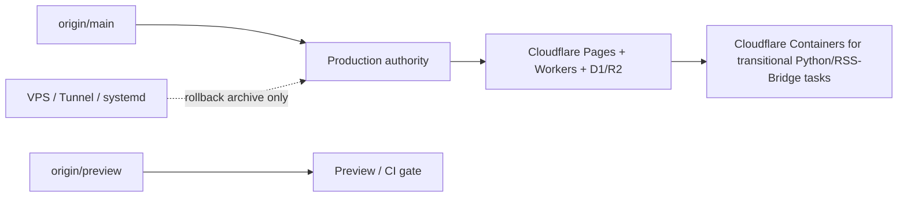

# News Sentry Current Status

> Last local audit: 2026-07-08 04:20 Asia/Shanghai
> Purpose: single source for dynamic project state. If a status value can change between runs, keep it here instead of copying it into `AGENTS.md`, `README.md`, or architecture docs.

## Branch And Release State

| Field | Current local evidence | Notes |
| --- | --- | --- |
| Working branch | `codex/news-value-latent-model` | Draft PR: <https://github.com/XucroYuri/NewsSentry/pull/49>. |
| Published commits | `4b869ac`, `5bda92b` | Ranked public workbench voting plus documentation/status simplification. |
| `origin/main` | `83efaaa` | Production authority branch according to local remote refs. Refresh before any release decision. |
| local `preview` | `7f0155e` | Local branch is behind remote preview history. |
| `origin/preview` | `d65445b` | Preview gate authority according to local remote refs. Refresh before CI/preview work. |
| Recorded RC label | `v2.0.0-rc3` | Treat as a project label, not proof of a currently checked-out tag. Verify tags before release. |

Previous blocker resolved: `git push -u origin codex/news-value-latent-model` initially failed with GitHub HTTPS connection errors, then succeeded after retry. PR #49 is open as a draft.

## Runtime Authority



- Public reads should stay on Cloudflare Pages + Worker + D1/R2.
- Cloudflare Containers are for transitional background/admin/collector surfaces.
- VPS, Tunnel, and systemd are not the default production path.
- Before claiming production health, verify live headers and health endpoints; local curl success is not enough.

## Product State

| Area | Current state | Next minimal step |
| --- | --- | --- |
| Public workbench | Ranked list, `推荐/最新/突发` sorting, anonymous vote path, Worker read contract, and admin merge fix are published in draft PR #49. | Continue with small reviewable follow-up phases. |
| Minimal operations audit | `docs/design/minimal-operations-workbench-audit-2026-07-08.md` records issues P0-P5. | Continue with small, verifiable phases. |
| Agent docs | This status file is now the dynamic state authority. | Keep `AGENTS.md` short and update this file when evidence changes. |
| AI provider capacity | Strategy spec exists at `docs/specs/2026-07-03-ai-provider-free-capacity-and-paid-fallback.md`. | Implement only after route schema and ledger tests are planned. |
| Latent news value model | Local untracked implementation and tests exist; targeted test passes. | Decide whether to integrate as a separate feature commit. |

## Verification Snapshot

Latest checks performed in this work session:

```bash
.venv/bin/python -m pytest tests/unit/test_public_handlers.py tests/unit/test_hn_ranking.py tests/unit/test_hn_ranking_integration.py tests/unit/test_voting.py -q
npm run test --prefix frontend/public
npm run lint --prefix frontend/public
npm run lint --prefix frontend/admin
.venv/bin/python -m ruff check src/news_sentry/api/routes/public.py src/news_sentry/core/public_handlers.py src/news_sentry/core/public_news_utils.py src/news_sentry/core/voting.py src/news_sentry/core/api_server.py tests/unit/test_public_handlers.py tests/unit/test_voting.py
.venv/bin/python -m mypy src/news_sentry/api/routes/public.py src/news_sentry/core/public_handlers.py src/news_sentry/core/public_news_utils.py src/news_sentry/core/voting.py src/news_sentry/core/api_server.py
python tools/scan_sensitive_data.py
cd frontend/cloudflare && npx wrangler deploy --env="" --dry-run --outdir /tmp/ns-worker-dry-run-codex --containers-rollout none
.venv/bin/python -m pytest tests/unit/test_latent_value_model.py -q
```

Result summary:

- Public workbench and voting checks passed.
- Frontend public/admin checks passed.
- Worker dry-run passed.
- Sensitive-data scan passed.
- Latent value model targeted test passed.
- Remote push eventually succeeded after an initial GitHub HTTPS failure; draft PR #49 was created.

## Status Maintenance Rules

- Update this file whenever a release label, branch SHA, deployment authority, test count, coverage figure, or production proof changes.
- Keep `README.md` and `AGENTS.md` stable: they should link here instead of repeating volatile numbers.
- When a command cannot run, record the reason and the next-best evidence rather than writing a successful-looking status.
