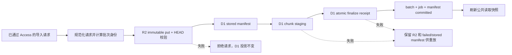

# Cloudflare 统一持久化导入与 Preview 真实制品设计

> 日期：2026-08-02
> 状态：方案 A 已获批准，待书面规格复核
> 适用范围：Cloudflare Worker、D1、R2、Preview Access、部署与恢复演练

## 1. 背景

当前候选分支已经实现 R2 不可变导入正文、D1 `artifact_manifests`、分块导入、围栏式
finalize 和隔离恢复演练。精确提交 `021739caf2e8c9c83573ba91a297dec48f0b4adb`
也已经通过 Preview Worker、D1、R2 binding、Pages 和恢复演练。

但导入入口仍不一致：

- Scheduled Container 会先调用 `persistImportArtifact()`，再写 D1。
- Queue staging 会先写 R2，再通过分块 staging 和 fenced finalize 提交 D1。
- `POST /api/v1/events/import` 仍直接调用 `importEventsToD1()` 写 D1，不生成 R2
  对象和 manifest。
- Preview 关闭 Container、Cron 和 Queue，因此没有现成路径生成一份真实
  `imports/v1/YYYY/MM/DD/<sha256>.json` 制品。

这意味着“数据先进入不可变对象存储，D1 只保存查询投影和完整性清单”的边界尚未覆盖
全部入口，也无法在 Preview 证明正常导入路径的真实 R2 制品恢复。

## 2. 目标与非目标

### 2.1 目标

1. 所有会改变 D1 新闻投影的导入路径必须先成功持久化 R2 不可变正文。
2. 同一批次重试必须解析为同一 artifact、batch 和 finalize receipt。
3. R2 不可用、对象校验失败或 D1 finalize 失败时，接口必须 fail-closed。
4. API/Container 使用统一的 projection finalize；Queue 保留 source-fenced finalize。
5. Preview 使用正常受保护导入端点生成真实制品，不增加测试专用公开路由。
6. Preview canary 不启动 Container、不访问新闻源、不调用 AI Provider，也不修改生产资源。
7. 恢复演练必须校验真实 artifact 的 key、SHA-256、字节数和 committed manifest。

### 2.2 非目标

- 本设计不把 Queue 切换为 authoritative。
- 本设计不启用 Preview Cron、Container 或 Queue。
- 本设计不合并 PR、不部署生产，也不开始 72 小时生产 canary。
- 本设计不改变公开读取 API 的响应契约。
- 本设计不把本地 SQLite、Markdown 或 Container 文件系统重新定义为云端事实源。

## 3. 核心决策

### 3.1 使用正常导入端点，不增加 Preview-only 路由

Preview canary 调用现有 `POST /api/v1/events/import`。环境隔离由 Access 应用、Worker
运行变量、D1/R2 binding 和部署 guard 共同保证。这样验证的是生产将使用的正常代码路径，
不会留下额外测试攻击面。

### 3.2 R2 是导入正文事实源，D1 是投影和清单

任何可进入 D1 投影的有效导入批次都遵循以下顺序：

R2 对象成功后不能覆盖或删除；失败批次保留对象和失败状态，供确定性重放和取证。

### 3.3 两种 finalize 模式共享 staging，不混淆语义

`stageImportBatch()` 增加显式 finalize 策略：

- `source-fenced`：现有 Queue 路径使用。必须同时校验 job lease、fencing version、
  source runtime state 和 output watermark。
- `projection-only`：API 与 Scheduled Container 使用。必须原子提交 projection job、
  import batch、projection finalize receipt 和 artifact manifest，但不得推进 source cursor。

为避免把人工/API 导入伪装成 source-fenced 采集，新增
`import_projection_finalize_receipts`。它与现有 `import_batch_finalize_receipts` 分开，至少记录：

- `batch_id`
- `job_id`
- `batch_checksum`
- `artifact_id`
- `finalized_at`
- `batch_guard`
- `job_guard`
- `artifact_guard`
- `origin`，固定为 `api-import` 或 `container-import`

同一个批次只能存在一种 finalize receipt。恢复演练必须检查跨表孤儿和冲突 receipt。

### 3.4 确定性幂等身份

导入端点先验证以下 envelope 条件，失败时返回 4xx，且不得写 R2 或 D1：

- 请求体是非空 JSON 数组。
- 请求体不超过既定导入上限。
- 每项存在 `target_id`、`source_id`、`title_original`、`url` 和 `collected_at`。
- 至少一个 `collected_at` 能通过现有时间戳策略并形成稳定 UTC 时间。

通过 envelope 后：

1. 对事件数组进行稳定键排序和 canonical JSON 序列化。
2. 计算 `payload_sha256`。
3. `batch_id = api-batch:<payload_sha256>`。
4. `job_id = api-job:<payload_sha256>`。
5. `generated_at` 使用批次中最大的、通过时间戳策略的规范化 `collected_at`，因此同一
   正文重试保持稳定；全部时间戳无效时返回 422。
6. R2 key 继续由 artifact canonical body 的 SHA-256 生成。

客户端可以提供 `Idempotency-Key` 作为审计标签，但不能覆盖正文摘要身份。相同 key 配不同
payload 必须返回 409；相同 payload 重试返回原有 committed receipt，不创建第二个对象。

### 3.5 projection job 是审计对象，不是假采集任务

API/Container projection 在 `jobs` 中创建确定性 job：

- `job_type = projection-import`
- `capability = api-import` 或 `container-import`
- `target_id = multi`、`source_id = multi`，真实 target/source 仍来自每个 staged event
- `scheduled_for` 和 `scheduled_window` 使用确定性 `generated_at`
- 状态从 `running` 原子进入 `committed`

它不进入 outbox，不发送 Queue，不更新 `source_runtime_state`，也不参与采集成功率统计。

## 4. Access 机器身份设计

### 4.1 边缘策略

建立一个只覆盖精确路径
`news-sentry-api-preview.xuyu.workers.dev/api/v1/events/import` 的 self-hosted Access 应用。
策略动作使用 `Service Auth`，只 include 专用 Service Token。其他 Preview 公开读取端点保持
不受该路径策略影响。

Cloudflare 官方说明：

- [`workers.dev` 可以启用 Cloudflare Access](https://developers.cloudflare.com/workers/configuration/routing/workers-dev/)。
- [Service Token 必须由 `Service Auth` 策略接收](https://developers.cloudflare.com/cloudflare-one/access-controls/service-credentials/service-tokens/)。
- [Access 会向源站发送签名的 `Cf-Access-Jwt-Assertion`](https://developers.cloudflare.com/cloudflare-one/access-controls/applications/http-apps/authorization-cookie/validating-json/)。
- [Service Token JWT 使用 `common_name` 表示 Client ID，而不是 `email`](https://developers.cloudflare.com/cloudflare-one/access-controls/applications/http-apps/authorization-cookie/application-token/)。

### 4.2 Worker 二次验证

Worker 不直接信任 `CF-Access-Client-Id` 或 `CF-Access-Client-Secret` 请求头。它继续验证
`Cf-Access-Jwt-Assertion` 的：

- RS256 签名和 `kid`
- issuer
- audience
- `exp` 与 `nbf`
- token `type=app`

验证器返回明确 principal：

- 人类：`kind=user`，身份来自 `email`。
- 机器：`kind=service`，身份来自 `common_name`。

机器 principal 还必须命中 Worker 变量 `CF_ACCESS_SERVICE_TOKEN_IDS` 的精确 allowlist。该变量只
保存非秘密的 Client ID；Client Secret 仅存 GitHub `preview` Environment Secret，绝不部署到
Worker、写入 artifact、日志或回执。

Preview Environment 还保存该应用独立的 `CF_ACCESS_TEAM_DOMAIN`、`CF_ACCESS_AUD` 和
`CF_ACCESS_SERVICE_TOKEN_IDS` 非秘密变量。Preview 不复用 production AUD 或机器身份。

Preview 和 production 使用不同 Service Token。当前阶段只创建 Preview token。

## 5. Preview canary

部署精确 SHA 后，workflow 执行一次确定性 synthetic import：

- `event_id = preview-artifact-canary-<commit前12位>`
- target/source 使用 Preview seed 中的专用 synthetic identity
- `collected_at` 使用该 Git commit 的 committer time
- URL 使用不可解析到内网的固定 `https://example.test/...`
- 不包含外部内容抓取、AI 调用或告警动作

请求携带：

- `CF-Access-Client-Id`
- `CF-Access-Client-Secret`
- `Idempotency-Key: preview-artifact-canary:<full commit>`

请求成功后，workflow 使用 Wrangler 只读检查：

1. D1 有且仅有一个匹配 batch/job/artifact。
2. `artifact_manifests.status = committed`。
3. `import_batches.status = committed`。
4. `import_projection_finalize_receipts` 存在且 guard 全匹配。
5. R2 GET 的 key、SHA-256 和 UTF-8 字节数与 manifest 一致。
6. 同一 commit 再调用一次不会增加 artifact、batch 或 event 数量。

回执只上传摘要、对象 key、SHA-256、字节数、状态和计数，不上传 Service Token、原始 Access
JWT、完整请求头或任意秘密。

## 6. 恢复与部署门禁

Preview canary 成功后：

- Preview restore drill 不再允许 `artifact_coverage=not_available`。
- restore drill 必须下载最新 committed artifact 并核对 SHA-256/bytes。
- 隔离 D1 恢复后必须同时验证 projection/source 两类 finalize receipt。
- 任一 failed/stored artifact、receipt 冲突或 orphan 都阻止发布。
- production restore 继续只允许从 `main` 和精确 SHA 发起。

Production 发布仍需要：

1. PR 审核和明确生产发布授权。
2. 最终 SHA 安全深扫。
3. production 独立 Access 配置与独立机器身份。
4. 生产真实采集生成 artifact，而不是复用 Preview synthetic 制品。
5. 72 小时 canary 和 7 天 SLO 证据。

## 7. 失败语义

| 故障 | 结果 |
|---|---|
| Access 缺失或 JWT 无效 | 403；R2/D1 均不变 |
| Service Token 未命中 Worker allowlist | 403；R2/D1 均不变 |
| envelope 无效或空数组 | 4xx；R2/D1 均不变 |
| R2 binding 缺失 | 503；D1 投影不变 |
| R2 put/head/checksum 不一致 | 503；D1 投影不变 |
| D1 chunk 失败 | 5xx；R2 对象保留，manifest 为 stored/failed |
| atomic finalize guard 失败 | 409/5xx；不得报告成功，允许相同批次重放 |
| 快照刷新失败 | 导入 committed，但 readiness degraded，并记录可重试快照任务 |
| Access secret 过期 | canary fail-closed；不回退到匿名或 Bearer API key |

## 8. 测试策略

### 8.1 Worker 单元与 SQLite 集成测试

- 未配置 R2 时，API 导入不能写 D1。
- R2 校验失败时，API 导入不能写 D1。
- 正常 API 导入生成 committed artifact、batch、job 和 projection receipt。
- 相同正文重放不增加对象和行数。
- 相同 `Idempotency-Key` 搭配不同正文返回冲突。
- mixed target/source 正确进入 staged events，不推进 source cursor。
- Queue 仍要求 lease/fencing/source guard。
- Service Token JWT 的 `common_name` 只有命中 allowlist 才通过。
- 伪造 client headers、错误 audience、issuer、签名、过期 token 全部拒绝。

### 8.2 Workflow 契约测试

- Preview deploy 必须读取 `preview` Environment Secrets，而不是 production/repo fallback。
- canary 必须只调用 Preview URL、`ns-db-preview` 和 `news-sentry-artifacts-preview`。
- workflow 不启用 Container、Cron 或 Queue。
- receipt artifact 不包含 client secret、JWT 和原始请求头。
- restore drill 在 canary 启用后拒绝缺失 artifact。

### 8.3 远端验证顺序

1. 全量本地 Worker 测试、ruff、mypy 和 workflow contract 测试。
2. 精确 SHA Preview deploy。
3. 未携带 Access token 的写探测返回 403。
4. Service Token canary 首次调用成功。
5. 相同 canary 重放保持幂等。
6. D1/R2 交叉校验通过。
7. 隔离 restore drill 对真实 artifact 通过。

## 9. 代码边界

预计实施触及：

- `frontend/cloudflare/workers/lib/access-jwt.ts`
- `frontend/cloudflare/workers/lib/access.ts`
- `frontend/cloudflare/workers/lib/router.ts`
- `frontend/cloudflare/workers/api/webhook.ts`
- `frontend/cloudflare/workers/lib/container-import.ts`
- `frontend/cloudflare/workers/lib/import-staging.ts`
- `frontend/cloudflare/db/schema.sql`
- 新的 append-only D1 migration
- `.github/workflows/deploy.yml`
- `.github/workflows/cloudflare-restore-drill.yml`
- 对应 Worker、工具和 workflow contract 测试

不修改用户现有未跟踪的 latent-value 文件，也不在本设计阶段改生产资源。

## 10. 验收标准

本设计只有在以下证据全部成立时才算实施完成：

1. 仓库中不存在会绕过 R2 直接写 D1 新闻投影的 Worker 导入入口。
2. API、Container、Queue 的正常路径均有真实 artifact 和 committed manifest。
3. 所有相关失败测试先红后绿，完整 Worker/工具测试通过。
4. Preview Access 的匿名写入为 403，机器 canary 为成功。
5. Preview D1/R2 交叉校验和真实 artifact restore drill 通过。
6. 回执不含秘密，Preview 资源名和 production 资源名严格隔离。
7. Production 仍保持未变更，直到独立审批、深扫和发布门禁满足。
