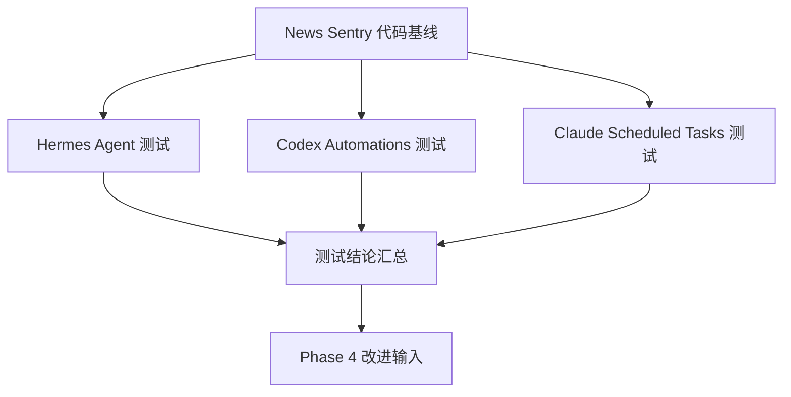

# News Sentry — 多运行环境测试方案索引

> **版本**: v1.0 | 日期: 2026-05-10
> **状态**: 设计方案（待各运行环境 Agent 加载执行）

---

## 测试方案文档

| 文档 | 目标环境 | 优先级 | Agent 类型 |
|------|---------|--------|-----------|
| [test-plan-hermes-agent.md](./test-plan-hermes-agent.md) | **Hermes Agent** (生产主通道) | 1 (最高) | CLI 执行 + subagent 检查 |
| [test-plan-codex-automations.md](./test-plan-codex-automations.md) | **Codex Desktop Automations** (fallback) | 2 | CLI 执行 + subagent 检查 |
| [test-plan-claude-scheduled-tasks.md](./test-plan-claude-scheduled-tasks.md) | **Claude Desktop Scheduled Tasks** (fallback) | 3 | LLM Agent tool calls |

## 测试反馈报告

| 文档 | 来源 | 状态 |
|------|------|------|
| [hermes-agent-test-feedback.md](./hermes-agent-test-feedback.md) | Hermes Agent 2 轮 PDCA 测试执行反馈 | ✅ 已完成 (2026-05-10) |

## 运行环境优先级

```
1. Hermes Agent      → 生产主通道，24h cron 调度，cloud-vps profile
2. Codex Automations → 本地自动化引擎，fallback，local-workstation profile
3. Claude Desktop    → LLM Agent 定时任务，fallback，local-workstation profile
```

## 方案设计原则

每个方案遵循同一 PDCA 框架，但针对目标环境定制：

1. **Agent 自加载** — 每个方案 §0 包含 Agent 自加载指令，目标环境 Agent 读取后即可执行
2. **PDCA 闭环** — Plan → Do → Check → Act 四步循环，每轮可独立验证
3. **Subagent 自检** — Check 阶段均可分派 subagent 并行检查
4. **心跳监控** — 每个循环完成后写入 heartbeat 文件，供 Claude Code 外部监控
5. **纠正闭环** — 每个方案 §4 定义了完整的错误分类和纠正决策树

## 外部监控（Claude Code）

Claude Code 通过读取各方案的心跳文件进行外部监控：

```bash
# 检查 Hermes Agent 进度
cat data/italy/logs/.heartbeat-hermes.json

# 检查 Codex Automations 进度
cat data/italy/logs/.heartbeat-codex.json

# 检查 Claude Scheduled Tasks 进度
cat data/italy/logs/.heartbeat-claude.json
```

## 执行依赖



三个方案**可并行执行**，互不依赖。

## 执行后汇总

全部测试完成后，将三个方案的测试报告合并为统一视图：

```bash
python -c "
import json, glob
reports = []
for f in glob.glob('data/italy/logs/.test-conclusion-*.json'):
    with open(f) as fp:
        reports.append(json.load(fp))
for r in reports:
    print(f'{r[\"test_plan\"]}: {r[\"result\"]}')
"
```
