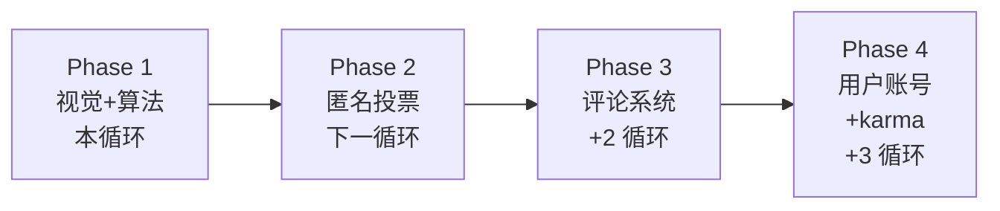

# 以 Hacker News 为学习目标全面升级网站 — 分阶段计划

> **日期**: 2026-07-07
> **范围**: `frontend/public/` 公开新闻阅读器 + `src/news_sentry/core/` 公共 API 后端
> **目标**: 把当前卡片式新闻阅读器升级为 HN 哲学下的"高密度 ranked list + 算法排序 + 用户交互"情报平台
> **品牌约束**: 保留金色瞭望塔 + Geist 字体；只借鉴 HN 哲学，不克隆 HN 视觉

---

## 1. 设计哲学取舍

### Hacker News 的核心哲学

| 哲学点 | HN 实现 | 我们借鉴的方式 |
|--------|---------|----------------|
| **信息密度优先** | Verdana/Times，无图，无卡片 | 移除卡片边框，列表化布局，保留 Geist 字体 |
| **算法排序透明** | `(points-1)^0.8 / (age+2)^gravity` | 实现 HN 公式，分数对外可见 |
| **扁平导航** | 顶部 `[new \| past \| comments \| ask \| show \| jobs \| submit]` | 顶部 tab：`Breaking \| Recent \| Top \| All \| Daily` |
| **元数据二行式** | 标题后接 `(domain)` + 第二行 `points \| user \| time \| comments` | 同样模式，但用我们的字段（source · score · target · time · related） |
| **极简交互** | 三角 upvote + 评论数 | Phase 2 实现（匿名投票 → 评论） |
| **无品牌装饰** | 仅橙色 `#ff6600` | 保留金色瞭望塔 `--brand-gold` 作为主强调色 |

### 我们不照搬

- ❌ Times/Verdana 字体（Geist 更现代且已落地）
- ❌ 白底纯文字（保留深浅主题切换）
- ❌ `#ff6600` 橙色（用金色瞭望塔品牌色）
- ❌ 文末 "discuss" 链接（中文环境用 "讨论" 或 "相关 N 条"）

---

## 2. 分阶段路线图



### Phase 1 — 视觉与算法（本循环交付）

**目标**: 把卡片式 feed 改为 HN 风格 ranked list，并实现 HN 排名公式。

| 子任务 | 文件 | 状态 |
|--------|------|------|
| HN 排名算法 + 单元测试 | `src/news_sentry/core/hn_ranking.py` | ✅ |
| PublicNewsItem schema 扩展 hn_score/points/gravity_age_hours | `src/news_sentry/api/schemas.py` | ✅ |
| 后端注入 hn_score 到 API 响应 | `src/news_sentry/core/public_news_utils.py` | ✅ |
| TypeScript HN 算法 port + vitest | `frontend/public/src/lib/hn-rank.ts` | ✅ |
| HN 风格 NewsListRow 组件 | `frontend/public/src/components/news-list-row.tsx` | ✅ |
| 顶部 tab 导航（Breaking/Recent/Top/All） | `frontend/public/src/App.tsx` | ✅ |
| NewsFeedPage 改为 ranked list 布局 | `frontend/public/src/pages/public-pages.tsx` | ✅ |
| BreakingHomePage 简化为 HN 风格 lead + list | `frontend/public/src/pages/public-pages.tsx` | ✅ |
| 测试全套（vitest + pytest + tsc） | — | ✅ |

**HN 排名公式（实现）**:

```python
def hn_score(points: float, age_hours: float, gravity: float = 1.8) -> float:
    """
    HN ranking formula: (points - 1) ^ 0.8 / (age_hours + 2) ^ gravity

    - points: 来自 news_value_score / 10（0-100 → 0-10 浮点）
    - age_hours: (now - published_at).total_seconds() / 3600
    - gravity: 1.8（HN 默认值，可调）
    """
    return (points - 1) ** 0.8 / (age_hours + 2) ** gravity
```

### Phase 2 — 匿名投票（后续循环）

**目标**: 实现 HN 式 upvote，无需注册账号。

- 新表 `news_votes`：`(event_id, voter_hash, created_at)`
- `voter_hash = sha256(ip + user_agent + salt + day)` — 24h 去重
- API: `POST /api/v1/public/news/{event_id}/vote` (anonymous)
- API: `DELETE /api/v1/public/news/{event_id}/vote` (取消)
- 前端：localStorage 记录已投票 ID
- 投票后 `points` 字段从 vote_count 推导
- 限制：同 IP 24h 内最多 50 票（防刷）

### Phase 3 — 评论系统（后续循环）

- 表 `news_comments`：`(id, event_id, parent_id, content, created_at, voter_hash)`
- 嵌套层级 max_depth = 4
- 编辑窗口 60 分钟
- 管理员隐藏/删除接口
- 一楼自动从 AI summary 生成"AI 摘要"占位

### Phase 4 — 用户账号 + karma（后续循环）

- 复用现有 `/api/v1/auth/setup` 注册流
- 表 `users`：`(id, username, email_hash, karma, created_at)`
- karma = sum of vote weights on user submissions
- 公开 profile 页 `/u/{username}`
- HN 风格约束：注册 1 周内不能 downvote

---

## 3. 不在范围内

以下特性虽然 HN 有，但本项目明确不做：

- ❌ **submit link**：本项目是采集系统，不接受用户投稿
- ❌ **ask/show/jobs 分类**：与"全球新闻情报"定位冲突
- ❌ **karma 限制可见性**：与"开放情报平台"冲突
- ❌ **折叠负分评论**：评论系统由 AI + 人工审核替代

---

## 4. 验收标准（Phase 1）

### 功能验收

- [ ] 访问 `/public-app/` 默认看到 HN 风格 ranked list
- [ ] 列表每行包含：rank #, title, source (domain), score, time, related count
- [ ] 顶部 tab 可在 Breaking / Recent / Top / All 间切换
- [ ] Top tab 按 hn_score 排序，Recent 按时间排序，Breaking 按 breaking_score 排序
- [ ] 详情页（EventDetailPage）保留富信息卡片
- [ ] 深色主题仍可用
- [ ] 移动端可读，无横向滚动

### 技术验收

- [ ] `pytest tests/core/test_hn_ranking.py` 全绿
- [ ] `cd frontend/public && npm run test` 全绿
- [ ] `cd frontend/public && npm run lint` (tsc --noEmit) 0 errors
- [ ] `ruff check src/news_sentry/core/hn_ranking.py` 0 errors
- [ ] `mypy --strict src/news_sentry/core/hn_ranking.py` 0 errors

### 兼容性

- [ ] 现有 PublicNewsItem 的所有字段保持不变，只新增字段
- [ ] `valueScore` 字段保留（向后兼容）
- [ ] 现有路由 `#feed`, `#event`, `#sources` 全部可用

---

## 5. 后续 Phase 触发条件

后续 Phase **不会自动启动**。需要：

1. Phase 1 上线 ≥ 2 周收集用户行为数据
2. 用户主动要求启动下一 Phase
3. 重新评估容量、安全（投票防刷）、合规（评论审核）风险

---

## 6. 参考

- [Hacker News Ranking Algorithm](https://medium.com/hacker-news-ranking-algorithm-8d23a857dda4)
- [HN Help - How does ranking work](https://news.ycombinator.com/item?id=1781417)
- [AGENTS.md §核心设计决策](../../AGENTS.md)
- [contracts-canonical.md §分值约定](../contracts-canonical.md)
